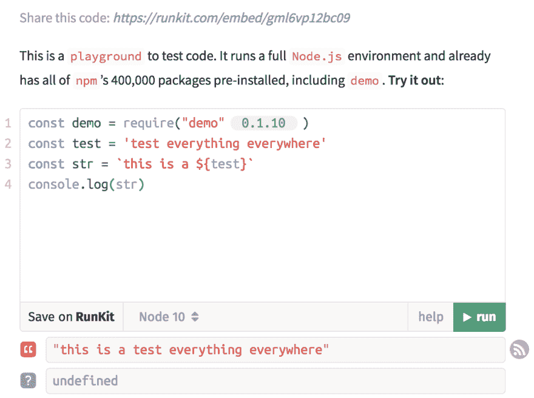
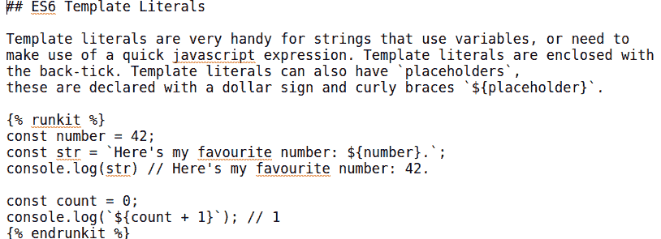
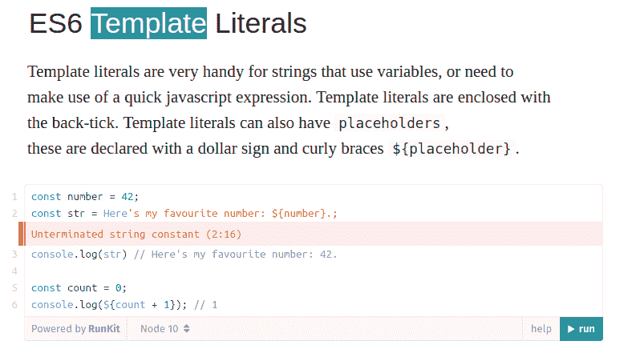
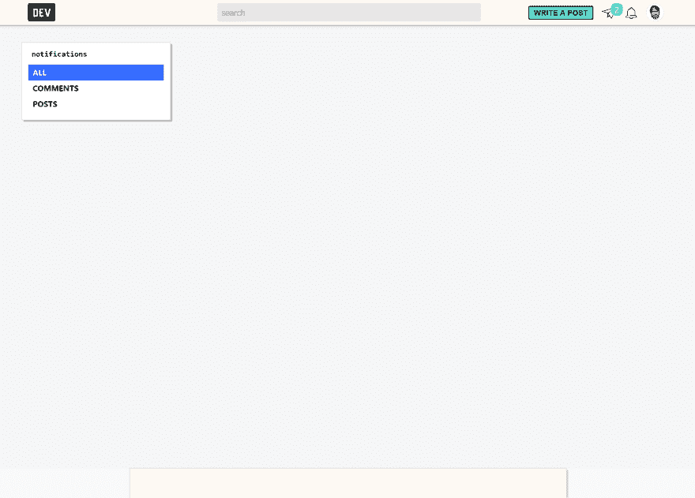
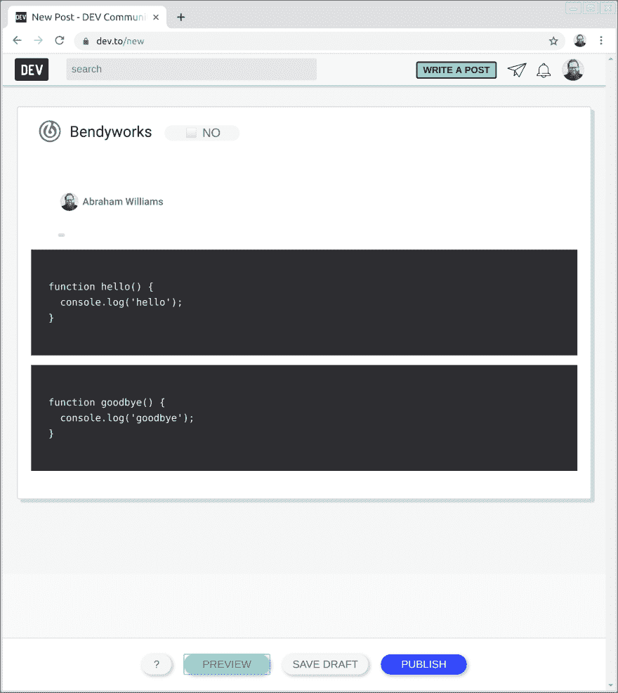
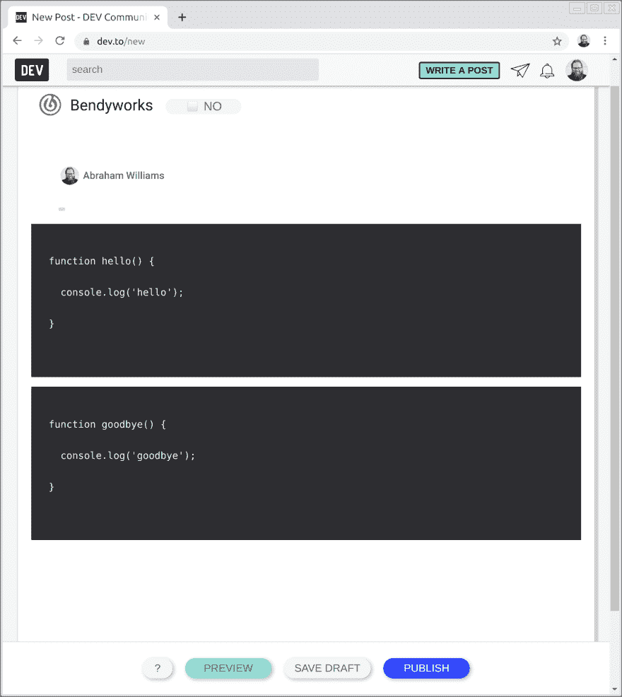
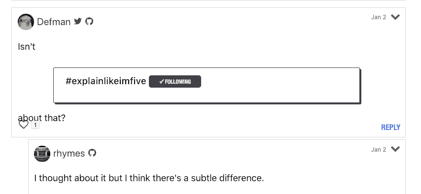

# 开发人员对上周的回购进行总结

> 原文：<https://dev.to/devteam/devto-repo-recap-from-the-past-week-15ck>

欢迎来到今年的第一版概述！我们将报道从 12 月 30 日到 1 月 5 日的情况。

# 特性

主回购没有新功能！虽然所有的改进都是特性，对吧？

# Bug 修复/其他贡献

@nickytonline 为我们构建时部署 Storybook 打下了基础。谢谢尼克。

*   [链接到 PR](https://github.com/thepracticaldev/dev.to/pull/1412)

[@rhymes](https://dev.to/rhymes) 从我们的`rubocop_todo.yml`文件中清理了很多问题，这个文件收集了 Rubocop 的所有 linter 错误。查看下面的 PRs。谢谢，[@韵](https://dev.to/rhymes)！

*   [Rubocop 清理公司](https://github.com/thepracticaldev/dev.to/pull/1415)
*   [修复 rubocop 安全漏洞](https://github.com/thepracticaldev/dev.to/pull/1447)
*   [修复 Rubocop Style/MixinUsage 并清理 prefix_all_images](https://github.com/thepracticaldev/dev.to/pull/1451)

[@link2twenty](https://dev.to/link2twenty) 正在继续添加黑暗模式的 CSS 变量。谢谢安德鲁。

*   [链接到 PR](https://github.com/thepracticaldev/dev.to/pull/1421)

[@tensai](https://dev.to/tensai) 从 2018 年到 2019 年更新了我们的页脚和一个简介占位符。谢谢，[@天赛](https://dev.to/tensai)！

*   [链接到 PR](https://github.com/thepracticaldev/dev.to/pull/1437)

[@joeventures](https://dev.to/joeventures) 把硬编码的 2019 动态化了。谢谢， [@joeventures](https://dev.to/joeventures) ！

*   [链接到 PR](https://github.com/thepracticaldev/dev.to/pull/1436)

[@arun](https://dev.to/arun) 重构了几小段代码。查看下面的 PRs。谢谢， [@arun](https://dev.to/arun) ！

*   [删除多余的条件](https://github.com/thepracticaldev/dev.to/pull/1441)
*   [重构！空的？对任何人？](https://github.com/thepracticaldev/dev.to/pull/1442)
*   [挽救一个特定的错误并使用 present？或者！空白？](https://github.com/thepracticaldev/dev.to/pull/1443)
*   [修正 Rubocop 的违法行为](https://github.com/thepracticaldev/dev.to/pull/1452)
*   [修复块分隔符 rubocop 进攻](https://github.com/thepracticaldev/dev.to/pull/1456)

@jess 对我们的内部工具做了一些补充，这将帮助我们更好地管理用户角色。

*   [链接到 PR](https://github.com/thepracticaldev/dev.to/pull/1444)

@maestromac 修复了一个标签部件列表不显示的小错误。

*   [链接到 PR](https://github.com/thepracticaldev/dev.to/pull/1448)

[@abraham](https://dev.to/abraham) 去掉了一行调试用的。谢谢亚伯拉罕。

*   [链接到 PR](https://github.com/thepracticaldev/dev.to/pull/1462)

[@ben](https://dev.to/ben) 去掉了一个不必要的 private 关键字。

*   [链接到 PR](https://github.com/thepracticaldev/dev.to/pull/1463)

# 新问题

[@antogarand](https://dev.to/antogarand) 建议堆栈溢出液体标签。谢谢安东尼。

# [ 建议:堆栈溢出液体标签 #1419](https://github.com/thepracticaldev/dev.to/issues/1419) 

[](https://github.com/AntonyGarand) **[AntonyGarand](https://github.com/AntonyGarand)** posted on [<time datetime="2018-12-30T01:39:06Z">Dec 30, 2018</time>](https://github.com/thepracticaldev/dev.to/issues/1419)

**您的功能请求是否与某个问题相关？请描述一下。**我刚刚注意到，当我试图在我的帖子上嵌入这些问题或答案时，我们没有为堆栈溢出问题或答案添加液体标签。
考虑到以开发者为中心的网站，这可能是一个不错的补充。

**描述你想要的解决方案**使用`{{ SO stackoverflow-url }}`或类似的语法在帖子中嵌入 stackoverflow 问题或答案。

**附加上下文**在使用此功能时，需要考虑 stackexchange 网站上所有不同的子域名。这里有一个网站列出了大多数不同的域名/社区:[https://stackexchange.com/sites](https://stackexchange.com/sites)

快速浏览一下，似乎以下域是有效的:

*   [https://stackoverflow.com](https://stackoverflow.com)
*   [https://stackexchange.com](https://stackexchange.com)
*   [https://superuser.com](https://superuser.com)
*   [https://mathoverflow.net](https://mathoverflow.net)
*   https://*.stackexchange.com
*   [https://es.stackoverflow.com](https://es.stackoverflow.com)

最后两个是子域:任何 stackexchange 子域，显然很少有特定于语言的 stackoverflow 子域。

域的多样性意味着我们不能只使用`{{ so [post-id] }}`作为语法，因为我们不知道从哪里获取 ID。
也许我们可以使用简化的语法`{{ so [id] [Opt: Q or A] [Opt: Domain] }}`
，其中默认模式是问题和 Stackoverflow.com，但是它们可以被用户指定的值覆盖。

以下是几种有效的 URL 格式示例:

**问题**【https://math.stackexchange.com/q/12186】T2[https://math.stackexchange.com/questions/12186](https://math.stackexchange.com/questions/12186)[https://math . stack exchange . com/Questions/12186/arc-length-of-b % C3 % a9 zier-curves](https://math.stackexchange.com/questions/12186/arc-length-of-b%c3%a9zier-curves)[https://math.stackexchange.com/q/12186/anything](https://math.stackexchange.com/q/12186/anything)

**答案**https://math.stackexchange.com/a/64769T2【https://math.stackexchange.com/a/64769/anything】T4

[View on GitHub](https://github.com/thepracticaldev/dev.to/issues/1419)

[@hardy613](https://dev.to/hardy613) 报道 ES6 字符串文字不起作用。谢谢斯科特。

# [  Runkit - ES6 模板文字对开发无效 #1431](https://github.com/thepracticaldev/dev.to/issues/1431) 

[](https://github.com/shardyMBAI) **[shardyMBAI](https://github.com/shardyMBAI)** posted on [<time datetime="2018-12-31T16:59:30Z">Dec 31, 2018</time>](https://github.com/thepracticaldev/dev.to/issues/1431)

**描述 bug** 为 dev.to post 编写标记时使用`runkit`进行代码示例模板文字(反勾`)被剔除。

**重现**重现行为的步骤:

1.  转到开发工具
2.  点击写一篇文章
3.  增加

```
const test = 'test everything everywhere'
const str = `this is a ${test}`
console.log(str)
```

Enter fullscreen mode Exit fullscreen mode

4.  点击预览查看错误(图像已粘贴) [](https://user-images.githubusercontent.com/27963753/50564392-8258fe00-0cf2-11e9-9a20-af757585dd65.png)

**预期行为**dev . to 的 runkit 嵌入式环境中使用的模板文字要支持这里是一个来自 [runkits 演示页面](https://npm.runkit.com/demo) [](https://user-images.githubusercontent.com/27963753/50564467-10cd7f80-0cf3-11e9-90a1-5c3a91ae7c0c.png) 的示例

**截图** Markdown: [](https://user-images.githubusercontent.com/27963753/50564475-204cc880-0cf3-11e9-8adc-364ce16b4d6c.png)

结果: [](https://user-images.githubusercontent.com/27963753/50564478-25117c80-0cf3-11e9-89b2-183c6f57c1e8.png)

预计: [](https://user-images.githubusercontent.com/27963753/50564481-2b9ff400-0cf3-11e9-81d5-dd83db5e4037.png)

*   操作系统:MAC
*   浏览器:铬
*   版本:版本 71.0.3578.98(正式版)(64 位)

**附加上下文**该漏洞是在更新一个帖子作为请求公关时发现的，这里:【https://github.com/shardy613/es6-notes/pull/13】T2

[View on GitHub](https://github.com/thepracticaldev/dev.to/issues/1431)

[@raymondcamden](https://dev.to/raymondcamden) 报告称，他有时会收到一个新通知，然后查看通知页面显示没有通知。如果您在这个问题上也遇到了这种情况，请告诉我们。谢谢你，雷蒙德！

# [ 通知空白 #1438](https://github.com/thepracticaldev/dev.to/issues/1438) 

[](https://github.com/cfjedimaster) **[cfjedimaster](https://github.com/cfjedimaster)** posted on [<time datetime="2019-01-01T20:07:17Z">Jan 01, 2019</time>](https://github.com/thepracticaldev/dev.to/issues/1438)

描述这个 bug 一天中我第一次访问这个网站时，我会看到一个通知计数。我点击加载它们，总是得到一个空白页面(说清楚一点，页面 UI 是有的，只是没有内容)。示例:

[](https://user-images.githubusercontent.com/393660/50576004-5a3ecd00-0dce-11e9-82ac-c58371b9d68c.png)

如果我在浏览网站时收到通知，它会正常工作。

**重现**重现行为的步骤:

1.  请注意，您有通知在等待。
2.  点击铃铛图标

**预期行为**通知列表。

**桌面(请填写以下信息):**

*   操作系统:[例如 iOS] Windows 10
*   浏览器 Firefox
*   版本 64

[View on GitHub](https://github.com/thepracticaldev/dev.to/issues/1438)

[@raymondcamden](https://dev.to/raymondcamden) 还报告说，有时 RSS 提要需要很长时间才能拉入一篇文章。

# [  RSS feed 不再为新文章工作 #1439](https://github.com/thepracticaldev/dev.to/issues/1439) 

[](https://github.com/cfjedimaster) **[cfjedimaster](https://github.com/cfjedimaster)** posted on [<time datetime="2019-01-01T20:11:39Z">Jan 01, 2019</time>](https://github.com/thepracticaldev/dev.to/issues/1439)

**描述 bug** 我要安装 dev，以便从我的 feed(【https://www.raymondcamden.com/feed_full.xml】)中吸收新文章。在某个时候，这停止工作，不再拿起新的文章。我也试着编辑我的设置并保存以强制刷新，但没有帮助。

[View on GitHub](https://github.com/thepracticaldev/dev.to/issues/1439)

[@bnb](https://dev.to/bnb) 提出了在 dev.to 之外使用体面嵌入 DEV 帖子的功能。谢谢，Tierney！

# [  HTML 嵌入开发贴子 #1445](https://github.com/thepracticaldev/dev.to/issues/1445) 

[](https://github.com/bnb) **[bnb](https://github.com/bnb)** posted on [<time datetime="2019-01-02T19:24:42Z">Jan 02, 2019</time>](https://github.com/thepracticaldev/dev.to/issues/1445)

**描述你想要的解决方案:**除了社交分享，我还希望看到 HTML 嵌入，就像你如何用简单的 HTML(分别加上脚本或 iframe)嵌入推文或 YouTube 视频一样。

**描述你考虑过的备选方案:**

*   添加 oembed、Embedly 等。
    *   并不是对每个网站都可行，尤其是那些我贡献但不拥有的网站。
*   手工编码一个漂亮的嵌入
    *   用户端没有足够的理由这样做。

**附加上下文:**我很想在几天后发布的博客文章中嵌入一个漂亮的开发工具，但不幸的是，它目前不存在。

[View on GitHub](https://github.com/thepracticaldev/dev.to/issues/1445)

[@abraham](https://dev.to/abraham) 报告了一个 bug，当在代码块后使用头时，代码块有一个额外的换行符。谢谢亚伯拉罕。

# [ 代码块在每行之间添加分隔符 #1446](https://github.com/thepracticaldev/dev.to/issues/1446) 

[](https://github.com/abraham) **[abraham](https://github.com/abraham)** posted on [<time datetime="2019-01-02T20:22:50Z">Jan 02, 2019</time>](https://github.com/thepracticaldev/dev.to/issues/1446)

**描述 bug** 代码块有时会在每行之间添加 break`<br>`。你可以在[上的一个代码块中看到:一个动荡的月:回顾](https://dev.to/abraham/a-month-of-flutter-a-look-back-1j1a#annotatedregion)。这似乎与代码块后面有头有关。

**重现**

转到[创建一个新帖子](https://dev.to/new)输入下面的降价，然后点击“预览”。

```
~~~
function hello() {
  console.log('hello');
}
~~~

~~~
function goodbye() {
  console.log('goodbye');
}
~~~

# header 
```

**预期行为**

代码块的每行代码之间不应有任何空行。

**截图**

不包括`# header`时的正确显示:

[](https://user-images.githubusercontent.com/3341/50610638-50ce6700-0e99-11e9-9fc1-6fe4c6d80770.png)

包含`# header`时显示不正确:

[](https://user-images.githubusercontent.com/3341/50610645-562bb180-0e99-11e9-8a51-54eecd27f333.png)

**桌面(请填写以下信息):**

*   操作系统:Ubuntu 18.10
*   浏览器:
    *   铬合金
    *   火狐 64.0

**附加上下文**

只有在代码块后面有标题时，显示才会中断。如果我在代码块之间或之前移动它，中断不会发生。我用的是编辑器的 v2，还没有用 v1 测试过。

[View on GitHub](https://github.com/thepracticaldev/dev.to/issues/1446)

@abraham 还请求了一个“post linter”，它可以帮助检查重复的标题、没有替代文本的图片以及其他好东西。

# [# 1449](https://github.com/thepracticaldev/dev.to/issues/1449)

[](https://github.com/abraham) **[abraham](https://github.com/abraham)** posted on [<time datetime="2019-01-02T22:30:04Z">Jan 02, 2019</time>](https://github.com/thepracticaldev/dev.to/issues/1449)

**您的功能请求是否与某个问题相关？请描述一下。**

有时候帖子有简单的错误，比如没有语法高亮。

**描述您想要的解决方案**

如果帖子编辑器中有一些降价林挺，可以建议你的帖子进行改进，那就太好了。用棉绒突出一些问题可能是有用的:

*   没有语言标记的代码块
*   现有帖子的重复标题
*   缺少标签
*   具有相对路径的图像标签
*   没有替代文本的图像
*   多次使用相同的图像替代文本
*   像 GitHub/Twitter 链接这样的流动标签

[View on GitHub](https://github.com/thepracticaldev/dev.to/issues/1449)

[@artemix](https://dev.to/artemix) 报告了一个无休止的加载问题。本评论说，这很可能是因为一个推脚本保持开放。

# [ 无限负荷 #1458](https://github.com/thepracticaldev/dev.to/issues/1458) 

[](https://github.com/Arteneko) **[Arteneko](https://github.com/Arteneko)** posted on [<time datetime="2019-01-03T19:48:29Z">Jan 03, 2019</time>](https://github.com/thepracticaldev/dev.to/issues/1458)

我尝试了一个清新干净的访客火狐档案

**描述 bug**

当我有时硬刷新页面时(由于我的网速太慢，所以需要)，页面保持在“加载”状态，很可能是一个持续的请求，迫使标签状态为“加载”。

**重现**

我真的找不到任何复制的上下文，但当这种情况发生时，我的情况如下:

*   慢速互联网(< 200kBps)
*   作为固定标签的开发
*   硬刷新(缓存清理等)

**预期行为**

应加载基础资产并完成。

**截图**

[](https://camo.githubusercontent.com/0c1b9ae127bbac659dd8a6191db2983de71d8d94/68747470733a2f2f7069782e77617463682f58572d6236632f484f385443782e706e67)

**桌面(请填写以下信息):**

*   操作系统:转载于 Windows 7，10，Manjaro 17，ArchLinux
*   浏览器:Firefox
*   版本:62 到 64

[View on GitHub](https://github.com/thepracticaldev/dev.to/issues/1458)

与开发相关的液体标签有时会不正确地渲染。

# [ 与开发相关的液体标签有时会不正确地渲染文本 #1459](https://github.com/thepracticaldev/dev.to/issues/1459) 

[](https://github.com/Zhao-Andy) **[Zhao-Andy](https://github.com/Zhao-Andy)** posted on [<time datetime="2019-01-03T20:14:52Z">Jan 03, 2019</time>](https://github.com/thepracticaldev/dev.to/issues/1459)

# Bug 报告

`user`、`tag`和`link`液体标签在某些上下文中使用时，不能正确呈现文本。

例如，这两个降价的例子:

```
Isn't  about that?
#  or 
Isn't 
about that?
```

Enter fullscreen mode Exit fullscreen mode

将呈现类似于:

[](https://user-images.githubusercontent.com/17884966/50658933-e7b62480-0f68-11e9-9638-cb2a212d920f.png)

问题是`about that?`没有用`<p>`标签包装，但是在液体标签`<div>`之后有一个换行`<br>`。

我用 CodePen 标签对此进行了测试，结果还不错。

一个临时的解决方法是在使用了与 DEV 相关的液体标签之后添加一行代码:

```
Isn't 

about that?
```

Enter fullscreen mode Exit fullscreen mode[View on GitHub](https://github.com/thepracticaldev/dev.to/issues/1459)

[@bgadrian](https://dev.to/bgadrian) 请求了一项功能，允许任何人通过 Connect 向您发送消息。谢谢艾利安。

# [ 功能请求:打开连接/收件箱 #1460](https://github.com/thepracticaldev/dev.to/issues/1460) 

[](https://github.com/bgadrian) **[bgadrian](https://github.com/bgadrian)** posted on [<time datetime="2019-01-04T14:25:47Z">Jan 04, 2019</time>](https://github.com/thepracticaldev/dev.to/issues/1460)

**您的功能请求是否与某个问题相关？请描述一下。**

无法使用 dev . Connect 私信联系我。

**描述您想要的解决方案**

我想一个复选框，允许社区中的任何人与我联系，类似于 twitter 上的开放 DM。

**描述你考虑过的替代方案**

在个人资料页面上更加强调我的电子邮件地址。

[View on GitHub](https://github.com/thepracticaldev/dev.to/issues/1460)

[@rhymes](https://dev.to/rhymes) 请求一个功能来导出您的评论。谢谢，[@韵](https://dev.to/rhymes)！

# [ 出口评论 #1461](https://github.com/thepracticaldev/dev.to/issues/1461) 

[](https://github.com/rhymes) **[rhymes](https://github.com/rhymes)** posted on [<time datetime="2019-01-04T16:37:49Z">Jan 04, 2019</time>](https://github.com/thepracticaldev/dev.to/issues/1461)

**您的功能请求是否与某个问题相关？请描述一下。**

既然 dev.to 可以选择导出帖子，我认为是时候考虑向 zip 文件添加注释了。

我打开这个问题，看看是否应该添加评论，如果是，如何添加，用哪些属性添加

**描述您想要的解决方案**

评论有自己的属性，但它们也是树形结构的一部分。父的概念应该是导出的一部分吗？哪方面？

还应该决定哪些属性是导出的 JSON 的一部分。

这些是注释的属性:

```
  create_table "comments", id: :serial, force: :cascade do |t|
    t.string "ancestry"
    t.text "body_html"
    t.text "body_markdown"
    t.integer "commentable_id"
    t.string "commentable_type"
    t.datetime "created_at", null: false
    t.boolean "deleted", default: false
    t.boolean "edited", default: false
    t.datetime "edited_at"
    t.string "id_code"
    t.integer "markdown_character_count"
    t.integer "positive_reactions_count", default: 0, null: false
    t.text "processed_html"
    t.integer "reactions_count", default: 0, null: false
    t.boolean "receive_notifications", default: true
    t.integer "score", default: 0
    t.integer "spaminess_rating", default: 0
    t.datetime "updated_at", null: false
    t.integer "user_id"
    t.index ["ancestry"], name: "index_comments_on_ancestry"
  end
```

Enter fullscreen mode Exit fullscreen mode[View on GitHub](https://github.com/thepracticaldev/dev.to/issues/1461)

# 开发-iOS 摘要

iOS 回购有一段时间没有被覆盖，因此这里是从 11 月 19 日到 1 月 5 日的贡献摘要:

[@ceri_anneblog](https://dev.to/ceri_anneblog) 重构了`decidePolicyForNavigationAction`函数。谢谢，@cerianne_blog！

*   [链接到 PR](https://github.com/thepracticaldev/DEV-ios/pull/94)

[@ben](https://dev.to/@ben) 增加了通用链接功能。

*   [链接到 PR](https://github.com/thepracticaldev/DEV-ios/pull/101) [@chickdan](https://dev.to/@chickdan) 做了几个 PR。谢谢你，丹！
*   [增加了 CFBundleURLTypes](https://github.com/thepracticaldev/DEV-ios/pull/107)
*   [增加了网络可达性](https://github.com/thepracticaldev/DEV-ios/pull/109)
*   [为清晰起见，重命名了一些构建阶段脚本](https://github.com/thepracticaldev/DEV-ios/pull/119)

[@striderHND](https://dev.to/@striderHND) 也做了几个 pr。谢谢你，埃里克！

*   [更新 Swift Lint 配置](https://github.com/thepracticaldev/DEV-ios/pull/105)
*   [更新我们的触觉反馈功能](https://github.com/thepracticaldev/DEV-ios/pull/110)
*   [支持 iPad](https://github.com/thepracticaldev/DEV-ios/pull/112)

还有一期由 [@striderHND](https://dev.to/striderHND) 制作。请随意插话！

# [ 行为驱动开发自动化测试提案 #113](https://github.com/thepracticaldev/DEV-ios/issues/113) 

[](https://github.com/StriderHND) **[StriderHND](https://github.com/StriderHND)** posted on [<time datetime="2018-12-17T22:20:16Z">Dec 17, 2018</time>](https://github.com/thepracticaldev/DEV-ios/issues/113)

你好，

至于展望 dev.to 应用程序的 iOS 开发项目的未来，我真的很想提出我们应该采取什么方向，就新功能的案例测试或应用程序的当前代码库而言。

还有 XCTests，Xcode 原生案例测试工具，它非常棒，但是如果你是原生 iOS 开发的新手，需要一些时间来学习。

还有 [Quick](https://github.com/Quick/Quick) 它对那些与 javascript 开发更相关的人更友好，它与(JEST / Chai)非常相似，并且具有非常好的特性，可以使测试更容易。如果你想做一些测试，这是[安装指南](https://github.com/Quick/Quick/blob/master/Documentation/en-us/InstallingQuick.md#carthage)

我真的很想讨论一下什么样的覆盖率是可以接受的(我想建议 90%是一个很好的阈值，100%是理想的)

任何其他规则都应该适用于如何编写和组织测试。

欢迎任何其他建议！

[View on GitHub](https://github.com/thepracticaldev/DEV-ios/issues/113)

感谢阅读！