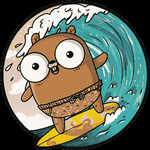

# GopherCon 2019 CFP OMG！

> 原文：<https://dev.to/arschles/gophercon-2019-cfp-omg-2h1c>

嘿地鼠们！

我想让你[提交一份提案](https://www.papercall.io/gophercon-2019)在 [GopherCon 2019](https://www.gophercon.com/home) 上演讲。

...我希望你们现在就开始，因为征集提案的截止日期是 1 月 31 日！

你说提交一份提案？让我们稍微谈一谈这个问题。

 
*冲浪地鼠插图归功于阿什利·麦克纳马拉，而地鼠则归功于蕾妮·弗伦奇*

# 但是我可以*永远不要*在 GopherCon 演讲！

是的，你可以。你在舞台上看到的那些“超级明星”？他们通过[和你一样的表格](https://www.papercall.io/gophercon-2019)提交会谈。你可以提交，你可以被接受。

事实上，我们喜欢新的扬声器。在所有条件都相同的情况下，我们倾向于更喜欢新来的人，而不是已经说过话的人。

# 但是我可能不会被录取:(

我们真的很想看看你的提议，但这是真的，你可能会被拒绝。我们在这个项目中得到的空间远远不止这些，不幸的是，我们不得不拒绝一些很棒的提议。但是，如果你没有被这个会议接受，也不是所有的东西都没了！

一个提议不是一劳永逸的，如果它没有被 GopherCon 2019 接受，它远不是浪费。我鼓励你把它作为其他会议的灵感。有成吨的其他人[只是为了去](https://github.com/golang/go/wiki/Conferences)一个人！

就我个人而言，我提交我被拒绝的提案- *而且有很多！* -其他会议，或将其作为新提案的灵感来源。

# 好的，我怎样才能让我的提议更好？

有很多文章都有写好提案的技巧和窍门。

与我同在今年项目委员会的@carolynvs -在她的帖子中为今年的[会议提供了一些很棒的建议。](https://carolynvanslyck.com/blog/2018/12/talk-at-gophercon/)

还有很多其他帖子是关于如何[写](https://medium.com/@fox/how-to-write-a-successful-conference-proposal-4461509d3e32) [伟大的](https://dave.cheney.net/2017/02/12/how-to-write-a-successful-conference-proposal) [提案](http://russolsen.com/articles/2012/06/21/acing-the-technical-talk-getting-your-proposal-through-the-door.html)。

写“完美”的提案没有简单的公式，但是 CFP 页面上的选择标准大致列出了我们想要的。我将为每一项添加一点细节。

## 【关联性】

我们寻找与 *Go* 相关的会谈。人们来到 GopherCon 学习围棋生态系统中的新东西，学习新技能，并普遍了解围棋和这个社区。

如果你正在写一份关于其他语言、技术或社区的提案，那么你就在正确的轨道上。

另一方面，如果你在写一份可以用另一种语言代替围棋的提案，它可能不会被接受。如果你正在写一份与编程或技术无关的提案，它几乎肯定不会被接受。

## 【清明】

告诉我们你已经想好了你想在演讲中说什么。我们希望看到清晰、详细的文字。我想特别强调这一部分。写下你打算谈论的一切。

只要是字迹清晰的，我们都想看。我个人很喜欢人们在提案中写一个粗略的谈话提纲。你可以在 CFP 的“注释”部分做这件事。

正如《CFP》杂志第、*页所说，从来没有提案因为太长而被否决*。

## 【正确性】

为了让我们接受你的提议，我们必须知道*你*知道你在说什么。所以告诉我们为什么！

很容易说服自己放弃提交，因为你觉得自己不是专家。我一直都这么做。

以下是每次帮助我克服这种感觉的方法:

我们不是在寻找专家，我们是在寻找经验。经历可以意味着很多事情。这里有两个对 GopherCon 同样有效和有价值的经验:

*   “编写一个可伸缩的系统，在一家大公司每秒处理 1，000，000 个请求”
*   “作为一名 Javascript 开发人员，我是如何学习围棋的”

所以，清楚地告诉我们你的经历是什么，以及它如何应用到你的演讲中。有时候，你的经历很容易在你的谈话描述中写出来，但是如果不适合，一定要在 CFP 的笔记和/或简历部分告诉我们。

## 【可实现性】

有时候我想在我的演讲中谈论所有的事情。我对一些技术非常感兴趣，以至于我想在一次演讲中谈论 3 或 4 件大事。但是这些提议从未被接受。

我在上面说过，我们寻求清晰和细节，这意味着**你的提议需要专注于一个特定的主题**。CFP 上的电梯推介部分要求你用 300 个字符或更少的篇幅告诉我们你将要谈论的内容，所以如果你不能在那个空间清楚地总结，那么这个演讲就太长了。

如果你的提议太宽泛，这是一个很好的机会把它分成多个不同的演讲！

## 【冲击】

这对我来说绝对是最重要的部分。告诉我们听众会从你的演讲中得到什么。一个好的提案通常会在描述的最后有如下内容:“观众会知道……”

此外，记住你不仅仅是告诉评论者听众将会得到什么，你也是在告诉*听众*他们为什么应该来听你的演讲。在你的演讲描述中，你在推销我们和观众。

# 就是这样！

如果你觉得有什么要谈的，我真的希望你提交一份提案。

今年我不能亲自帮助人们完成他们的计划，但是如果你需要帮助，请向地鼠俱乐部的人们寻求帮助。

祝你好运！！