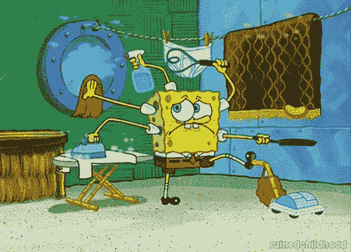

# SCSS 嵌套问题

> 原文：<https://dev.to/jackharner/scss-nesting-question-4p4e>

嗨，SCSS 的朋友们！我正在努力养成写更好的《清洁 SCSS》的习惯，我需要一些反馈。

[](https://i.giphy.com/media/3DnDRfZe2ubQc/giphy.gif)

给定以下(简化的)混合以在 SCSS 生成媒体查询:

```
@mixin breakpoint($point) {
    @if $point==desktop {
        @media (min-width: 70em) {
            @content ;
        }
    }
} 
```

Enter fullscreen mode Exit fullscreen mode

## 举例一

你会像这样嵌套父子选择器吗:

```
.parent {

    // Parent Mobile Styles

    .child {
        // Child Mobile Styles
    }

    @include breakpoint(desktop) {

        // Parent Desktop Stlyes

        .child {
            // Child Desktop Styles
        }
    }
} 
```

Enter fullscreen mode Exit fullscreen mode

## 例子 B

或者像这样:

```
.parent {
    // Parent Mobile Styles

    @include breakpoint(desktop) {
        // Parent Desktop Styles 
    }

    .child {
        // Child Mobile Styles

        @include breakpoint(desktop) {
            // Parent Desktop Styles
        }
    }
} 
```

Enter fullscreen mode Exit fullscreen mode

或者完全不同的东西？我的一个问题是，我需要选择一种方式来处理媒体的询问，并坚持下去。有什么建议吗？