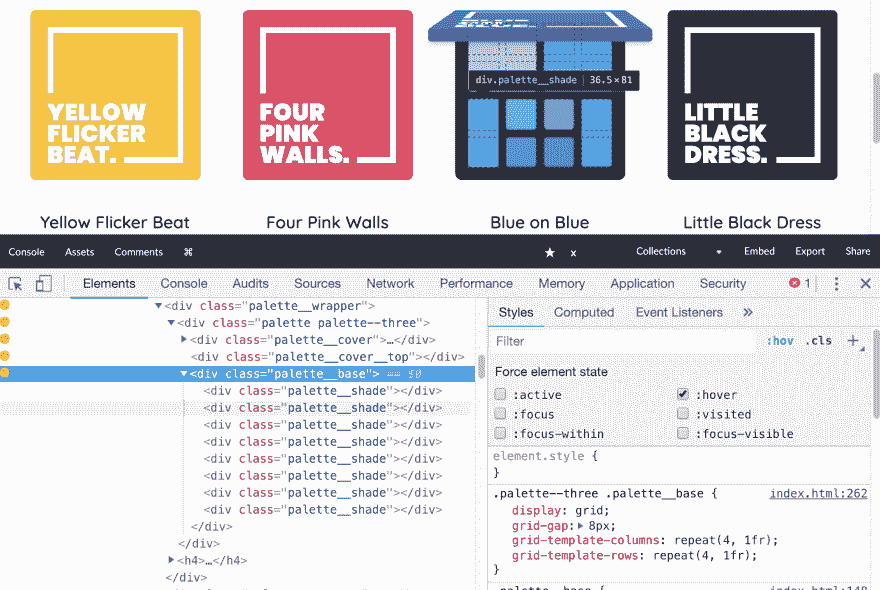

# 来自 CodePen 的一些非常聪明的布局笔

> 原文：<https://dev.to/chriscoyier/some-incredibly-clever-layout-pens-from-codepen-with-bonus-twists-34l1>

## 尼古拉斯·恩格勒的子弹杂志

CSS 网格使得这个日历，一个完美的简单用例！但是赋予不同元素倾斜的变换真的赋予了它生命。

[https://codepen.io/nicolasjengler/embed/yGxaEW?height=600&default-tab=result&embed-version=2](https://codepen.io/nicolasjengler/embed/yGxaEW?height=600&default-tab=result&embed-version=2)

喜欢那种被标记的细胞外观。你看看，都是有重复渐变的 CSS:

```
.cell.x {
  background-image: 
    repeating-linear-gradient(
      -45deg, 
      transparent, transparent 3px, 
      #e53a40 3px, #e53a40 6px
    );
} 
```

## 艾琳·e·沙利文的书的版面

您可能会认为您必须手动将内容切割成两个不同的元素，以形成这样的并排布局，从而保持内容流。但是没有！Erin 在这里使用了 [CSS 列](https://css-tricks.com/guide-responsive-friendly-css-columns/),因此浏览器会自然地进行拆分和流动。

你可能想跳到[整页视图](https://codepen.io/erinesullivan/full/gxdbzp)来看看这个:

[https://codepen.io/erinesullivan/embed/gxdbzp?height=600&default-tab=result&embed-version=2](https://codepen.io/erinesullivan/embed/gxdbzp?height=600&default-tab=result&embed-version=2)

这里甚至还有更多巧妙的地方，包括所有手写风格的下划线、高亮和 stet。这是一个背景数据 URL SVG，使下划线发生！

```
.open-book a {
    background: url(data:image/svg+xml;base64,PD94bWwgdmVyc2lvbj0iMS4wIiBlbmNvZGluZz0idXRmLTgiP…gsNDMuOCw0MzIuNCw0Ni41LDQzMC45LDQ5LjJ6Ii8+DQoJCTwvZz4NCgk8L2c+DQo8L3N2Zz4=) bottom repeat-x;
} 
```

## 卢克·杰克逊的 Flexbox 砖石

除了灵活，flexbox 可以设置在多个方向，可以包装。将所有这些想法整合在一起可以产生有趣的灵活布局，如下所示:

[https://codepen.io/lukejacksonn/embed/QyPPmK?height=600&default-tab=result&embed-version=2](https://codepen.io/lukejacksonn/embed/QyPPmK?height=600&default-tab=result&embed-version=2)

其中最酷的一点是，那些原本为空的 flex 元素通过在它们的视图框中包含 SVG 元素来保持它们的纵横比:

```
<div></div>
<div></div> 
```

通常情况下，Masonry 处理的是看起来像交错的垂直列，但是内容通常仍然是从左到右排列的。砖石图书馆在这方面仍然做得很好:

[https://codepen.io/marcobiedermann/embed/oYvoQL?height=600&default-tab=result&embed-version=2](https://codepen.io/marcobiedermann/embed/oYvoQL?height=600&default-tab=result&embed-version=2)

### 奥利维亚的化妆调色板

你知道 flexbox 和 grid 可以很好地合作，对吗？任何网格单元都可以成为 flex 容器。但是反过来也一样，一个 flex 项目可以变成一个网格容器！这正是这里正在发生的事情:

[https://codepen.io/oliviale/embed/bOWqbj?height=600&default-tab=result&embed-version=2](https://codepen.io/oliviale/embed/bOWqbj?height=600&default-tab=result&embed-version=2)

这里的整体布局是 flexbox，但是单独的彩色部分(巧妙地利用 3D 变换打开)下面有一个网格布局。另外，每一个都有一个稍微不同的网格设置，这是一个美妙的触摸。

[](https://res.cloudinary.com/practicaldev/image/fetch/s--7t9SPRma--/c_limit%2Cf_auto%2Cfl_progressive%2Cq_auto%2Cw_880/https://thepracticaldev.s3.amazonaws.com/i/s2r5067bzqfc4mju5l3p.png)

## 环顾四周！

我自己也曾尝试[复制杂志版面](https://codepen.io/chriscoyier/pen/mewZzy)只是为了好玩。有[很多值得探索的地方](https://codepen.io/search/pens?q=layout&page=1&order=popularity&depth=everything&show_forks=on)！