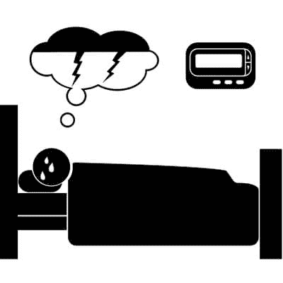

# 随叫随到的噩梦播客-第 5 集-科尔顿安德鲁斯-格雷姆林

> 原文：<https://dev.to/jaydestro/on-call-nightmares-podcast---episode-5---kolton-andrus---gremlin--j0c>

## 随叫随到噩梦播客-第 5 集-科尔顿·安德鲁斯-小妖精

恐惧，混乱和痛苦

 [# 第 5 集-科尔顿安德鲁斯-格里姆林公司](/oncallnightmares/episode--5--kolton-andrus--gremlin-inc)  [## 随叫随到的噩梦](/oncallnightmares)   

<audio id="audio" data-episode="episode--5--kolton-andrus--gremlin-inc" data-podcast="oncallnightmares"><source src="https://oncallnightmares.podomatic.com/enclosure/2019-01-10T07_28_49-08_00.mp3" type="audio/mpeg"> Your browser does not support the audio element.</audio>

           <input type="range" name="points" id="volumeslider" value="50" min="0" max="100" data-show-value="true">      1x  initializing... × 

克里斯托弗·诺兰蝙蝠侠系列电影中的常见主题，尤其是小丑出现的时候。我们如何实时避免恐惧、混乱和痛苦的时刻？通过为此做准备。今天我们采访了 Gremlin 公司的创始人兼首席执行官 Kolton Andrus。

科尔顿是 Gremlin 的联合创始人兼首席执行官。此前，他是网飞的一名混沌工程师，负责提高流媒体可靠性和运营 Edge 服务。他设计并建立了 F.I.T .，网飞的失败注入服务。此前，他改善了亚马逊零售网站的性能和可靠性。在这两家公司，他都担任过“呼叫负责人”，管理公司范围内事件的解决。

gremlin . com
Twitter:@ gremline