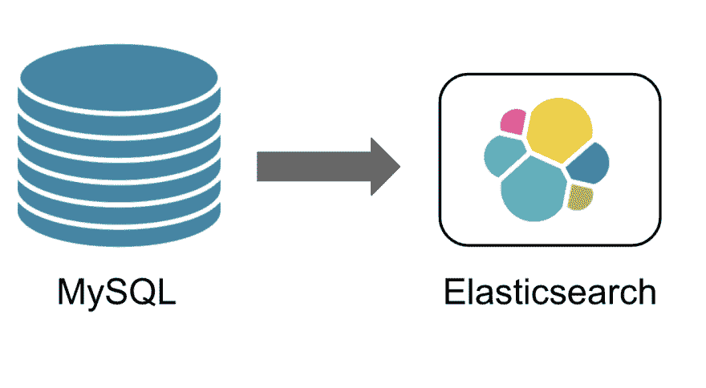
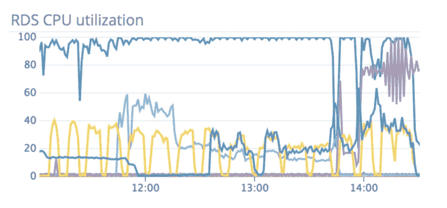
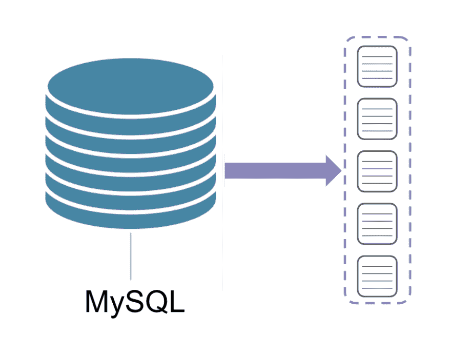
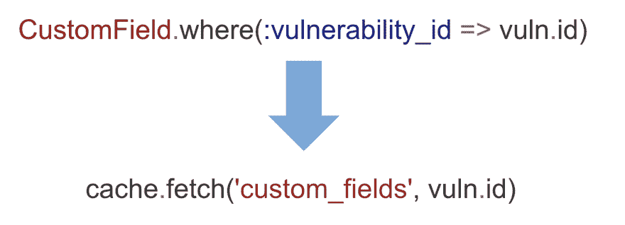
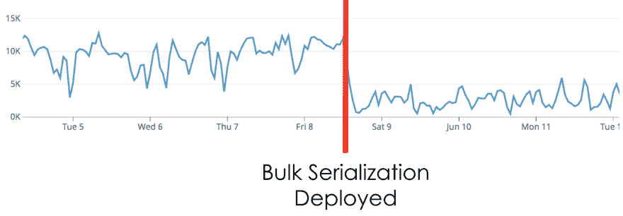
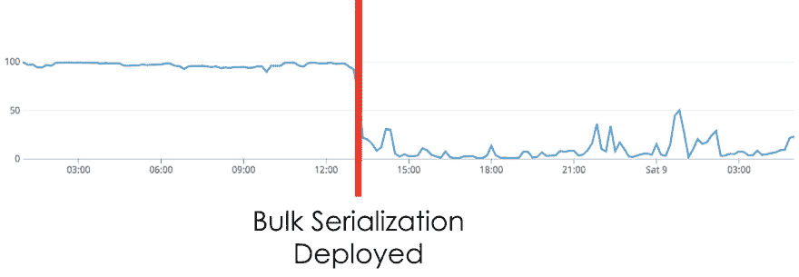

# 批量处理数据以减少数据库命中并提高性能

> 原文：<https://dev.to/molly/bulk-process-data-to-decrease-database-hits-and-boost-performance-1d07>

当被要求加快数据处理速度时，作为站点可靠性工程师，我们通常做的第一件事就是深入缓慢的查询优化。然而，有时这还不够。这就是我们在肯纳的情况。尽管优化了我们所有的慢速查询，我们仍然不能足够快地处理数据。此外，我们的 MySQL 数据库经常在 CPU 上达到极限。这太糟糕了，甚至连简单的请求都很困难。在我深入细节之前，我想先给你一些关于 Kenna 的背景，这样你就有了这个故事的背景。

### 肯纳安全

Kenna 帮助财富 500 强企业管理其网络安全风险。一般公司有 6 万资产。资产基本上是任何有 IP 地址的东西。一般的公司也有 2400 万个漏洞。漏洞就是你可以黑掉一项资产。有了这些数据，公司很难知道他们需要首先关注和解决什么问题。这就是肯纳的用武之地。在肯纳，我们获取所有的数据，并通过我们专有的算法进行运算。这些算法然后告诉我们的客户哪些漏洞对他们的基础设施构成最大的风险，以便他们知道他们需要首先修复什么。

我们最初将所有这些数据存储在 MySQL 中，这是我们的真实来源。从那里，我们将资产和漏洞数据索引到[弹性搜索](https://www.elastic.co/products/elasticsearch)中。

[](https://res.cloudinary.com/practicaldev/image/fetch/s--MVeoIeaA--/c_limit%2Cf_auto%2Cfl_progressive%2Cq_auto%2Cw_880/https://thepracticaldev.s3.amazonaws.com/i/9xmvs6beft38mb4z6pik.png)

为了将所有这些资产和漏洞索引到 Elasticsearch 中，我们必须将它们序列化，这正是我在这篇文章中想要讨论的，序列化！特别是，我想把重点放在漏洞的序列化上，因为这是我们在 Kenna 做得最多的事情。

### 序列化漏洞

当我们第一次开始为 Elasticsearch 序列化漏洞时，我们是使用 [`ActiveModelSerializers`](https://github.com/rails-api/active_model_serializers) 来完成的。`ActiveModelSerializers`直接挂钩到您的 ActiveRecord 模型中，这样您所要做的就是定义您想要序列化的方法，剩下的事情就交给它了。

```
module Serializers
  class Vulnerability < ActiveModel::Serializer
    attributes :id, :client_id, :created_at, :updated_at,
                    :priority, :details, :notes, :asset_id,
                    :solution_id, :owner_id, :ticket_id
  end
end 
```

Enter fullscreen mode Exit fullscreen mode

它非常简单，这就是为什么它是我们的第一个解决方案。然而，当我们开始每天序列化超过 2 亿个漏洞时，它就成了一个不太好的解决方案。我们的漏洞数据不断变化，我们必须确保它在 MySQL 和 Elasticsearch 之间保持同步，这就是为什么我们必须进行如此多的序列化。随着我们序列化的漏洞数量的增加，我们序列化它们的速度急剧下降。很快，我们就跟不上数据变化的速度了！

此外，我们的数据库开始在 CPU 上达到极限。

[](https://res.cloudinary.com/practicaldev/image/fetch/s--9IUZVyYd--/c_limit%2Cf_auto%2Cfl_progressive%2Cq_auto%2Cw_880/https://thepracticaldev.s3.amazonaws.com/i/5ir2wh0wubrzwlk6rb5n.png)

Slack 中这张截图的标题是“11 个小时，还在继续”。我们的数据库实际上一直在着火！一些人看到这个图表的第一反应可能是说，为什么不加强你的硬件呢？不幸的是，在这一点上，我们已经在运行 AWS 所能提供的最大的 RDS 实例，所以这不是一个选项。当我和我的团队看到这个图表时，我们认为其中一定有一个可怕的 MySQL 查询。所以我们去了，寻找那个难以捉摸的可怕的查询。

[](https://res.cloudinary.com/practicaldev/image/fetch/s--VFj1GX-J--/c_limit%2Cf_auto%2Cfl_progressive%2Cq_66%2Cw_880/https://thepracticaldev.s3.amazonaws.com/i/wanphqfdf74ivoa4ko8z.gif)

但是我们从来没有发现任何可怕的、长时间运行的查询，因为它们不存在。相反，我们发现大量快速的毫秒级查询反复执行。所有这些查询都快如闪电，但是我们一次做这么多查询，数据库已经超负荷了。我们立即开始尝试找出如何序列化所有这些漏洞，并减少数据库调用。如果我们将所有的漏洞组合在一起，通过一个单独的调用一次获取所有的数据，而不是单独调用来获取每个漏洞的数据，那会怎么样？

[](https://res.cloudinary.com/practicaldev/image/fetch/s--m9gY70j---/c_limit%2Cf_auto%2Cfl_progressive%2Cq_auto%2Cw_880/https://thepracticaldev.s3.amazonaws.com/i/kvtbrms156mzm6wgfdwx.png)

批量序列化的概念由此而来。

### 批量序列化

为了实现这一点，我们从一个缓存类开始，它负责获取一组漏洞和一个客户端，并立即在 MySQL 中查找所有相关数据。

```
class BulkVulnerabilityCache
  attr_accessor :vulnerabilities, :client, :vulnerability_ids

  def initialize(vulns, client)
    self.vulnerabilities = vulns
    self.vulnerability_ids = vulns.map(&:id)
    self.client = client
  end   

  # MySQL Lookups
end 
```

Enter fullscreen mode Exit fullscreen mode

然后，我们将这个缓存类传递给我们的漏洞序列化程序，它仍然具有序列化每个字段所需的所有格式化逻辑。

```
module Serializers
  class Vulnerability
    attr_accessor :vulnerability, :cache

    def initialize(vuln, bulk_cache)
      self.cache = bulk_cache
      self.vulnerability = vuln
    end
  end
end 
```

Enter fullscreen mode Exit fullscreen mode

除了现在，串行化器将从缓存而不是数据库中获取数据**。让我们看一个例子。在我们的应用程序中，漏洞有一个称为自定义字段的相关模型。** 

```
class Vulnerability
  has_many :custom_fields
end 
```

Enter fullscreen mode Exit fullscreen mode

以前，当我们序列化自定义字段时，我们必须与数据库对话。现在，我们可以简单地从缓存中读取。

[](https://res.cloudinary.com/practicaldev/image/fetch/s--72MCaDS5--/c_limit%2Cf_auto%2Cfl_progressive%2Cq_auto%2Cw_880/https://thepracticaldev.s3.amazonaws.com/i/5wenwyt0r3a54s1on96s.png)

### 结果

这一改变的回报是巨大的！首先，序列化漏洞的时间大幅减少。单独序列化 300 个漏洞只需 6 秒多一点。

```
(pry)> vulns = Vulnerability.limit(300);                                                           
(pry)> Benchmark.realtime { vulns.each(&:serialize) }                                                                                                                          
=> 6.022452222998254 
```

Enter fullscreen mode Exit fullscreen mode

通常，当数据库达到极限时，需要更长的时间。如果我们批量序列化完全相同的 300 个漏洞...

```
(pry)> Benchmark.realtime do                                                           
>    BulkVulnerability.new(vulns, [], client).serialize                                              
> end                                                                                          
=> 0.7267019419959979 
```

Enter fullscreen mode Exit fullscreen mode

不到一秒钟的时间！这些速度提升是**数据库点击率下降的直接结果**我们必须对漏洞进行序列化。

当我们逐个序列化这 300 个漏洞时，我们必须对数据库进行 2100 次调用。当我们批量序列化它们时，我们只需要对数据库进行 **7** 调用。您可能会从数学上推断出，每个漏洞有 7 个调用，或者有 7 个调用，但是同时有许多漏洞被组合在一起。在我们的例子中，我们以 1000 为一批对漏洞进行索引。这意味着我们将每批数据库请求的数量从 7k 减少到了 7。

在这个 MySQL 查询图中可以很容易地看到数据库请求的下降。该图显示了部署批量序列化更改前后发出的查询数量。

[](https://res.cloudinary.com/practicaldev/image/fetch/s--vln1NTzL--/c_limit%2Cf_auto%2Cfl_progressive%2Cq_auto%2Cw_880/https://thepracticaldev.s3.amazonaws.com/i/d8axqmq9df06j9mnrvc9.png)

随着查询的大幅减少，数据库负载也大幅下降，这可以在 RDS CPU 利用率图中看到。

[](https://res.cloudinary.com/practicaldev/image/fetch/s--E3XZTyJl--/c_limit%2Cf_auto%2Cfl_progressive%2Cq_auto%2Cw_880/https://thepracticaldev.s3.amazonaws.com/i/21etbrhxf8s9oajohxgj.png)

### 吸取教训

这个故事的寓意是，当您处理大量数据时，请尝试找到批量处理这些数据的方法。我们这样做是为了序列化，但同样的概念也适用于您发现自己在以逐个方式处理数据的任何时候。退一步，问问你自己，我能一起处理所有这些数据吗？因为对 1000 个 id 的一次数据库调用总是比 1000 次单独的数据库调用快。

*如果你对使用 Ruby checkout 防止数据库命中的其他方法感兴趣，我的[缓存为王](http://confreaks.tv/videos/rubyconf2018-cache-is-king-get-the-most-bang-for-your-buck-from-ruby)来自 RubyConf 的演讲启发了这篇文章。*