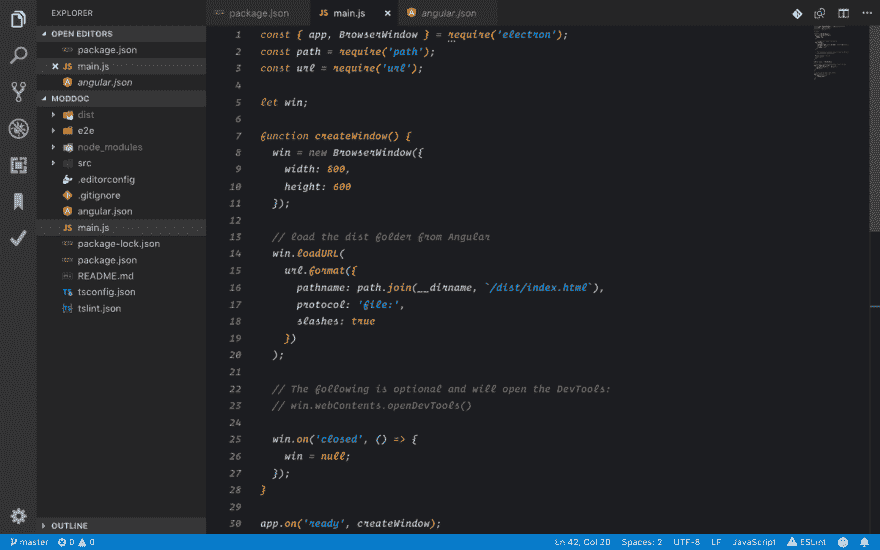
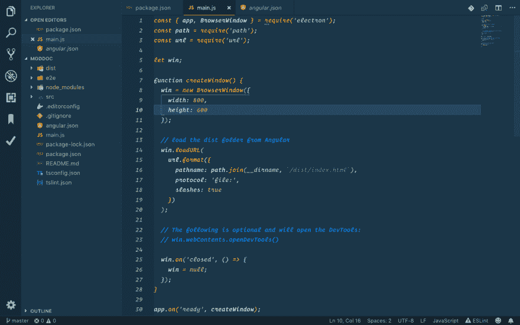
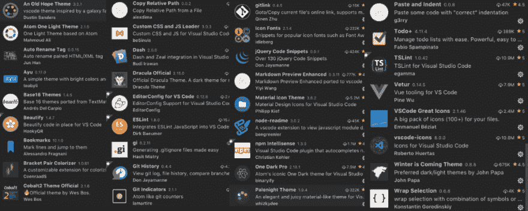
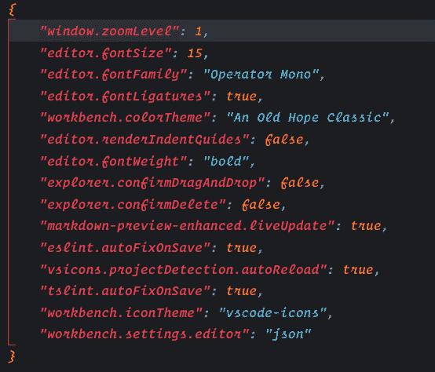

# 展示你的文本编辑器👨🏻‍💻

> 原文：<https://dev.to/xenoxdev/show-off-your-text-editor--4mkd>

或 IDE

上周我们让[展示了你的待办事项清单](https://dev.to/sarthology/show-off-your-todo-list---566d)。本周，让我们通过展示我们的文本编辑器和 IDE 来相互启发。

只需将以下格式复制并粘贴到您的评论中:

#### 截图:

**主题偏好 1:** *一部古老的希望经典*

**主题偏好 2:** *钴 2*

#### 插件:

我使用的其他主题和扩展列表。

#### 用户设置:

*查看字体和其他用户设置*

#### 其他提示(如果有的话):

*   查看[这篇](https://dev.to/teamxenox/pro-tips-for-visual-studio-code-to-be-productive-in-2018--1jek)帖子。

## 走吧

伙计们，让我们开始吧。去吧去吧！！

