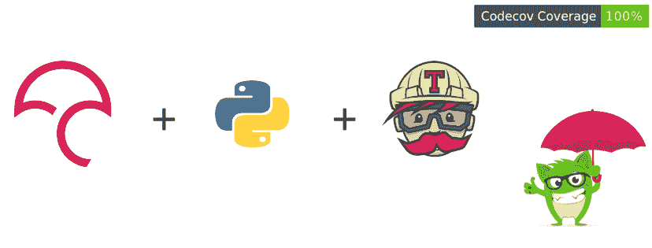

# 将 Codecov 与 Travis-CI 一起使用(pytest-cov)

> 原文：<https://dev.to/j0nimost/using-codecov-with-travis-ci-pytest-cov-1dfj>

[](https://res.cloudinary.com/practicaldev/image/fetch/s--3Cug3Wvd--/c_limit%2Cf_auto%2Cfl_progressive%2Cq_auto%2Cw_880/https://thepracticaldev.s3.amazonaws.com/i/alcgc4o0744xkykkv2x4.png)

[持续集成](https://www.atlassian.com/continuous-delivery/continuous-integration)为确保高质量代码的发布带来了极大的便利。让开发人员的生活变得更容易，但它并没有就此结束，测试只是更大图景的一部分。我们还需要捕获测试覆盖率，我们希望通过确保我们的测试满足最小阈值来评估我们代码的质量。为此我们求助于 [pytest-cov](https://pypi.org/project/pytest-cov/) 。
因为我们已经为 python 项目设置了 [Travis-CI](https://travis-ci.org/) ，所以让我们添加 CodeCov 以确保我们从`.travis.yml`生成覆盖报告。将 Github 连接到 Codecov 就像[用我们的 Github 帐户注册](https://codecov.io/)一样简单。

我们现在可以在本地机器上安装 pytest-cov，只需运行`pip install pytest-cov pytest`然后添加 codecov 工具`pip install codecov`。
生成一个新的需求文件，简单地运行`pip freeze > requirements.txt`

之后，我们打开您的`.travis.yml`文件并添加

```
 install:
    - pip install -r requirements.txt

   script:
    - py.test  --cov-report term --cov=app/test/

   env:
    - CODECOV_TOKEN=<token>#IF ONLY YOU HAVE A PRIVATE REPOSITORY

   after_success:
    - codecov 
```

在你推送你的`root` (app)目录中的所有内容之前，运行这个
`py.test --cov-report term --cov=app/test/`，如果成功，你应该会看到一个新的`.coverage`文件。将它们全部添加到您的 git 存储库中，然后推送。搞定了。！！