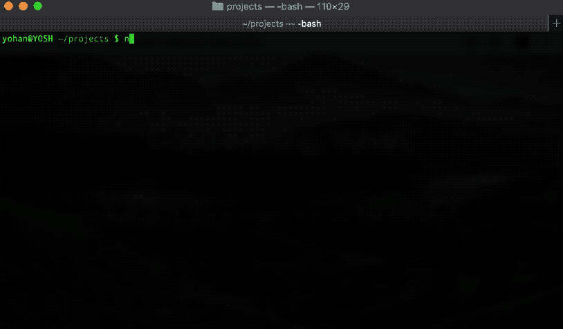

# 使用 Packer CLI 像专业人员一样构建节点模块

> 原文：<https://dev.to/yohangz/build-node-modules-like-a-pro-with-packer-cli-1cj8>

Packer CLI 帮助您启动符合 NodeJS 和 Browser 的新节点模块项目，提供最佳实践。Packer 封装了文件监视、实时重载、传输文件、捆绑和单元测试框架集成以及覆盖等等，所以你不需要这么做。您将享受到最新的 JavaScript 的强大功能，并可以灵活地定制以满足您的项目需求。

为了做到这一点，我们通过命令行提供了一个生成器生态系统，以完全控制所有公开的工作流来搭建完整的项目。

封隔器 CLI:[https://github.com/yohangz/packer-cli](https://github.com/yohangz/packer-cli)

🎯由卷起和吞咽提供动力
💡打字稿&巴别塔预处理
🎀启动反应库
💎支持萨斯，少，铁笔
🛡️Test 用 Jest，茉莉&摩卡

和更多的功能；阅读更多@ [使用 Packer CLI 像专业人员一样构建节点模块](https://medium.com/@yohan.gz/packer-cli-7f1aa05641f1)

