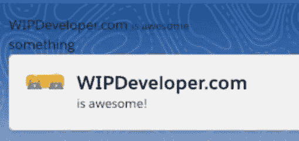
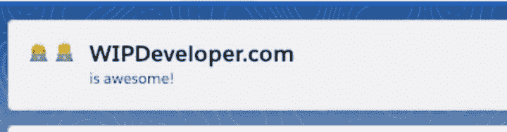

# LWC——第一眼——用闪电设计系统增添风格

> 原文：<https://dev.to/brettmn/lwc--first-look--adding-style-with-lightning-design-system-2gn>

[https://www.youtube.com/embed/uXQPax8ZXKA](https://www.youtube.com/embed/uXQPax8ZXKA)

你好，我是布雷特和 WIPDeveloper.com。上次我们创建了一个简单的 Lighting Web 组件，并将其部署到一个临时组织中。它看起来很简单，纯文本允许背景图像显示出来，所以很难看到。让我们使用 [Salesforce Lightning 设计系统](https://www.lightningdesignsystem.com/)为它添加一些样式。

## 挑选一些款式

在 lightningdesignsystem.com[可以获得](https://www.lightningdesignsystem.com/) [Salesforce Lightning 设计系统](https://www.lightningdesignsystem.com/) (SLDS)文档。我们不需要从那里下载任何东西，因为只要我们在 Salesforce Lightning 体验或 Salesforce 移动应用程序中使用它，所有样式都应该在我们的 Lighting Web 组件中可用。

因为我们的`firstComponent`类似于页面标题，所以让我们从 SLDS [页面基础标题](https://www.lightningdesignsystem.com/components/page-headers/)中获取代码样本。我将把它包括在下面，这样我就有参考了。

#### SLDS 基地页面页眉

```
<div class="slds-page-header">
  <div class="slds-page-header__row">
    <div class="slds-page-header__col-title">
      <div class="slds-media">
        <div class="slds-media__figure">
          <span
            class="slds-icon_container slds-icon-standard-opportunity"
            title="opportunity"
          >
            
              <use
                xmlns:xlink="http://www.w3.org/1999/xlink"
                xlink:href="/assets/icons/standard-sprite/svg/symbols.svg#opportunity"
              />
            
            <span class="slds-assistive-text">opportunity</span>
          </span>
        </div>
        <div class="slds-media__body">
          <div class="slds-page-header__name">
            <div class="slds-page-header__name-title">
              <h1>
                <span
                  class="slds-page-header__title slds-truncate"
                  title="Rohde Corp - 80,000 Widgets"
                  >Rohde Corp - 80,000 Widgets</span
                >
              </h1>
            </div>
          </div>
          <p class="slds-page-header__name-meta">
            Mark Jaeckal • Unlimited Customer • 11/13/15
          </p>
        </div>
      </div>
    </div>
  </div>
</div> 
```

我们可以将它粘贴到组件中。Visual Studio 代码会有 SVG 的`<use>`标签没有结束元素的问题，但我们将用 2 个表情符号来替换它，所以让我们删除 SVG 和 children 元素，并用女性技术专家和男性技术专家`👩‍💻 👨‍💻`来替换它。

在我们部署它之前，我要把现有的文本改成我希望它表达的意思，即 WIPDeveloper.com 太棒了！并移除以前的标记。完成的标记应该像这样。

#### 更新`firstComponent` HTML 中的页眉

```
<template>
  <div class="slds-page-header">
    <div class="slds-page-header__row">
      <div class="slds-page-header__col-title">
        <div class="slds-media">
          <div class="slds-media__figure">
            <span class="slds-icon_container slds-icon-standard-opportunity" title="WIPDeveloper.com">
              👩‍💻 👨‍💻<span class="slds-assistive-text">WIPDeveloper.com</span>
            </span>
          </div>
          <div class="slds-media__body">
            <div class="slds-page-header__name">
              <div class="slds-page-header__name-title">
                <h1>
                  <span
                    class="slds-page-header__title slds-truncate"
                    title="WIPDeveloper.com"
                    >WIPDeveloper.com</span
                  >
                </h1>
              </div>
            </div>
            <p class="slds-page-header__name-meta">is awesome!</p>
          </div>
        </div>
      </div>
    </div>
  </div>
</template> 
```

现在让我们部署它，看看所有的样式都在我们的页面中正确呈现。

<figure>[](https://res.cloudinary.com/practicaldev/image/fetch/s--mY0Hm2mq--/c_limit%2Cf_auto%2Cfl_progressive%2Cq_auto%2Cw_880/https://i2.wp.com/wipdeveloper.com/wp-content/uploads/2019/01/Screen-Shot-2019-01-12-at-9.49.19-AM.png%3Fw%3D1100%26ssl%3D1) 

<figcaption>`firstCompoent`带 SLDS 页眉标记</figcaption>

</figure>

如果你注意到表情符号周围的黄色/橙色背景，那是因为我忘了从包裹图标的范围中移除`slds-icon-standard-opportunity`类。拆下`slds-icon-standard-opportunity`，重新部署并再次检查。

<figure>[](https://res.cloudinary.com/practicaldev/image/fetch/s--KJXjCECw--/c_limit%2Cf_auto%2Cfl_progressive%2Cq_auto%2Cw_880/https://i1.wp.com/wipdeveloper.com/wp-content/uploads/2019/01/Screen-Shot-2019-01-12-at-8.11.38-PM.png%3Fw%3D1100%26ssl%3D1) 

<figcaption>`firstComponent`完成！
</figcaption>

</figure>

目前看起来不错。下一次，我们应该考虑使用一些 CSS 来获得一些个人风格。

## 链接

*   [页眉](https://www.lightningdesignsystem.com/components/page-headers/)–[sales force Lightning 设计系统](https://www.lightningdesignsystem.com/)
*    [女技师](https://emojipedia.org/female-technologist/)
*    [男技师](https://emojipedia.org/male-technologist/)

## 现在就这样。

记得报名参加 **[每周一次的单口相声！你可以得到我们关于 WIPDeveloper.com 的任何最新信息。](https://wipdeveloper.com/newsletter/)**

WIPDeveloper.com上最先出现了[LWC——第一眼——用闪电设计系统添加风格](https://wipdeveloper.com/lwc-first-look-adding-style-with-lightning-design-system/)的帖子。