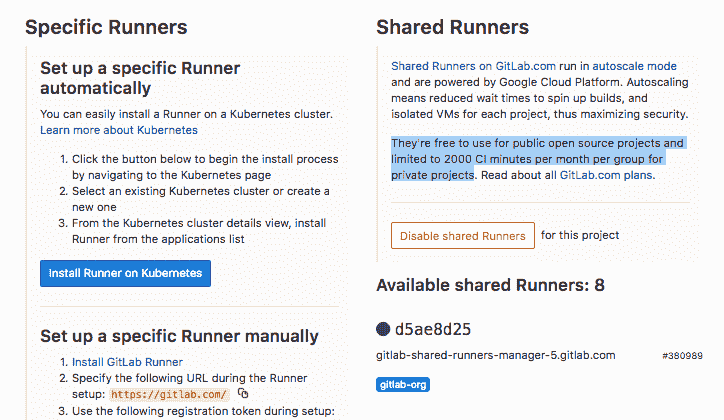
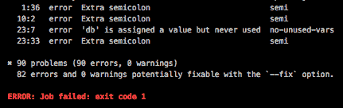
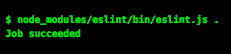

# Gitlab CI/CD: Eslint 入门

> 原文：<https://dev.to/karltaylor/getting-started-with-gitlab-cicd-eslint-1m80>

启动并运行 Gitlab 的持续集成不到 10 分钟(取决于您想做什么，YMMV)我将向您展示如何:

首先，我只想设置一个简单的任务，在我们的代码上运行`eslint`。幸运的是，我们已经成功了一半。

> 从 8.0 版本开始，GitLab 持续集成(CI)完全集成到 GitLab 本身中，并且在所有项目上默认启用。

如果你前往 Gitlab 中的一个项目，点击**设置**和**CD/CD**(【https://gitlab.com/{username}/{project}/settings/ci_cd】T4)你会看到**跑步者**的下拉列表。您应该会看到两列。**特定流道**和**共享流道**。厉害！(什么都不用做)。

[](https://res.cloudinary.com/practicaldev/image/fetch/s--jYCdDMXL--/c_limit%2Cf_auto%2Cfl_progressive%2Cq_auto%2Cw_880/https://thepracticaldev.s3.amazonaws.com/i/9byh5332zm8zbt8ni9b4.png)

## 跑步者

你应该有一些共享的跑步者。共享跑步者可以免费用于公共开源项目，对于私人项目，每个组每月限制 2000 CI 分钟。

运行者是运行在`.gitlab-ci.yml`中指定的作业的虚拟机。这个文件将告诉跑步者做什么工作。

```
# At the root of your repository, add the .gitlab-ci.yml file.
$ touch .gitlab-ci.yml 
```

运行者使用 [docker](https://www.docker.com/) 来拉一个`image`并在一个容器中运行我们的应用程序，所以我们需要告诉它要拉什么映像，要安装什么东西，要运行什么脚本。

因为我在使用 node，所以我们想从 Docker
中提取那个[图像](https://hub.docker.com/_/node/)

```
# We're pulling and installing node into our virtual container, neat!
image: node 
```

现在我们要加一个`stage`。阶段告诉跑步者何时运行什么功能。例如，你可能有`build`、`test`和`deploy`阶段。阶段可以有多个作业。

```
image: node

stage:
 # I just want to lint, so I will create a "lint" stage
 - lint

# Lets name our Job eslint, because that's what it's doing.
eslint:
 # tell eslint what stage it is. (This could also be build or test for example)
 stage: lint
 # What scripts do we want to run?
 script:
    # install eslint
    - npm i eslint
    # Run eslint
    - node_modules/eslint/bin/eslint.js . 
```

提交`.gitlab-ci.yml`并将其推送到 gitlab！

前往`https://gitlab.com/{username}/{project}/-/jobs`查看您的工作。

假设你有一些 eslint 错误，你的工作就会失败——哇哦！

[](https://res.cloudinary.com/practicaldev/image/fetch/s--bqPQfXIS--/c_limit%2Cf_auto%2Cfl_progressive%2Cq_auto%2Cw_880/https://thepracticaldev.s3.amazonaws.com/i/bx6m849ec4c28k6g61sa.png)
[T6】](https://res.cloudinary.com/practicaldev/image/fetch/s--jWFKs_8p--/c_limit%2Cf_auto%2Cfl_progressive%2Cq_auto%2Cw_880/https://thepracticaldev.s3.amazonaws.com/i/f5rep0a669na7vhn5pns.png)

[](https://res.cloudinary.com/practicaldev/image/fetch/s--UulisSJr--/c_limit%2Cf_auto%2Cfl_progressive%2Cq_66%2Cw_880/https://media2.giphy.com/media/5VKbvrjxpVJCM/giphy.gif%3Fcid%3D3640f6095c36689c3370327963701ff7)

### 但是我有插件，还有预置！

您可以简单地将它们安装在`npm i eslint`语句旁边。

如果你有多个，你可以用一个反斜杠`\`把它移到新的一行，作为一个**多行命令**T3】

```
image: node

stages:
  - lint

eslint:
  stage: lint
  script:
    # Install eslint
    - |
      npm install eslint \
      eslint-config-airbnb \
      eslint-config-prettier \
      eslint-plugin-flowtype \ # Any ideas on what I might want to do next?
      eslint-plugin-import \
      eslint-plugin-jsx-a11y \
      eslint-plugin-prettier \
      eslint-plugin-react
    # Run eslint
    - node_modules/eslint/bin/eslint.js . 
```

现在去消除你所有的 eslint 错误，你就可以通过管道了！

[](https://res.cloudinary.com/practicaldev/image/fetch/s--vsWyjFws--/c_limit%2Cf_auto%2Cfl_progressive%2Cq_auto%2Cw_880/https://thepracticaldev.s3.amazonaws.com/i/5s9oin61bmuswpz9fifd.png)
[T6】](https://res.cloudinary.com/practicaldev/image/fetch/s--aBxf64HY--/c_limit%2Cf_auto%2Cfl_progressive%2Cq_auto%2Cw_880/https://thepracticaldev.s3.amazonaws.com/i/d8c13yl6lne4wihgsrd7.png)