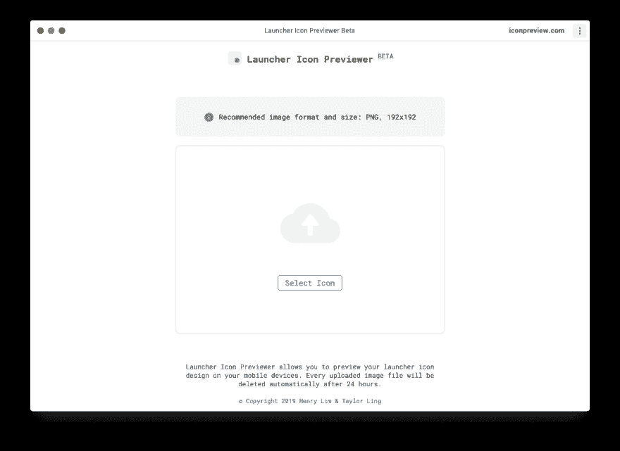
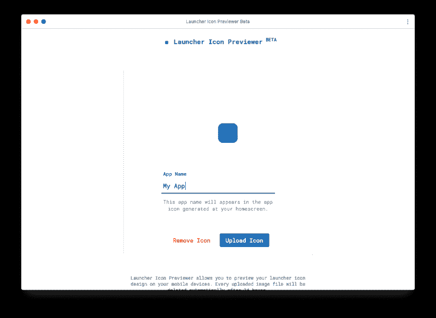
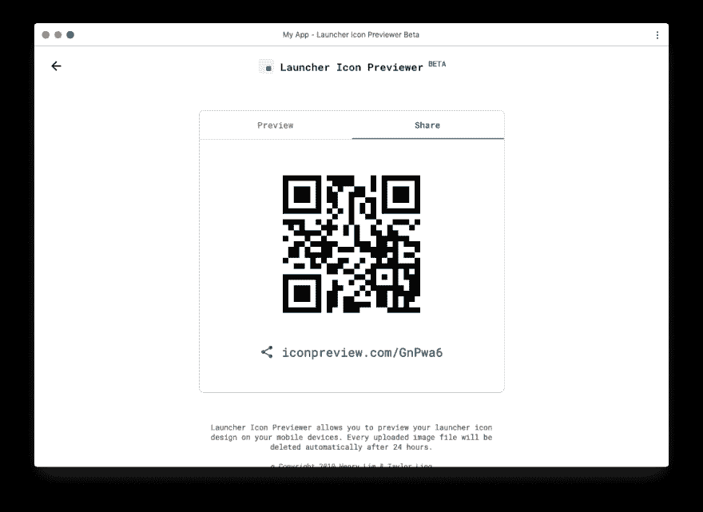
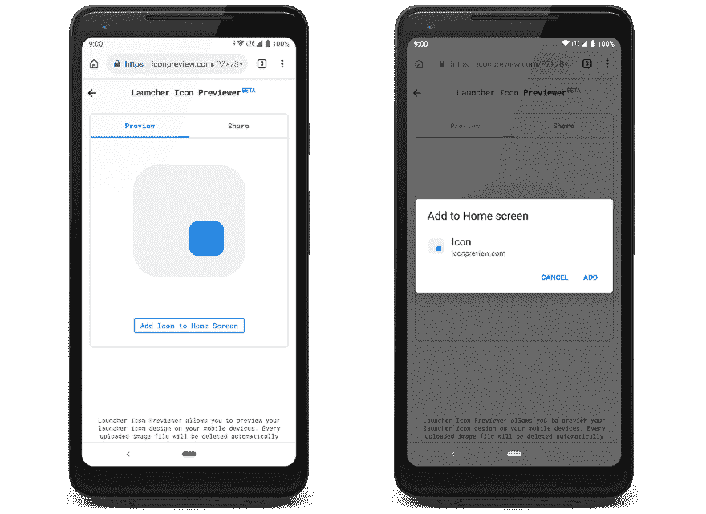

# 在你的设备上预览你的应用程序图标设计

> 原文：<https://dev.to/henrylim96/meet-launcher-icon-previewer---preview-your-app-icon-design-on-yourdevice-4m97>

需要一个更简单的方法来测试你的启动器图标设计在一个真实的家庭设备上吗？

遇见 **[启动器图标预览器](https://icon.limhenry.xyz/)** ，启动器图标预览器允许你在你的移动设备上预览你的启动器图标设计。

**现在就试试:[https://icon.limhenry.xyz/](https://icon.limhenry.xyz/)T3】**

* * *

以下是如何使用启动器图标预览器:

### 步骤 1:转到 icon.limhenry.xyz

首先，导航到 [icon.limhenry.xyz](https://icon.limhenry.xyz) ，选择你的启动器图标。我们建议您上传一个图像分辨率为`192px × 192px`的 PNG 文件。

之后，您将可以选择设置应用程序名称(可以留空)。

完成后，只需点击**上传图标**按钮。

### 第二步:在移动设备上打开链接

现在，该工具会显示一个二维码和一个链接。在移动设备上使用 Chrome 或 Safari(如果您使用的是 iOS)打开链接。

### 第三步:添加到主屏幕

如果你在 Android 上使用 Chrome，一个蓝色的**添加到主屏幕**按钮应该会出现在屏幕上。点击蓝色按钮，屏幕上将显示**添加到主屏幕对话框**。点击**添加**将图标添加到您的主屏幕。

如果蓝色的**添加到主屏幕**按钮没有出现在屏幕上，您可以点击浏览器菜单中的**添加到主屏幕**选项。

如果你在 iOS 上使用 Safari，点击屏幕底部的**框和箭头图标**，然后点击**添加到主屏幕**。

现在，你应该可以在主屏幕上看到应用程序图标了！

* * *

启动器图标预览器目前处于测试阶段。请告诉我们如何改进。

现在就试试:[https://icon.limhenry.xyz/](https://icon.limhenry.xyz/)

* * *

想支持这个项目？你可以在这里捐款！