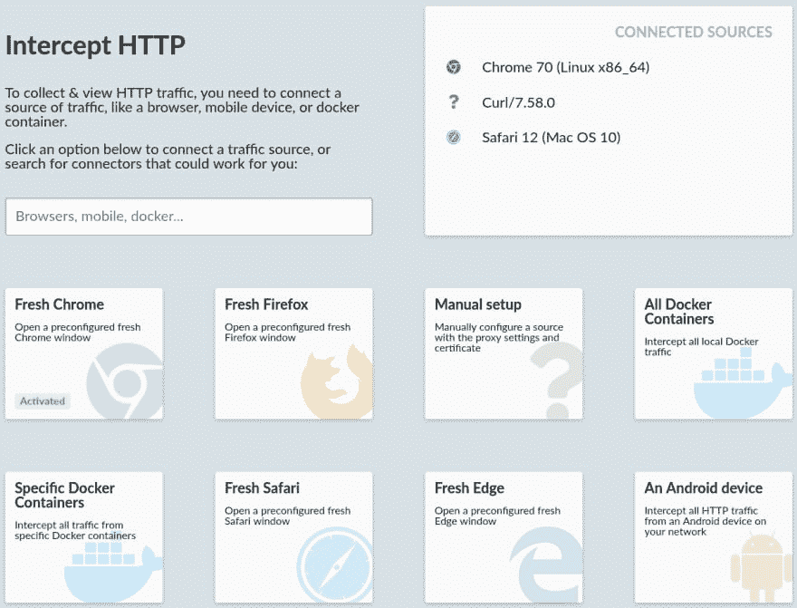
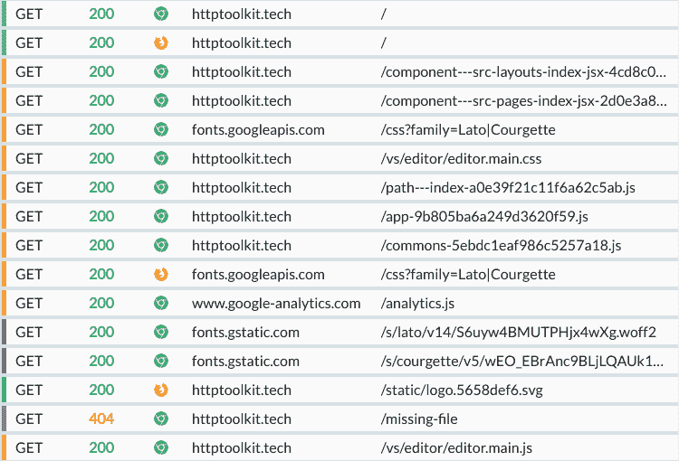
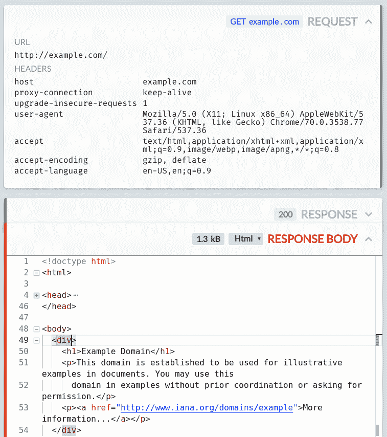

# 宣布 HTTP 视图:HTTP 的一键调试

> 原文：<https://dev.to/pimterry/announcing-http-view-one-click-debugging-for-https-o1h>

我很兴奋地宣布 HTTP View([HTTP Toolkit](https://httptoolkit.tech)的第一个版本)现已推出！

HTTP View 是一个免费的开源 HTTP inspector。HTTP 查看器让您只需一次点击就可以拦截 HTTP 或 HTTPS 流量，近距离浏览和检查该流量，并准确发现您的代码(或任何其他人的代码)正在发送的内容。

想一头扎进去吗？[现在下载](https://httptoolkit.tech/view)。

HTTP Toolkit 是我从事了一段时间的一个项目，旨在为 HTTP 开发构建一套开源工具。目标是拦截和检查 HTTP，实时编辑它，分析 HTTP 请求流以审计性能和安全性，并快速原型化 HTTP 客户端或服务器。

您可能熟悉 Fiddler 或 Charles——这是一个类似的概念，但是做了进一步的改进，与更新的工具和技术紧密集成。

这第一个版本包括核心技术和只读部分的全套工作特性，更多的功能将很快推出。到目前为止包括的一些功能:

## 零设置捕捉 HTTP & HTTPS

HTTP View 可以在大量平台上对 HTTP 和 HTTPS 进行自动免提拦截，从 Chrome 到 iOS 到 Docker，很快会有更多平台推出。

对于任何没有自动集成的平台，它只是充当一个 HTTP(S)代理，所以它可以与几乎所有现成的 HTTP 客户端兼容。

## 快速浏览&搜索 HTTP 流量

HTTP 交换按内容类型、状态和来源自动突出显示，因此您可以浏览请求流，并轻松发现问题。您也可以搜索完整的请求和响应 URL、状态和标题，以快速找到您正在寻找的消息。

## 深入 HTTP 交流

如果您选择一个特定的请求，您可以仔细检查完整的 URL、状态、标题和正文，以准确理解发送的内容。

您还可以探索请求和响应主体的细节，内置编辑器高亮显示和自动格式化 JavaScript、JSON、所有流行的图像格式、HTML、hex 等。

所有的身体检查都是使用 Monaco 构建的，Monaco 是 Visual Studio 代码中的编辑器，因此它具有内置 VS 代码的所有功能。

* * *

听起来有趣吗？太好了！你现在可以从 httptoolkit.tech/view 下载。

有反馈？下面让我知道！