# 使用 IBM Cloud 上的 Sysdig 进行日常监控

> 原文：<https://dev.to/vidyasagarmsc/knative-monitoring-with-sysdig-on-ibm-cloud-5245>

在学习了如何[在 IBM Cloud](https://dev.to/vidyasagarmsc/install-knative-with-istio-on-ibm-cloud-2fd9) 上部署一个应用程序到 Knative 以及如何使用 LogDNA 进行 [Knative 日志分析之后，是时候使用 IBM Cloud Monitoring with sys dig service 来监控我们的 Knative Kubernetes 集群了。](https://dev.to/vidyasagarmsc/knative-log-analysis-with-logdna-on-ibm-cloud-34ag)

带有 Sysdig 的 IBM Cloud Monitoring 是一个第三方云原生的容器智能管理系统，您可以将其作为 IBM Cloud 架构的一部分。

> 使用它来了解您的应用、服务和平台的性能和运行状况。它为管理员、DevOps 团队和开发人员提供了全栈遥测技术，具有监控和故障排除、定义警报和设计定制仪表板的高级功能。使用 Sysdig 的 IBM 云监控是由 Sysdig 与 IBM 合作运营的。

### 预配一个 Sysdig 实例

> 在提供服务之前，[管理用户访问](https://cloud.ibm.com/docs/services/Monitoring-with-Sysdig/index.html#step1)

有了在 IBM Cloud 上运行的 Knative node 应用程序，让我们提供一个 Sysdig 实例来开始监控应用程序。

*   导航到[可观察性仪表板](https://cloud.ibm.com/observe)，在概述>下点击“创建监控实例”。
*   给出一个服务名称，选择一个地区/位置(美国南部)，选择一个资源组，然后根据您的需求选择一个合适的计划。
*   点击**创建**来提供实例。

### 配置 Sysdig 代理

预配实例后，必须为要监视的每个度量源配置一个 Sysdig 代理。度量源是您想要监视和控制其性能和健康状况的云资源。在我们的例子中，度量源是一个 Kubernetes 集群。

[](https://res.cloudinary.com/practicaldev/image/fetch/s--0fvpSJQ7--/c_limit%2Cf_auto%2Cfl_progressive%2Cq_auto%2Cw_880/https://cdn-images-1.medium.com/max/1024/1%2ATp9L9xGydrC-SD7lsGbKcw.png)

要配置，

*   在 observability dashboard 上的 monitoring 下，单击上一步中刚刚创建的 Sysdig 实例旁边的 **Edit sources** 。
*   单击左侧窗格中的 Kubernetes，因为您已经设置了 KUBECONFIG，所以可以跳到“将 Sysdig 代理安装到您的集群”步骤。
*   运行类似下面的命令*(使用您的 sysdig 访问密钥)*

```
curl -sL https://raw.githubusercontent.com/draios/sysdig-cloud-scripts/master/agent_deploy/IBMCloud-Kubernetes-Service/install-agent-k8s.sh | bash -s -- -a **<ACCESS_KEY>** -c ingest.us-south.monitoring.cloud.ibm.com -ac 'sysdig_capture_enabled: false' 
```

> 或者，您可以按照此处的说明[手动部署 Sysdig 代理。](https://cloud.ibm.com/docs/services/Monitoring-with-Sysdig/config_agent.html#kube_manually)

[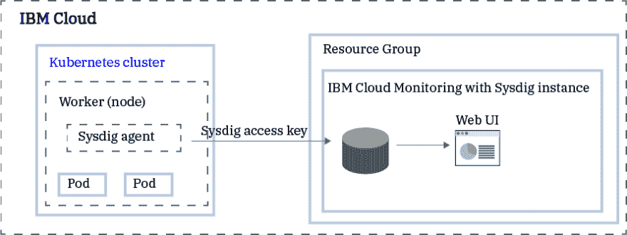](https://res.cloudinary.com/practicaldev/image/fetch/s--xwsyWrwy--/c_limit%2Cf_auto%2Cfl_progressive%2Cq_auto%2Cw_880/https://cdn-images-1.medium.com/max/891/1%2AbokInzlndbLxoptWP0PAMQ.png)

*   要确认在集群中的每个工作节点上成功创建 Sysdig 代理，请运行以下命令

```
kubectl get pods -n ibm-observe 
```

[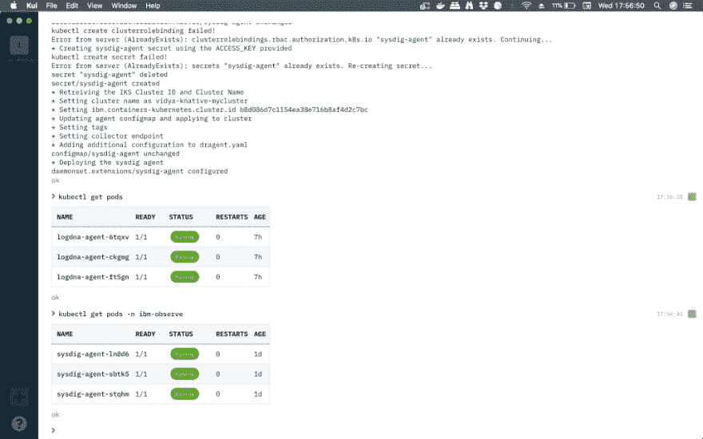](https://res.cloudinary.com/practicaldev/image/fetch/s--MoG9VSum--/c_limit%2Cf_auto%2Cfl_progressive%2Cq_auto%2Cw_880/https://cdn-images-1.medium.com/max/1024/1%2A7PiwKbZ3YB4X9Dbfa-vfeQ.png)

### 监控你的集群

让我们监控 Kubernetes 集群在 Knative 上运行您的应用程序。为此，点击**查看 Sysdig** ，您应该会看到 Sysdig 监控向导。

*   在欢迎页面上，单击**下一步。**
*   在设置环境下选择 **Kubernetes** 作为您的安装方法。

[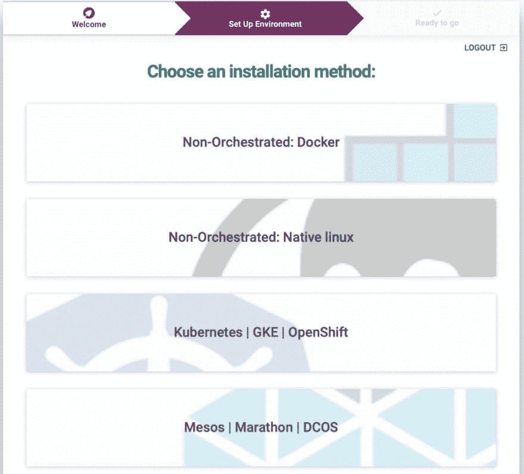](https://res.cloudinary.com/practicaldev/image/fetch/s--_t5wKTe6--/c_limit%2Cf_auto%2Cfl_progressive%2Cq_auto%2Cw_880/https://cdn-images-1.medium.com/max/1024/1%2ANqgp2OdZjv3d3SToDBX2Ug.png)

*   一旦连接了节点，就可以开始了。将扫描您的群集的基础架构和集成。

[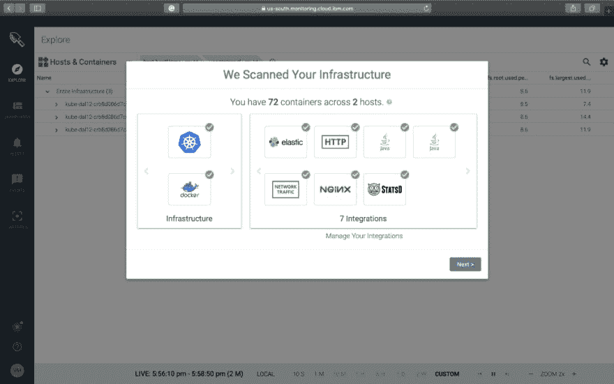](https://res.cloudinary.com/practicaldev/image/fetch/s--Gm1hZhPP--/c_limit%2Cf_auto%2Cfl_progressive%2Cq_auto%2Cw_880/https://cdn-images-1.medium.com/max/1024/1%2ArTOyTVo0PlK05_heru-1Jg.png)

*   您可以通过 Web UI 在 **EXPLORE** 视图中监控您的集群。此视图是对基础架构进行故障排除和监控的起点。它是用户的 Web UI 的默认主页。
*   在 EXPLORE 视图中，您可以看到集群中的所有命名空间，并通过一组信息检查各种仪表板和指标，包括节点、部署、pod、服务等的运行状况。,

[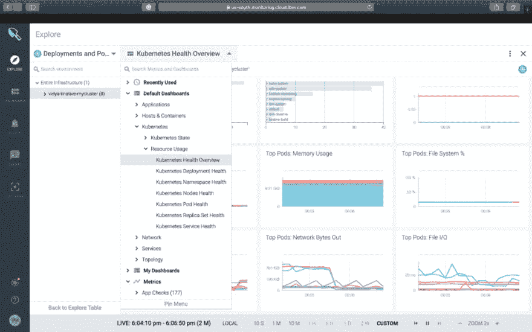](https://res.cloudinary.com/practicaldev/image/fetch/s--s0Cva9yD--/c_limit%2Cf_auto%2Cfl_progressive%2Cq_auto%2Cw_880/https://cdn-images-1.medium.com/max/1024/1%2ANQcQ_PiDqRyGYI919rYSXw.png)

[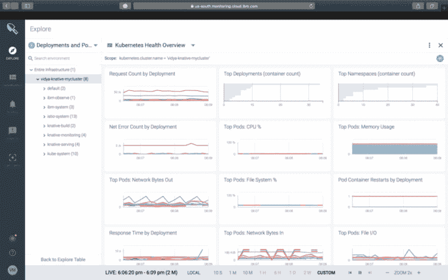](https://res.cloudinary.com/practicaldev/image/fetch/s--H8Wa3hup--/c_limit%2Cf_auto%2Cfl_progressive%2Cq_auto%2Cw_880/https://cdn-images-1.medium.com/max/1024/1%2AkfqbdpnlLzVZcPQp-A72qQ.png)

*   我们需要产生一些流量/负载，有许多开源库/工具可用。在这篇文章中，我们将使用[贝吉塔](https://github.com/tsenart/vegeta)，一个 HTTP 负载测试工具和库。也可以用[嘿](https://github.com/rakyll/hey)。
*   在生成负载之前，让我们快速检查一下在部署应用程序时是否正确设置了 IP_ADDRESS 和 HOST_URL。

```
echo $IP_ADDRESS

echo $HOST_URL 
```

安装[贝吉塔](https://github.com/tsenart/vegeta/releases)后，运行下面的命令

```
echo “GET [http://${IP_ADDRESS](http://%24%7BIP_ADDRESS)}" | vegeta attack -duration=300s -header “Host: ${HOST_URL}” | tee results.bin | vegeta report
 vegeta report -type=json results.bin > metrics.json
 cat results.bin | vegeta plot > plot.html
 cat results.bin | vegeta report -type=”hist[0,100ms,200ms,300ms]” 
```

你可以打开你运行过上面命令的文件夹中的*plot.html*文件来查看贝吉塔图

[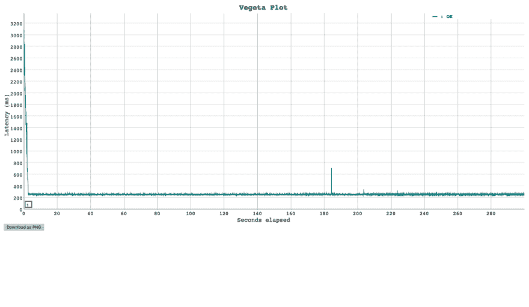](https://res.cloudinary.com/practicaldev/image/fetch/s--ObC_6ihO--/c_limit%2Cf_auto%2Cfl_progressive%2Cq_auto%2Cw_880/https://cdn-images-1.medium.com/max/1024/1%2AhJuS-5X0DGHwTc1mXvVj5Q.png)

一旦开始发送大量 HTTP 请求，就该检查仪表板了。

使用仪表板来监控您的基础架构、应用程序和服务。您可以使用预定义的仪表板。您还可以通过 Web UI 或以编程方式创建自定义仪表板。您可以使用 Python 脚本来备份和恢复仪表板。

> 一个**控制面板**显示多组指标，这些指标报告单个主机或一组主机的基础架构、应用程序和服务的运行状况、性能和状态。仪表板提供了对网络数据、应用程序数据、拓扑、服务、主机和容器的专业洞察。

*   单击左侧窗格上的**仪表板**，并选择我的共享仪表板下的 HTTP 概述。您应该会看到请求计数和其他指标。

[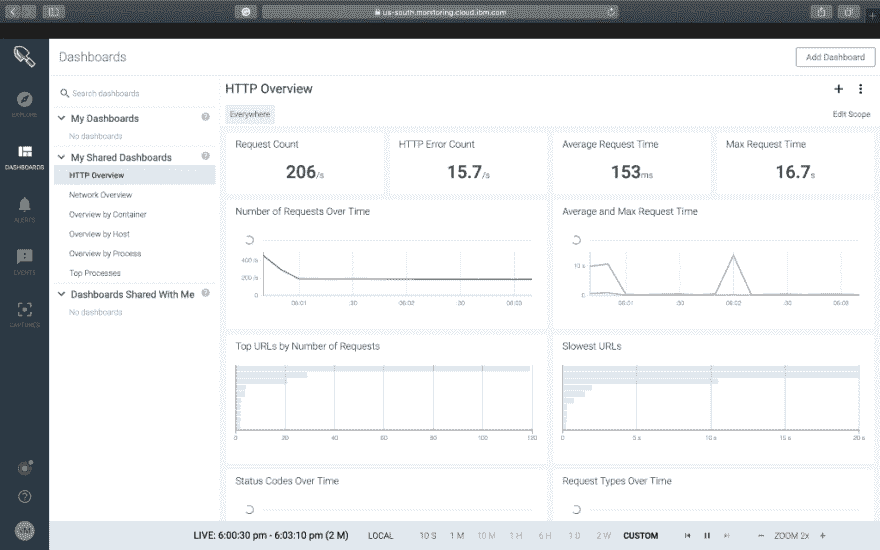](https://res.cloudinary.com/practicaldev/image/fetch/s--KEZqeioN--/c_limit%2Cf_auto%2Cfl_progressive%2Cq_auto%2Cw_880/https://cdn-images-1.medium.com/max/1024/1%2AtdPTFzUI8KJYf_ByLp_6Xw.png)

*   随意改变你想看的方式…

[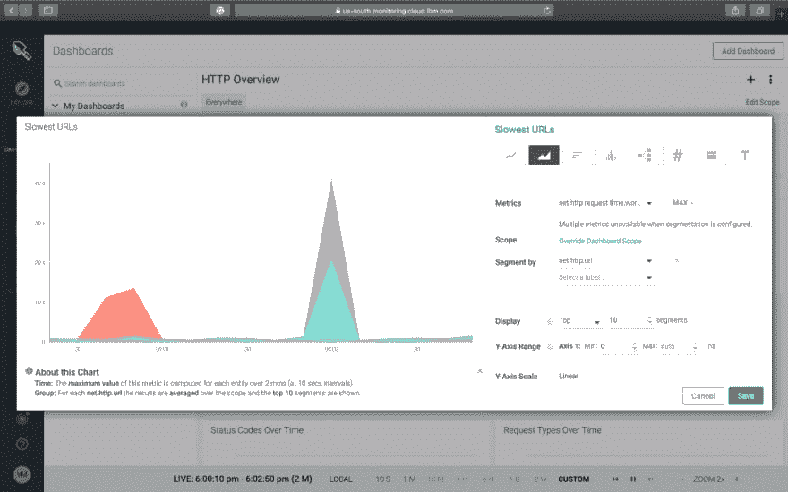](https://res.cloudinary.com/practicaldev/image/fetch/s--BKuqCVEP--/c_limit%2Cf_auto%2Cfl_progressive%2Cq_auto%2Cw_880/https://cdn-images-1.medium.com/max/1024/1%2AlZqnCawqF9sxB44Gwl-f_g.png)

*   这是按容器的概述

[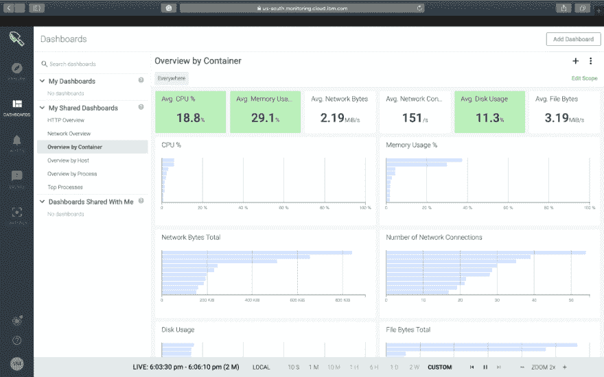](https://res.cloudinary.com/practicaldev/image/fetch/s--HjUND0MX--/c_limit%2Cf_auto%2Cfl_progressive%2Cq_auto%2Cw_880/https://cdn-images-1.medium.com/max/1024/1%2A27z1ugYu9TjhiRLjiGzCFg.png)

> 我们所看到的只是冰山一角，要深入挖掘仪表盘， [**阅读此**](https://cloud.ibm.com/docs/services/Monitoring-with-Sysdig/dashboards.html#dashboards)

您还可以了解警报。更多信息，请参见[使用警报](https://console.bluemix.net/docs/services/Monitoring-with-Sysdig/monitoring.html#alerts)。

### 动作中的自动缩放

让我们在 Sysdig 仪表板中实时检查 Knative 的自动缩放特性。在进行贝吉塔攻击之前，这是 Kubernetes 默认名称空间的部署状态。如果你仔细观察，你会发现没有活动节点应用程序舱。

> 荚数= 3 是 logdna 荚。

不要忘记在页面底部的实时面板上将刷新时间设置为 10 秒。

[](https://res.cloudinary.com/practicaldev/image/fetch/s--M-mjBZ_1--/c_limit%2Cf_auto%2Cfl_progressive%2Cq_auto%2Cw_880/https://cdn-images-1.medium.com/max/1024/1%2Al6KEm4m30b0isXqBdLNEEQ.png)

一旦我们让贝吉塔攻击持续 60 秒，这就是你将会看到的，一个新的**knative-node-app-00001-deployment**扩展到 3 个 pod 来处理并发请求。负载下降后，它将返回到

[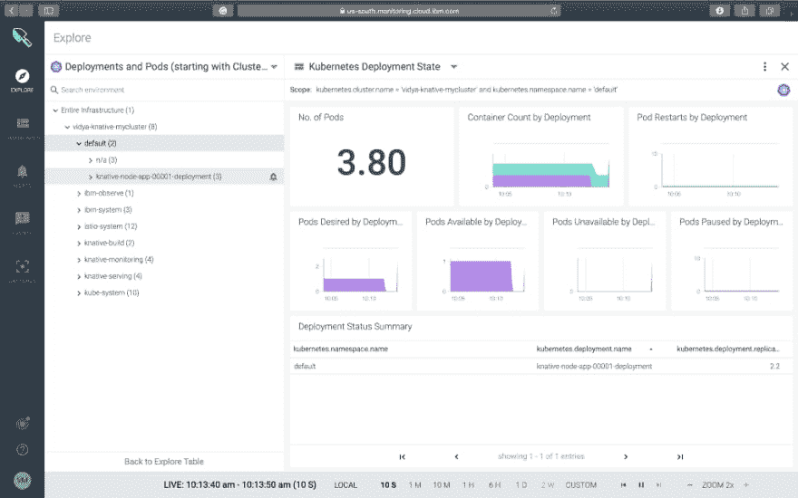](https://res.cloudinary.com/practicaldev/image/fetch/s--kwToBgo3--/c_limit%2Cf_auto%2Cfl_progressive%2Cq_auto%2Cw_880/https://cdn-images-1.medium.com/max/1024/1%2A98X7ShrWutNr7ndTJYF0RA.png)

**问题或顾虑？请不要犹豫，在推特上联系我:**[**vidyasargmsc**](https://twitter.com/VidyasagarMSC)

## 进一步阅读

*   [知识文档](https://github.com/knative/docs)
*   Knative [监控](https://medium.com/@VidyasagarMSC/knative-monitoring-with-grafana-zipkin-weavescope-other-plugins-30a2d8d20344)

* * *