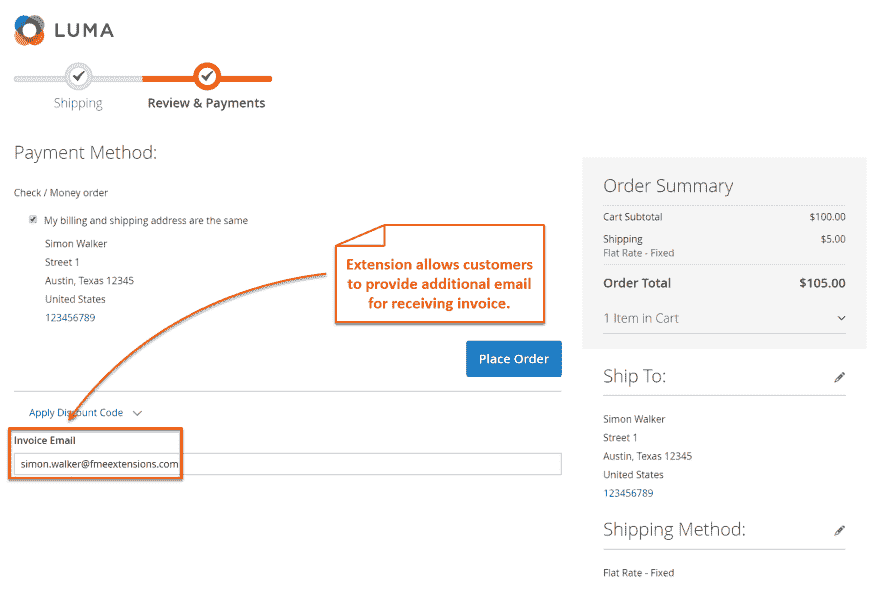
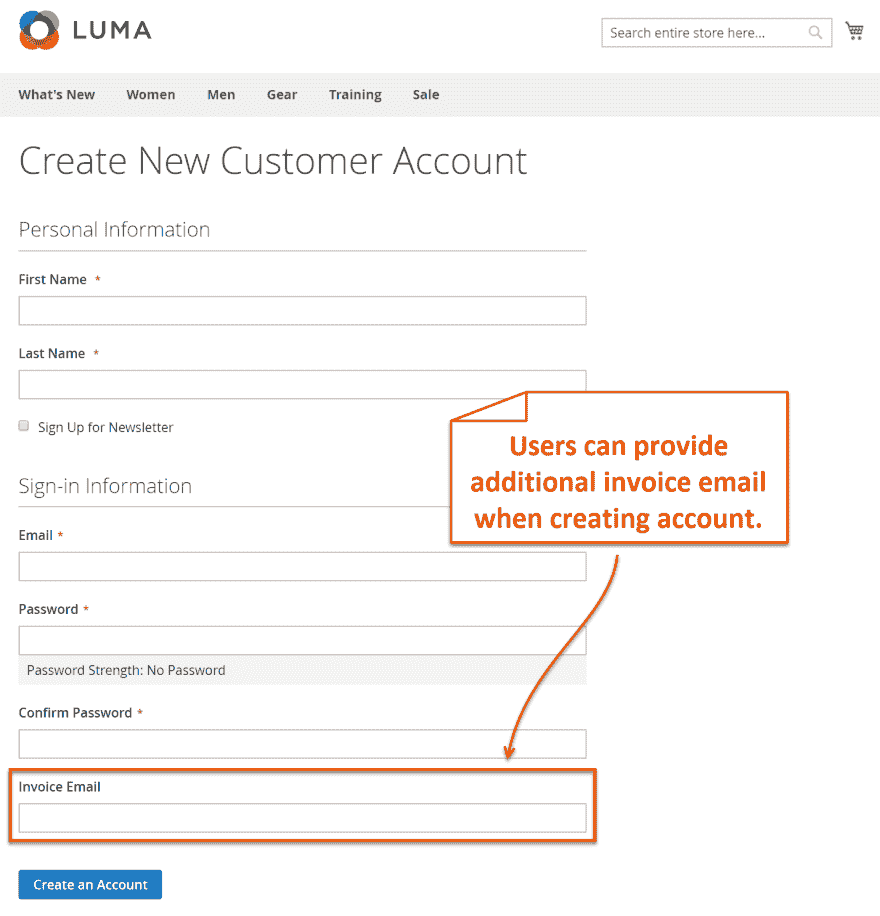
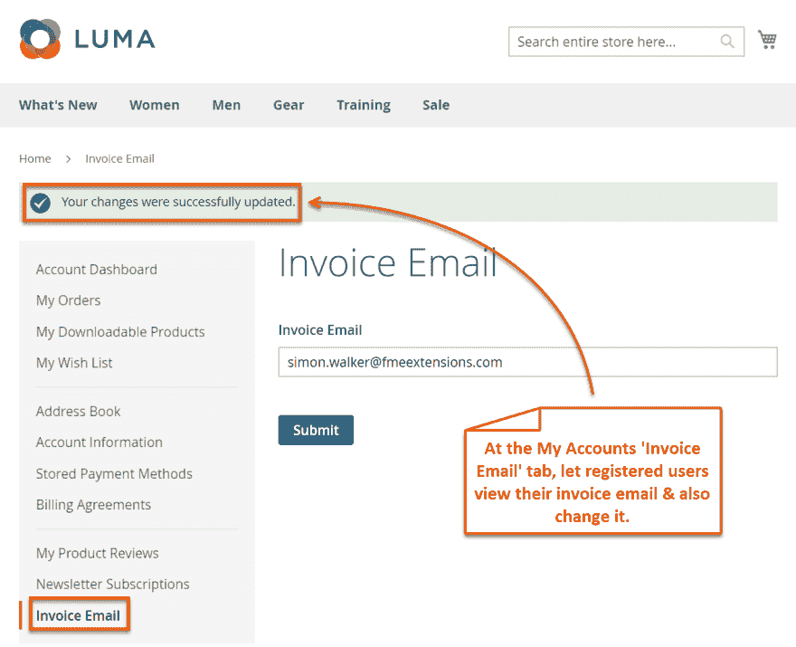
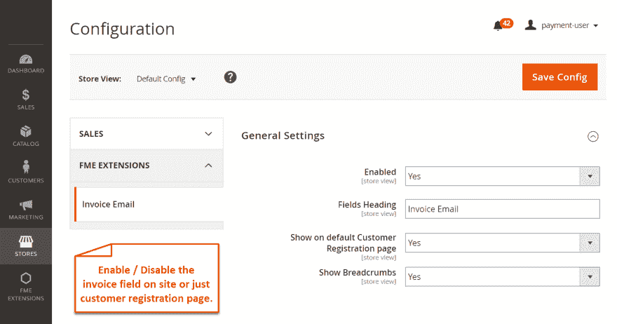

# Magento 2 发送发票电子邮件扩展

> 原文：<https://dev.to/simonwalkerfme/magento-2-send-invoice-email-extension-did>

使用 Magento 2 发送发票电子邮件扩展通过电子邮件发送发票副本。该扩展允许您在结帐过程中使用电子邮件发送发票副本。在注册表和结帐页面上提供发票字段的选项。发票电子邮件字段字段将只用于发送发票的副本。在客户提供发票电子邮件后，他们也可以更改其他发票的电子邮件。您也可以使用 Magento 2 发送发票电子邮件来编写发票电子邮件字段的标题。此扩展的升级和支持终身免费。

**主要特征**

在注册表上添加发送电子邮件发票字段
提供在结账步骤发送电子邮件发票的选项
让客户编辑和更新发送发票电子邮件
定制 Magenti 2 发送发票电子邮件字段的标题
免费终身升级并保证退款

**要探索更多功能，请访问: [Magento 2 发送发票电子邮件](https://www.fmeextensions.com/invoice-email-checkout-extension-magento-2.html)T3】**

**截图**

