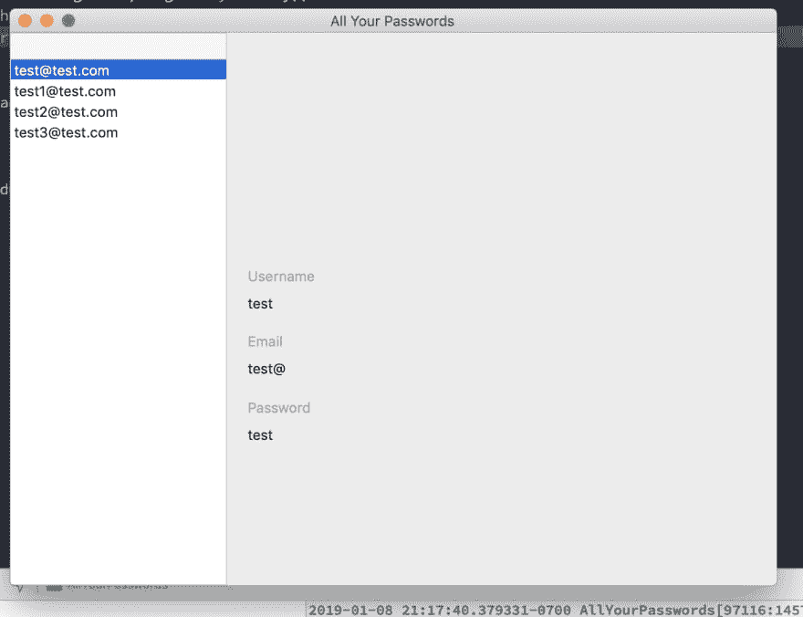
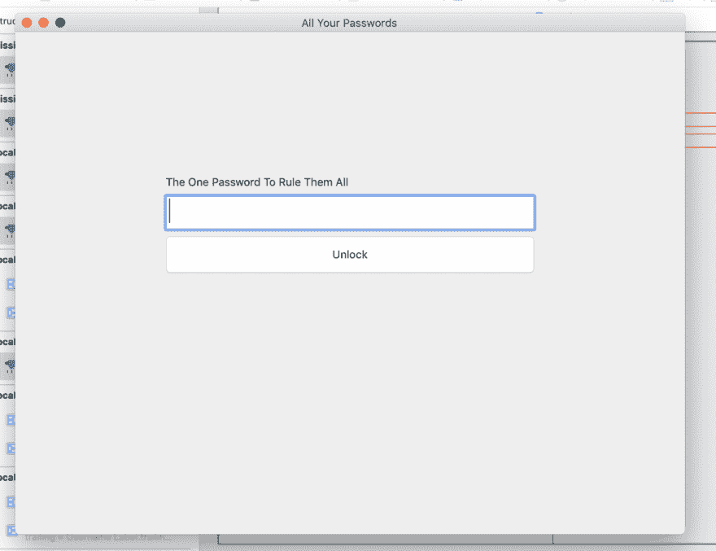

# 第八天:为讨厌云的人制作一个 swift MacOS 密码管理器

> 原文：<https://dev.to/swlkr/day-8-making-a-swift-macos-password-manager-for-people-who-hate-the-cloud-39j3>

📅2019 年 1 月 8 日
🚀距离发布还有 22 天
🔥八日连胜
🤑0 美元娃娃毛
⌚️ 6.5 小时
💻17 个文件被更改，690 个插入(+)，171 个删除(-)
📈0 个客户
🏁今天的目标:在 tableview 中选择一行时显示密码细节

[<——去这里玩第 7 天](https://dev.to/swlkr/day-7-making-a-swift-macos-password-manager-for-people-who-hate-the-cloud-32bn)

当我有日常事务时，时间过得更快。我开始更关注完成我的目标，而不是无聊和注意周围的事情。这是以进步的名义进行的巨大交易。我注意到 dev.to 是时区敌对的，并且显示随机的发布日期(大概是 UTC ),甚至当我设法达到每日目标时。从 1 月 1 日开始每天都是。所以我要开始把日子和日期放在第一位。

### 上午 8 点 45 分

看黑客新闻，煮咖啡，吃昨天剩下的油炸圈饼，想想密码管理器。幸运的是仍然有相当多的唾手可得的果实，今天的目标:在选择表格视图中的一行时显示密码细节，但是首先，必须工作一整天，因为信不信由你，在互联网上赚钱是非常困难的，而做一份全职工作要容易得多！修卡，我知道。

### 晚上 7 点 19 分

是时候开始了！首先，将容器视图更改为新的视图控制器，显示登录名、url、电子邮件、用户名和密码。

### 晚上 8 点 02 分

搞定了。让我们来看看这款 ux 大作
[](https://res.cloudinary.com/practicaldev/image/fetch/s--mAAOTGrD--/c_limit%2Cf_auto%2Cfl_progressive%2Cq_auto%2Cw_880/https://thepracticaldev.s3.amazonaws.com/i/p7arwj16uvjrnwm7m6s0.png) 

她在所有她开发者设计的荣耀里。

### 晚上九点零七分

我开始尝试从添加视图控制器返回到列表视图/显示视图，但到目前为止还没有运气。打算休息一会儿，和我的狗玩一会儿，也许安装我的巢恒温器。

### 晚上 9 点 19 分

我又回来了，但还是没有找到。我一定是做错了什么，以为容器视图不能从子视图中引用。

### 晚上 9 点 45 分

又休息了一会儿，但又回来了！终于知道如何从容器视图中改变视图控制器了！

```
 let query = login.table.order(login.id.desc)
        let row = try! db.pluck(query)

        let storyboard = NSStoryboard(name: NSStoryboard.Name("Main"), bundle: Bundle.main)
        let vc = storyboard.instantiateController(withIdentifier: "LoginViewController") as! LoginViewController
        vc.login = row

        let parentVC = self.parent as! PasswordListViewController

        parentVC.logins = Array(try! db.prepare(login.table))
        parentVC.tableView.reloadData()
        parentVC.tableView.selectRow(at: parentVC.logins?.count ?? 1 - 1)

        for sView in parentVC.containerView!.subviews {
            sView.removeFromSuperview()
        }

        addChild(vc)
        vc.view.frame = parentVC.containerView!.bounds
        parentVC.containerView!.addSubview(vc.view) 
```

Enter fullscreen mode Exit fullscreen mode

### 晚上十点零七分

再次回到这个问题上，这次我分心了，正在摆弄这个应用程序的“外观和感觉”，虽然它没有太多可看的，但我会让你来判断它迄今为止的外观和感觉(你可能需要给 gif 一点时间来加载)
 [](https://res.cloudinary.com/practicaldev/image/fetch/s--PKwd994a--/c_limit%2Cf_auto%2Cfl_progressive%2Cq_66%2Cw_880/https://thepracticaldev.s3.amazonaws.com/i/bvot281g0zn70pnraew9.gif)

就是这样，今晚肯定有相当多的工作，比往常更多，当然这是在看网飞，玩我的狗和一般只是生活之间混合的，但我会把今晚的大部分时间都花在应用程序上。

⌚️7.55 hours. Tick tock.