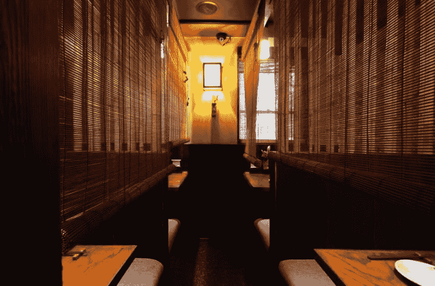

# Vue.js 是 omakase

> 原文：<https://dev.to/rossta/vuejs-is-omakase-aej>

我借用大卫·海涅梅尔·汉森的话。六年前，他写了 [Rails is omakase](https://dhh.dk//2012/rails-is-omakase.html) 来捕捉他关于什么是一个美味的软件框架的概念:它是由经验精心策划和承载的。我也是这么想 Vue.js 的。

以下是 DHH 邮报的摘录:

> 这个世界上有许多单点软件环境...我想把这个用于我的 ORM，我想把这个用于我的模板语言，让我们用这个路由库来完成它...这是一种非常流行的软件消费方式。Rails 不是那样的。Rails 是 omakase。一个厨师团队挑选了原料，设计了 API，并根据他们对美味全栈框架的想法，代表您安排了消费顺序。菜单可以是个性化的，也可以是古怪的。它不是为了迎合任何地方的任何人的口味而设计的。

我喜欢这个比喻，因为 a) Rails，包括它所有的 API 选择和包袱，在我的技术职业生涯中对我非常好，b)我喜欢一些 agedashi 豆腐。

这和 Vue 有什么关系？我相信 Vue 越来越受欢迎的部分原因是其高度选择性的维护者，并且推荐的成分，虽然不是每个人的口味，但非常适合大多数项目，无论大小。

### 享受多道菜的大餐

Vue 阐明了构成前端框架全套膳食的许多课程。如今，开发人员已经开始期待一个健壮的 API 来构建组件，以及一个基于虚拟 dom 的快速实现。然而 Vue.js 并不止于此。对于 Vue 开发者来说，这个框架和它的生态系统提供了足够的(如果不是优秀的)正交依赖实现，解决了许多重要应用最终需要的问题。

该产品包括 Vue 路由器、用于状态管理的 Vuex 和用于单元测试的 Vue 测试工具。通过 Vue CLI，开发人员还可以在 Webpack 配置中获得合理的默认值，用于热模块替换、代码分割、树抖动、高效的长期缓存，同时可以访问预先配置的 TypeScript、渐进式 Web 应用、ESLint 和多个测试运行程序的选择加入。

知道这些项目背后有 Vue 团队，并且它们在我的 Vue.js 应用程序中相互补充，这让我感到非常欣慰。

### 换人花费很少的额外费用

所以你可能不同意菜单上的所有东西。那也行！许多默认设置可以通过配置或附加组件轻松更改。想用 Redux？没问题！类风格的语法？顾客永远是对的。不喜欢模板里的小胡子式大括号？可以改！也许你根本无法忍受 Vue 有模板的事实，更倾向于使用 JavaScript。嗯，那也可以；添加另一个 [Babel 插件](https://github.com/vuejs/babel-plugin-transform-vue-jsx)，你就可以像 React 一样在渲染函数中使用 JSX 来编写 Vue 组件。

再举个例子，我们来说说 Webpack。我认为这是一款非常棒的软件。我花了几个月的时间学习它的工作原理。我已经给了[一个关于它的会议报告](https://rossta.net/talks/webpack-survival-guide-rails.html)。然而，通常，我们中的大多数人，包括我自己，当我们有最后期限要满足时，不希望从一个项目到另一个项目维护一个定制的配置。Vue CLI 的默认设置很好。还需要定制？Vue 提供了一个 API 来扩展基本配置，同时使升级变得更容易，以利用框架支持的改进。也没有什么能阻止你抛弃 Webpack，而选择 package 或 Rollup 或任何你喜欢的 transpiler 或 module bundler。

### 固执己见的厨师

核心团队在决定将哪些特性和改进纳入框架时始终表现出克制。例如，Vue 选择避免将组件的类语法作为默认，如 GitHub 上的[这个问题。这个决定有很好的理由，其中之一是 Vue 可以在没有构建环境的情况下工作。作为一个特性，这使得 Vue 非常容易启动和运行，对于学习框架的初学者或经验丰富的开发人员来说，可以尝试一个快速原型。“它会失败，”一些人说。我想这还有待观察，但经过几年的争论，该框架继续茁壮成长。](https://github.com/vuejs/vue/issues/2371)

### 给所有客户一致的体验

斯科特·莫利纳里对我之前的一篇帖子做了如下评论:

> 一旦掌握了 API 的用法，任何一个知道 Vue 的人基本上都在做同样的事情。这也意味着对最佳实践的需求保持在最低限度，这两个优势都意味着随着时间的推移认知负荷会减少。也就是说，当你钻研别人的组件时，你会很快理解它。这反过来意味着 Vue 代码更加健壮，最终质量更高。

这一点对于初学者和有经验的开发人员都非常重要。将库拼凑在一起的一个重要权衡是，过渡到新项目或大型代码库中不熟悉的部分会更加困难。这种方法对合适的团队可能会有回报。在大多数情况下，这些权衡对我来说是不值得的，因为我非常看重一致性。

* * *

当我已故的妻子和我住在纽约市的时候，我们最喜欢的餐馆是 Zenkichi。菜肴是日本啤酒店，但体验是如此之多。如果你去了布鲁克林的威廉斯堡社区，你应该试试。

它坐落在一个木质外墙的小建筑里，没有可辨别的标记。位于布鲁克林威廉斯堡的东河附近，从外面很容易错过。

内部是黑暗的，浪漫的，手工制作的。楼上的每一张桌子都像一个小的私人餐厅，有一个下拉的窗帘和一个小蜂鸣器来召唤服务员。

每次我们在那里吃饭，我们都选择 omakase 菜单。我们把所有的决策都交给了厨师。一开始很难相信别人的判断。放弃控制是不舒服的。然而，这导致了一些令人愉快的发现。当然，并不是所有的课程都合我们的口味。然而，我们喜欢这种体验。

* * *

在 web 开发中，厨师的菜单不需要为特殊场合保留。有了 Vue.js，我们有了一个框架，它给了我们构建优秀用户界面所需的所有要素。这也使得根据你的喜好更换菜单项变得相对容易。所以看起来你可以鱼与熊掌兼得？这是我觉得 Vue.js 如此令人满足的另一个原因。

你喜欢这个帖子吗？订阅我在[rossta.net](https://rossta.net)的时事通讯，我会给你发一封关于 vue . jsweb 开发的邮件

最初发表于[rossta.net](https://rossta.net/blog/vue-js-is-omakase.html)。