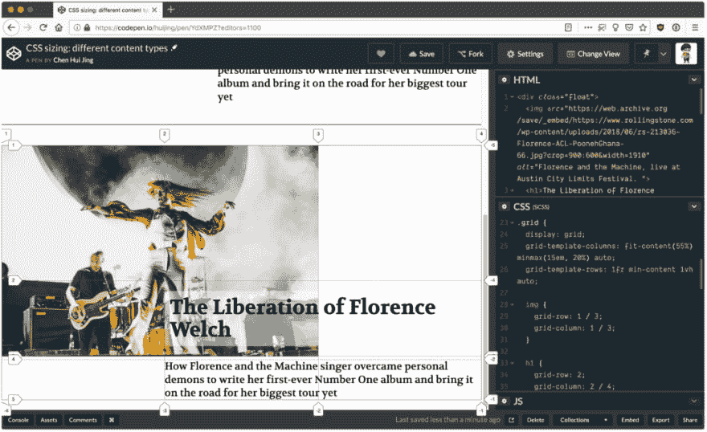
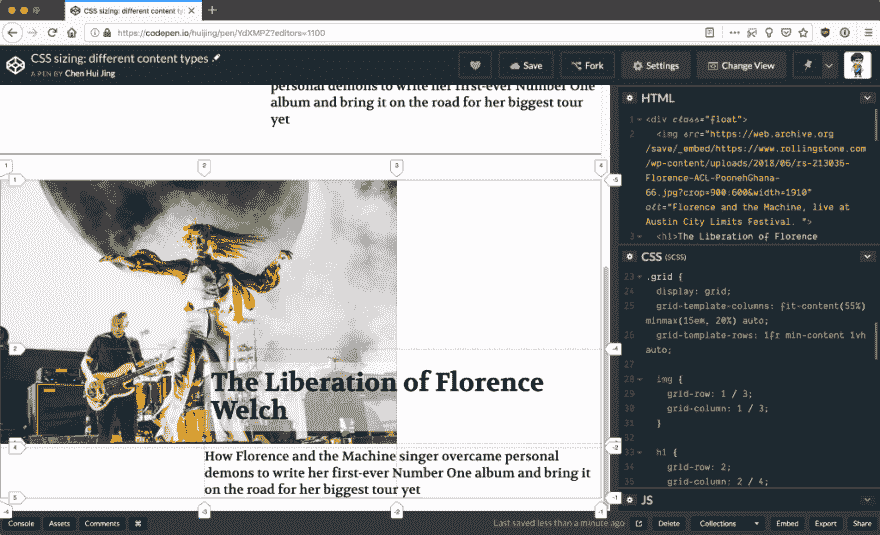

# 审视内在网页设计中的“挤压性”

> 原文：<https://dev.to/bnevilleoneill/examining-squishiness-in-intrinsic-web-design-489e>

2018 年网页设计界的一大亮点是 [Jen Simmons](http://jensimmons.com/) 提出了术语[内在网页设计](http://www.zeldman.com/2018/05/02/transcript-intrinsic-web-design-with-jen-simmons-the-big-web-show/)并与世界分享。内在的网页设计不是一个框架。它也不是一套可以遵循的规则。相反，它是一个概念的集合，强调了现代 CSS 的可能性。我们如何选择利用这些概念在网络上进行更好的艺术指导，并建立更好的布局，这取决于我们。

Jen 在谈到内在网页设计时涵盖了以下六个主要概念:

*   结合流动和固定
*   压扁的阶段
*   真正的二维布局
*   嵌套上下文
*   扩展和收缩内容
*   媒体询问，根据需要

您会注意到，这些概念都没有指出具体的 CSS 属性或模块。这是因为当各种互补的属性一起使用时，CSS 工作得最好。在这篇文章中，我想谈谈阶段挤压的概念，以及它将如何极大地提高网站上编辑内容的艺术导向。

### 用 CSS 调整项目大小

让我们从一些基础开始。浏览器执行大量的计算，以确保每个元素都能正确地呈现在网页上。每个元素都必须解析和计算每个可能的 CSS 属性值，然后才能在页面上布局。

根据视觉格式化模型，文档树中的每个元素生成零个或多个框。影响这些盒子尺寸的因素有很多。

详细涵盖这一点的 CSS 规范是 [CSS 内在&外在调整模块级别 3](https://www.w3.org/TR/css-sizing-3/) 。*外在大小*基于元素的上下文，不考虑其内容，而*内在大小*基于元素的内容，不考虑其上下文。

我们大多数人都熟悉外在大小，因为这通常是我们用来确定网页中项目大小的。我遇到的几乎每个 web 开发人员都是从用固定的 CSS 单位(如 px)或相对的 CSS 单位(如百分比)来设置宽度和高度开始的。

然后我们会学习 rem 和 em 单位，并被它们吸引。我们中的一些人也开始使用视口单位，这是另一种相对单位。以这种方式调整大小会完全忽略元素中的内容，如下面的[代码打开](https://codepen.io/huijing/pen/wRwYee/)所示:

[https://medium . com/media/6a 40774 a 352 EB 0 b 2 C4 a5 DD 35 c 27d 6915/href](https://medium.com/media/6a40774a352eb0b2c4a5dd35c27d6915/href)

这并不是说内在大小是一个新事物，我认为内在大小的使用只是意味着不去管它。浏览器会根据元素中的内容量为我们调整大小。

确定元素的宽度和高度有一个很长的规则集，这取决于它的类型(块或内嵌，替换与否，定位方案等)。)，如果感兴趣的话可以从 [CSS2.1 规范](https://www.w3.org/TR/CSS2/visudet.html)中找到。并且 [CSS 内在&外在尺寸模块级别 3](https://www.w3.org/TR/css-sizing-3/) 进一步扩展了该规范。

关于宽度和高度属性，我想提醒大家的一点是，这两个大小属性**不**适用于行内元素。内联元素的宽度由其呈现内容的宽度决定，而内联元素的高度由字体大小决定。

级别 3 规范向宽度和高度属性添加了新的基于内容的关键字，即:min-content、max-content 和 fit-content()，这允许非行内元素具有更多基于内容的大小调整选项。

在网格格式上下文中使用时，所有这些值都受支持。但是，如果您现在想要在调整属性中使用它们，您的里程数可能会有所不同。

[https://medium . com/media/2 BC B4 e 217 cc 6 f 7 e 191 F4 b 0 FDA 0854782/href](https://medium.com/media/2bcb4e217cc6f7e191f4b0fda0854782/href)

### 元素的相对尺寸

web 上响应式设计的一个常见设计模式是调整内容列以适应视窗。开发人员会用大量的媒体查询来编写这样的布局，因为每一列的宽度都必须在特定的断点指定。这种方法可以用 floats 或 inline-block 来实现，但是使用大量媒体查询的机制是相同的。

[https://medium . com/media/a 1973 C1 d 09 ce 7d 73 a 6 DFC 8 e 747 a 64 df 7/href](https://medium.com/media/a1973c1d09ce7d73a6dfc8e747a64df7/href)

当您调整窗口大小并观察列的增长和收缩时，请注意所有列都以相同的速率增长和收缩*。这是意料之中的，因为每列的大小都是视区宽度的百分比。*

这种行为的一个后果是，构建以最佳大小呈现不同类型内容的布局变得更加困难。与文本内容相比，具有内在纵横比的内容(如图像)需要更多的考虑，因为文本内容更容易流动和适应。

### 以可变的变化率调整大小

让我们来看看列的大小以*不同的速率*增长和收缩的情况。当我们在 flex 格式化上下文中操作时，当应用某些轨道大小时，或者当使用基于内容的大小调整时，可能会出现这种情况。

对于这个 Flexbox 例子，我强烈推荐阅读 Rachel Andrew 的[逐步解释](https://www.smashingmagazine.com/2018/09/flexbox-sizing-flexible-box/)关于规模算法如何工作。在这里你可以看到当最后一列有更多的内容时，Flexbox 会给它更多的空间，并将第二列收缩得“更早”。

[https://medium . com/media/E4 b 09d 41 c 56d 56 ee 28 AE 28 BBA 3315 AC 3/href](https://medium.com/media/e4b09d41c56d56ee28ae28bba3315ac3/href)

Grid 引入了 fr 单元，它被定义为网格容器中剩余空间的分数。它的行为类似于 flex 项目填充 flex 容器空间的方式。

一旦所有非弹性轨道达到其最大尺寸，从可用空间中减去这些行或列的总尺寸，产生剩余空间，然后在弹性大小的行和列中按照其弹性因子的比例划分剩余空间。

对于这个基于栅格的示例，使用各种值来调整列的大小，当视口大小改变时，这会影响它们的结果行为。对于第一个示例，第一列的大小为 1fr，这意味着它占用了内容所需的空间加上任何可用的空闲空间。因此，如果视口变宽，它将继续增长。

但是，当视口缩小时，其行为由其他列的大小决定。另外两列是 auto 和 fit-content(400px)，随着空间的减少，它们的行为类似，因为 fit-content 解析为 minmax(auto，max-content)，只是它被固定在提供的参数值上。

[https://medium . com/media/CB 4433 f 956 a4 ef 37 E4 d 302 DBC E6 DD 03 b/href](https://medium.com/media/cb4433f956a4ef37e4d302dbce6dd03b/href)

对于第二个示例，最后一列的大小为 minmax(200px，400px)。请注意，该列尽可能长时间地保持其最大大小，而其他列则收缩。fr 列首先收缩，然后是 auto 列。但是 auto 列和 minmax()列同时达到它们的最小大小。

### 更好的反应艺术方向

现在让我们将它应用到实际设计中。这个例子可以是一个编辑出版物上的特色文章，有一个大的英雄形象，标题和一些开放的文本。我再次强烈推荐在一个单独的窗口中打开这个演示，这样就可以观察整个视窗的行为。

第一个例子是用百分比大小来完成的，这里的限制是双重的。页眉在图像上的重叠有点笨拙，因为它是用负边距完成的。其次，图像和文本都以相同的速度缩小，所以在最窄的尺寸下，图像有点太小，文本也有点太挤。

[https://medium . com/media/22996 cc 79d 550 f 953480506252 ffbf 00/href](https://medium.com/media/22996cc79d550f953480506252ffbf00/href)

使用 Grid，管理重叠要容易得多，因为在网格中放置项目就是将它们分配到所需的行和列，并且不限制多个项目占用网格上的相同空间。

如果你已经安装了 Firefox，打开 DevTools 并打开网格检查器，它会向你显示轨迹是如何随着视口大小的变化而调整的。此外，使用 minmax()调整轨道大小允许中间列中的内容尽可能长时间地“保持”其大小，而轨道大小首先自动收缩。

 

<figcaption>火狐拥有最好的网格检查员工具</figcaption>

### 结论

这种行为为网页设计者和开发者在艺术指导方面提供了更好的选择和更大的灵活性，并确保了无论在什么样的背景下，内容的焦点都不会丢失。

我强烈鼓励开发人员自己尝试这些新的属性和技术，因为正是通过实验，我才弄清楚了很多这种东西。随着越来越多的开发人员和设计人员使用这些新工具，我们将有更多的想法和灵感来构建真正适合 web 本质的设计。

### Plug: [LogRocket](https://logrocket.com/signup/) ，一款适用于网络应用的 DVR

<figcaption>[https://logrocket.com/signup/](https://logrocket.com/signup/)</figcaption>

LogRocket 是一个前端日志工具，可以让你回放问题，就像它们发生在你自己的浏览器中一样。LogRocket 不需要猜测错误发生的原因，也不需要向用户询问截图和日志转储，而是让您重放会话以快速了解哪里出错了。它可以与任何应用程序完美配合，不管是什么框架，并且有插件可以记录来自 Redux、Vuex 和@ngrx/store 的额外上下文。

除了记录 Redux 操作和状态，LogRocket 还记录控制台日志、JavaScript 错误、堆栈跟踪、带有头+正文的网络请求/响应、浏览器元数据和自定义日志。它还使用 DOM 来记录页面上的 HTML 和 CSS，甚至为最复杂的单页面应用程序重新创建像素级完美视频。

免费试用。

* * *