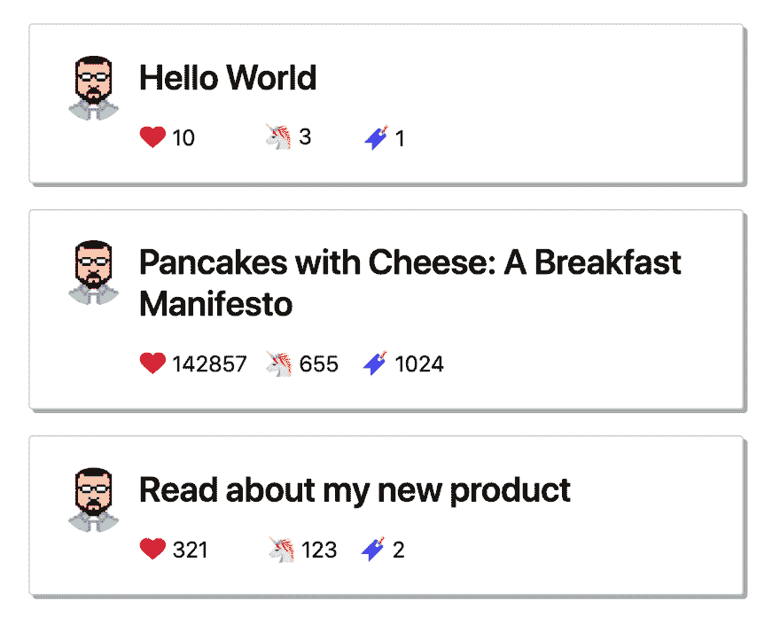
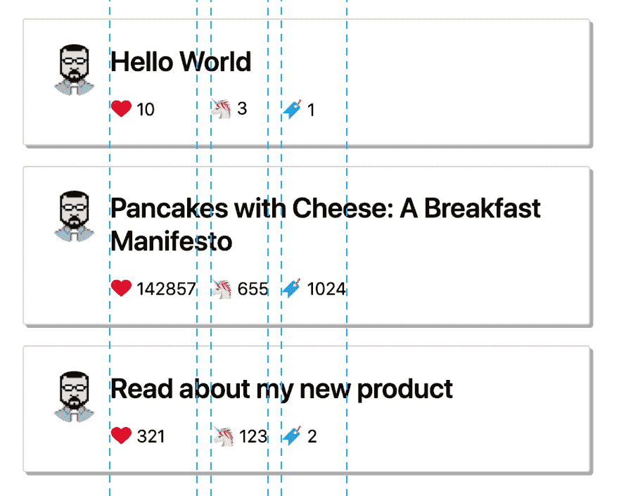
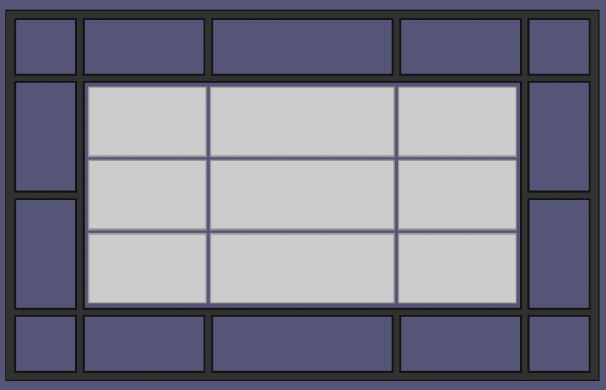

# 为什么我们需要 CSS 子网格

> 原文：<https://dev.to/kenbellows/why-we-need-css-subgrid-53mh>

距离 [CSS 网格布局模块 Level 1](https://drafts.csswg.org/css-grid/) 发布已经有一段时间了。从那时起，几乎两年过去了，所有主要的浏览器几乎同时聚在一起推出它(2017 年 3 月，ICYMI)。

而且 IMHO，这是一个超级长的时间里 CSS 最棒的东西。不要误解我，我喜欢 Flexbox，在很多情况下，Flexbox 显然是更好的选择，但是，网格只是让很多事情变得更容易。

但是 1 级规范中仍然缺少的一点是创建子网格的能力，这是一个拥有自己的网格的网格项目，它在一个或两个维度上与父网格对齐。它原本计划放在第 1 级，但是工作组决定他们需要更多的时间来制定细节，所以它被删除了，它将在 [CSS 网格布局模块第 2 级](https://www.w3.org/TR/css-grid-2/)中发布，这似乎已经接近完成。

在过去的 2 年里，有很多关于子网格用例的讨论，它应该如何实现，甚至有一些关于你是否需要它的争论。很多讨论都集中在另外两种方法上，这两种方法可以处理许多与子网格相同的问题:嵌套网格和`display: contents`。这篇文章将探讨这两种方法，我希望展示仍然有一些非常有效的情况，其中确实需要子网格，而其他情况并不严格需要*，但是会产生一个更干净的解决方案。*

 *正如我的上一篇文章一样，我将展示一个场景，并使用这些不同的方法实现一个解决方案，以探索它们的优缺点。

# 场景:一堆上面有数字的卡片

今天的场景:我希望在我的个人网站上有一个部分显示我最近的 Dev 文章，以及它们的反应计数。让我们做一个模型。

[](https://res.cloudinary.com/practicaldev/image/fetch/s--Ay9Exanv--/c_limit%2Cf_auto%2Cfl_progressive%2Cq_auto%2Cw_880/https://thepracticaldev.s3.amazonaws.com/i/v8f9etg9hsmg71slvkgm.png)

<figcaption>That second article sounds interesting; I should write that. Looks like it was pretty well received, too.</figcaption>

很简单的东西。每张卡都有一个带阴影的边框，用户头像在左边，标题在顶部靠左对齐，下面有三个反应计数。应该不难吧？

让我们把它编码起来。

# v1:好的 ol’浮动

乍一看，这似乎很简单，所以让我们从一个老式的基于浮动的布局开始，看看事情如何发展。

[https://codepen.io/kenbellows/embed/ZVadNJ?height=600&default-tab=result&embed-version=2](https://codepen.io/kenbellows/embed/ZVadNJ?height=600&default-tab=result&embed-version=2)

好的，非常好！我擅长 CSS。👏👏👏(实际上，我只是检查了 dev.to 主页上的卡，从那里偷了 CSS，并根据需要做了一些调整。)

反正我很满意。一切看起来都和模型一模一样，除了...等一下。那些反应计数是怎么回事？为什么第三张卡片上的阅读列表图标和第二张卡片上的图标相差那么远？为什么它们在卡片之间没有对齐？

我想要的是相同类型的计数器，例如，所有的独角兽计数器，在卡片上对齐，这样最小的独角兽计数器和最大的独角兽计数器占用一样多的空间。

[](https://res.cloudinary.com/practicaldev/image/fetch/s--o67SjYVm--/c_limit%2Cf_auto%2Cfl_progressive%2Cq_auto%2Cw_880/https://thepracticaldev.s3.amazonaws.com/i/x1nholc5t10mcl7b9ajq.png)

那么，为什么我的计数器不这样做呢？

因为我想我不是那样写的。嗯。我该怎么做？我希望小数字的计数和其他卡片上相同类型的大数字有一样多的水平空间。但是这意味着一些元素需要知道它们的...表亲元素？像，独角兽↗︎卡 1 ⟶卡 2 ↘︎独角兽。父母的兄弟姐妹的孩子。表哥。是啊。

但是老式的基于浮动的布局不允许这样做。我只能根据元素的父元素和它的兄弟元素来调整元素的大小...嘿，我知道，flex bo——不，Flexbox 也不这么做。同样的问题。还剩下什么？

当然，我相信你已经知道答案了。只有一个布局系统可以完成这项任务。它是... **HTML 表格！**

[](https://res.cloudinary.com/practicaldev/image/fetch/s--XQCkuwvi--/c_limit%2Cf_auto%2Cfl_progressive%2Cq_66%2Cw_880/https://i.imgur.com/y8Ea8jB.gif)

我只是在开玩笑。永远不要用表格来布局。

不幸的是，*当前的*回答是，我们不能，不能完美地，不能不用 JavaScript 设置`<span>`宽度，或者，是的，调用一些令人不舒服的、脆弱的基于表格的方法。

但是我们可以走得很近。剧透一下，如果你还没搞清楚，在这篇文章的最后，我会告诉你如何用 subgrid 来简单地做到这一点，但是现在我要说的是我们可以用当前的技术达到多近的距离。

> ## 略述表外之事
> 
> 为了解决房间里的大象，是的，这个*实际上可以用 HTML 表来解决。我知道的原因是...*呜呜*...我必须在日常工作中解决这个问题:布置一列卡片，每张卡片包含一个标题和 3 个动态计数器，计数器和它们的标签在独立的卡片上保持对齐。而*目前你在纯 CSS 中唯一可以做到的方式*就是用表格。*
> 
> 它可以工作，但是它很脆弱，很挑剔，非常冗长，对于任何其他可能需要与 CSS 交互或调整 CSS 的开发人员(包括未来的我)来说几乎是不可读的。因此，出于这些原因，我拒绝向你们展示如何去做，因为我将*而不是*成为问题的一部分！(又不是我的错！他们逼我的！😭)

# v2: CSS 网格和`display: contents`

我听到的最常见的反对在 CSS 中添加子网格的理由是`display: contents`填补了子网格应该填补的空白，所以子网格是多余的。

对于外行来说，CSS 网格布局的一个主要约束是，只有网格容器的直接子容器才能放在网格上。这就是为什么我们不能在卡片容器上使用一个简单的`display: grid`来解决我们的问题；我们可以把卡片放在网格上，但是我们不能把卡片的内容放在网格上，因为这些元素不是网格容器元素的直接子元素。

或者我们可以吗？

输入`display: contents`。如果你给一个容器元素一个规则`display: contents`，这个元素有点...*消失...*至少对于版面设计来说是这样。周围的元素不再知道该容器；相反，他们看到的是它的直系子孙。这在网格上下文中的意思是:**如果一个网格项被赋予了`display: contents`，它的子元素就会变成网格项！**

这里最大的优势是 HTML 文档的语义和可读性。您仍然可以在标记中对元素进行逻辑和语义分组，但是将它们放在网格上，就像它们是直接的网格项一样。

所以，让我们看看是否可以将这一点应用到我们的卡上！我们将在存放卡片的容器上定义一个网格，然后给出根卡片元素`display: contents`，并在网格上展示卡片的内容。(你能预料到我们将要遇到的问题吗？)

[https://codepen.io/kenbellows/embed/aPVeVP?height=600&default-tab=result&embed-version=2](https://codepen.io/kenbellows/embed/aPVeVP?height=600&default-tab=result&embed-version=2)

嗯，那个...这是不对的。计数现在排列正确了，但是...*卡在哪里？*有方框阴影的好看边框在哪里？就好像卡片本身不见了，所有的内容都被直接倒在了——*上...*

是的，事实就是如此。这是`display: contents`的局限性:如果你真的只需要一个元素的*内容*(因此得名),那就太棒了，但是如果你想要容器本身的任何样式，那么...你运气不好；就版面来说，少了。

## 手动进场

所以如果我们把脚趾稍微伸进去...更脏的水，并在每张卡中创建了我们自己的空“背景”元素，使它看起来像有一个容器？当然，你可以，但是棘手的是把它放到网格上。我喜欢 CSS Grid 的一点是它是多么容易将元素层层叠加:只需将它们附加到相同的网格区域，并根据需要应用`z-index`！

但是这里的诀窍是这些卡片是动态的。我们事先不知道(或者一旦我们真的把这个东西挂在 API 上就不会知道)我们会有多少张卡片，所以我们不能，例如，给它们每个一个`id`并把它们每个分配到网格中的某一行。这对于最初的几个来说是可行的，但是一旦你的卡片数量超过了你 CSS 中的`id`数量，你就没那么幸运了。无论如何，关键是要找到一些可重用的、可伸缩的、动态的东西。

在上面的解决方案中，我们依赖网格的自动放置行为来根据需要添加新行。这只有在你的元素彼此相邻的情况下才有效；没有办法将元素自动放置在彼此之上。可悲的是，也没有办法在网格上相对于它们的自动位置来定位元素。

似乎我们已经用完了基于 CSS 的解决方案。所以我们必须转向剩下的唯一选项(除了表): *JavaScript！*

# v3: JavaScript

现在，我知道我之前拒绝了 JavaScript 作为一个选项，但那是关于使用 JavaScript 来计算 count 元素的宽度，并在每次调整窗口大小时重新计算。这只是将我们的元素放在网格中正确的行上的一小段 JavaScript 代码，只需一次，不需要在每次调整窗口大小时重复。所以没*那么*差。(虽然还是不理想。)

我们将为每张卡片添加一个`<div class="backdrop"></div>`，将容器样式移动到一个`.backdrop { }`块，然后使用 JavaScript 为每个背景元素设置`grid-row`规则。

[https://codepen.io/kenbellows/embed/qLKgvL?height=600&default-tab=result&embed-version=2](https://codepen.io/kenbellows/embed/qLKgvL?height=600&default-tab=result&embed-version=2)

那好多了。它非常匹配的像素模型。

这是可行的，但是这种方法有两个主要缺陷:

1.  看看里面的 CSS。看看所有的`padding`和`margin`规则。注意，第一列是空的，其宽度由一个疯狂的`calc()`表达式定义。这是手动将所有内容添加到平面网格的缺点，因为没有容器来更自然地管理填充和边距。我花了 20 分钟摆弄这些值，让它匹配模型。

2.  这是没有反应的。这些卡片很小，这是真的，它们都在一列，所以没什么大不了的。但是想象一下，如果您想在搜索结果网格中使用卡片，包括卡片的行和列。这变得*非常*凌乱非常快。你不能仅仅使用`@media`查询或自动放置来在更小的分辨率下移动卡片；您将不得不做我们从一开始就想避免的事情:在每次窗口调整大小事件时，在 *JavaScript* 中重新排列您的项目。

总之，这将为您提供一个基本的解决方案，但它是混乱和脆弱的，完整的解决方案将需要更多的 JavaScript，这是我更喜欢的。

好了，好了，开场白到此为止。再来说说子网格！

# v4:🎆🎇子网格 FTW！！！🎇🎆

*所以。事情已经到了这种地步。*

正如我在介绍中提到的，子网格原本应该是 CSS 网格布局模块级别 1 的一部分，但在接近尾声时被收回了，这样工作组就可以花更多的时间来敲定细节。现在大部分工作已经完成，CSS 工作组正在指定 CSS 网格布局模块级别 2(也称为网格级别 2)。一份[公开工作草案](https://www.w3.org/TR/css-grid-2/)已经发布供审查，尽管正如我最喜欢的 CSS 网格资源 Rachel Andrew 在她 2018 年 4 月的博客文章[“网格第二层和子网格”](https://rachelandrew.co.uk/archives/2018/04/27/grid-level-2-and-subgrid/)中所写的那样，自草案发布以来，进一步的发展已经发生，并且确实在不断发生，因此参考[编辑的工作草案](https://drafts.csswg.org/css-grid-2/)可能更好。

> ~~**注意:**在撰写本文时，任何主流浏览器中都没有子网格实现...~~
> **更新:**子网格支持已在 [Firefox 每夜](https://www.mozilla.org/en-US/firefox/nightly/all/)中发货！不过，Chrome 仍然没有任何进展；也许可以点击[子网格实现标签](https://bugs.chromium.org/p/chromium/issues/detail?id=618969)上的星星来显示社区对它的渴望！(*太激动了！！！🎆🎈🎈🎈🎆*)

但是让我来回答我还没有回答的主要问题:到底什么是子网格？它是如何工作的？

“子网格”的概念是在一个项目中定义的网格，该项目位于与更大的网格有某种关系的周围网格上。为了简单起见，我将讨论“父网格”和“子网格”。最简单的关系是将子栅格的栅格轨迹沿单个轴锁定到父栅格的轨迹上，同时保持另一个轴上的轨迹分开。也可以进行 2D，将子网格的两个轴锁定到父网格上，以实现完全集成。(**编辑:**本段由原文更新而来，见下文尾注！)

在`grid-template-columns`或`grid-template-rows`规则中使用`subgrid`关键字来声明网格的某个轴应该与周围的网格对齐:

```
#parent {
    display: grid;
    grid-template-columns: 1fr 2fr 3fr 2fr 1fr;
    grid-template-rows: 1fr 2fr 2fr 1fr;
}
#subgrid {
    grid-column: 2 / 5;
    grid-row: 2 / 4;

    display: grid;
    grid-template-columns: subgrid;
    grid-template-rows: repeat(3, 1fr);
} 
```

[https://codepen.io/kenbellows/embed/majbZd?height=600&default-tab=result&embed-version=2](https://codepen.io/kenbellows/embed/majbZd?height=600&default-tab=result&embed-version=2)

由于上述演示目前不工作(*更新:除了在火狐每夜！*)，下面是为`grid-template-columns`实现了`subgrid`关键字后的样子:

[](https://res.cloudinary.com/practicaldev/image/fetch/s--Kih1MCQX--/c_limit%2Cf_auto%2Cfl_progressive%2Cq_auto%2Cw_880/https://thepracticaldev.s3.amazonaws.com/i/km92lsc9ung7adf76u24.png)

请注意，列与父网格对齐，但行完全独立。

这正是我们的卡片演示所需要的！

我们简单地将卡片容器做成一个有 5 列的网格，然后沿着列轴将每张卡片做成一个子网格，然后*嘣！*问题简单明了地解决了，模型精确到像素，没有牺牲语义、可读性或响应性，也不需要引入空的结构元素(如背景)或 JavaScript！

它在这里，在所有它还没有工作的地方(*——除了在 Firefox-Nightly 里！*)荣耀:

[https://codepen.io/kenbellows/embed/OrwJKz?height=600&default-tab=result&embed-version=2](https://codepen.io/kenbellows/embed/OrwJKz?height=600&default-tab=result&embed-version=2)

现在一切都有点不稳定；如果你想要一张它应该是什么样子的照片...检查顶部的模型。😉

# 关于子网格的更多想法

子网格如此简单，却又如此强大。我认为一旦我们有了子网格，*特别是*如果我们在网格级别 3(或 4，或...)，它将很快成为我们不可或缺的。

以下是一些让我对 subgrid 感到兴奋的事情:

*   如果我们在卡片中结合子网格和`grid-template-areas`(如果你不知道网格区域，请阅读[我的上一篇文章](https://dev.to/kenbellows/css-grid-areas-are-amazing-1gha)，这会让你大吃一惊)，复杂的基于卡片的响应布局变得*琐碎*。

*   两个轴上都有子网格的前景给了我们一种方法来完成相对网格定位，至少对于语义分组的项目是这样，就像我上面希望的那样！将你的东西放在一个容器中，将容器放在网格上，使容器成为两个轴上的子网格，并相对于子网格元素的网格位置声明你的轨迹！

*   在 Flexbox、Grid、`display: contents`和 subgrids 之间，我们将*最终*拥有我们需要的一切来编写非常苗条、干净、*语义*标记，基本上没有绒毛或纯粹的结构元素。这对于易访问性、SEO 以及试图理解你的标记的开发者来说都是一个巨大的福音！

# 结论

我对亚网格很感兴趣。总的来说，我对网络的未来充满信心。依我看，在过去 5 年左右的时间里，就对语言的改进程度而言，CSS 的改进与 ES6+中的 JavaScript 不相上下。它们没有被广泛引用，但它们具有变革性。

网络是一个越来越好的写作平台，我真的很兴奋。

希望我已经把这一点传递给你了。😁

# 资源

*   [W3C 公开工作草案](https://www.w3.org/TR/css-grid-2/)
*   [W3C 编辑稿](https://drafts.csswg.org/css-grid-2/)
*   [“网格级别 2 和子网格”——雷切尔·安德鲁](https://rachelandrew.co.uk/archives/2018/04/27/grid-level-2-and-subgrid/)
*   [“CSS 网格级别 2:子网格来了”——Rachel Andrew，Smashing Magazine](https://www.smashingmagazine.com/2018/07/css-grid-2/)
*   [子网格的浏览器实现状态](https://platform-status.mozilla.org/#css-subgrids)

* * *

### **尾注 1:** 关于双轴子网格的修正！

*2019 年 1 月 9 日*

当这篇文章第一次发表时，它包含了一个非常不正确的陈述，这是基于我的一个非常愚蠢的误解。我在上面定义子网格的段落中，最初部分内容如下(着重部分由作者添加):

> ...最简单的一种关系，**现在为网格级别 2** 指定的关系是将子网格沿单个轴的网格轨迹锁定到父网格的轨迹上，同时保持沿另一个轴的轨迹分开。**未来的网格级别可能允许将子网格的两个轴都锁定到父网格上，但是我们必须从某个地方开始。**

请注意:**这是错误的！** CSS 网格模块级别 2 *将*允许在两个轴上的子网格，以及在一个轴上！事实上，看起来更有争议的决定是是否只允许在*的一个轴*上有子网格，而不是限制总是要求两个轴都有子网格！

我已经更新了这一段，以及“关于子网格的更多想法”一节中的第二个要点，删除了这些不正确的信息。

这个误解来自于对瑞秋·安德鲁文章[“网格二级与子网格”](https://rachelandrew.co.uk/archives/2018/04/27/grid-level-2-and-subgrid/)第二段的可笑的反复误读。在写这篇文章的时候，我已经读了那一段(和周围的文字)大约八遍，每次我都认为它在说:

> 在柏林的 CSS 工作组会议上，我们决定子网格只能是单轴的。

但上面不是这么写的！它实际上说的是:

> 在柏林的 CSS 工作组会议上，我们决定子网格应该**只能是**单轴。

这是完全不同的事情！🤦🤦🤦

事实上，我发现这个错误要感谢下面来自 [@dan503](https://dev.to/dan503) 的一条评论，之后我在 Rachel 的推特上询问...只有在她回应后，我才终于把那段*重读了一遍*，并最终意识到我的错误！

> 瑞秋安德鲁@瑞秋德鲁[@ ken _ bellows](https://twitter.com/ken_bellows)没错。可以做一个也可以两个都做，这就是单轴的意思。双轴意味着你必须两个都做，没有机会只做一个。2019 年 1 月 09 日下午 16:15[](https://twitter.com/intent/tweet?in_reply_to=1083034514262278144)[](https://twitter.com/intent/retweet?tweet_id=1083034514262278144)0[](https://twitter.com/intent/like?tweet_id=1083034514262278144)1

整个尴尬的线索从这里开始:[https://twitter.com/ken_bellows/status/1083032646123483136](https://twitter.com/ken_bellows/status/1083032646123483136)

### **尾注 2:** CSS 表格

*2019 年 1 月 10 日*

@tigt_ 提出了另一种我在本文中没有考虑到的方法:CSS 表格。我知道我在上面的文章中指责了 HTML 表格，但是我认为 CSS 表格可以是许多问题的一个聪明的解决方案，因为它们允许您混合和匹配表格和块行为，并且因为它们保留了典型 HTML 元素的语义和可访问性优点。

也就是说，不幸的是，由于各种原因，CSS 表不能解决这个特殊的挑战。我尝试了几种不同的方法，并连接到一些笔，但每种方法都有一个缺陷。不管结果如何，这是一个非常有趣的调查，我推荐阅读这个帖子！*