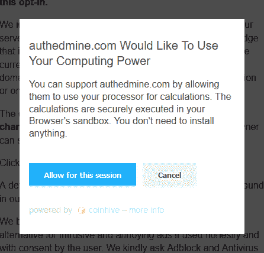

# 浏览器内加密挖掘(经许可)作为流量货币化的一种方式？

> 原文：<https://dev.to/jackharner/in-browser-crypto-mining-with-permission-as-a-way-to-monetize-traffic-2ic9>

*我知道你不能浏览我的 [BTC](https://unsplash.com/photos/JrjhtBJ-pGU) ，但是 [Unsplash](https://unsplash.com/jackharner) 没有任何 XMR 图片*

显然，密码劫持是一种不好的做法，应该全心全意地反对，但如果你先征求许可呢？

随着广告拦截器的兴起，AdSense 之类的网站可能不再是赚钱的好方法了。

我很想听听开发者社区对此事的想法。这是一个可行的货币化选择吗？先得到许可会有影响吗？有人在使用浏览器内加密挖掘并且取得了成功吗？先征得同意还算“恶意软件”吗？