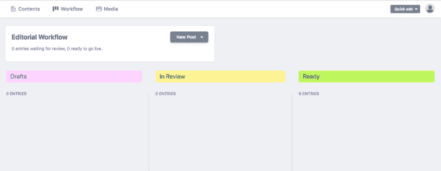

# 什么插件，CMS 等。用于你的盖茨比博客。

> 原文：<https://dev.to/nickytonline/what-plugins-cms-etc-are-using-for-your-gatsby-powered-blog-2cdd>

达米安·扎莱斯基在 [Unsplash](https://unsplash.com/search/photos/blog?utm_source=unsplash&utm_medium=referral&utm_content=creditCopyText) 上拍摄的照片

我真的对[盖茨比的插件架构](https://www.gatsbyjs.org/docs/plugin-authoring/)印象深刻。这是我当前的插件列表

*   [盖茨比插件提要](https://www.gatsbyjs.org/packages/gatsby-plugin-feed/)
*   [盖茨比插件谷歌分析](https://www.gatsbyjs.org/packages/gatsby-plugin-google-analytics/)
*   [盖茨比插件清单](https://www.gatsbyjs.org/docs/add-a-manifest-file/)
*   [盖茨比插件网络生活](https://www.gatsbyjs.org/packages/gatsby-plugin-netlify/)
*   [盖茨比-插件-网络生活-cms](https://www.gatsbyjs.org/packages/gatsby-plugin-netlify-cms/)
*   [盖茨比-外挂-离线](https://www.gatsbyjs.org/packages/gatsby-plugin-offline/)
*   [盖茨比插件 purgecss](https://www.gatsbyjs.org/packages/gatsby-plugin-purgecss/)
*   [盖茨比-插件-反应-头盔](https://www.gatsbyjs.org/packages/gatsby-plugin-react-helmet/)
*   [盖茨比-插件-萨斯](https://www.gatsbyjs.org/packages/gatsby-plugin-sass/)
*   [盖茨比-外挂-夏普](https://www.gatsbyjs.org/packages/gatsby-plugin-sharp/)
*   [盖茨比插件网站地图](https://github.com/gatsbyjs/gatsby/tree/master/packages/gatsby-plugin-sitemap)
*   [盖茨比-插件-推特](https://www.gatsbyjs.org/packages/gatsby-plugin-twitter/)
*   [盖茨比插件网页字体加载器](https://github.com/escaladesports/gatsby-plugin-web-font-loader)
*   [盖茨比-备注-复制-链接-文件](https://www.gatsbyjs.org/packages/gatsby-remark-copy-linked-files/)
*   [盖茨比-备注-图片](https://www.gatsbyjs.org/packages/gatsby-remark-images/)
*   [盖茨比——评论——相对——形象](https://github.com/danielmahon/gatsby-remark-relative-images)
*   [盖茨比源文件系统](https://www.gatsbyjs.org/packages/gatsby-source-filesystem/)
*   [盖茨比-变形金刚-备注](https://github.com/gatsbyjs/gatsby/tree/master/packages/gatsby-transformer-remark)
*   [盖茨比-变形金刚-夏普](https://www.gatsbyjs.org/packages/gatsby-transformer-sharp/)

你安装过哪些盖茨比插件？

我从 2017 年秋天就开始用盖茨比了，最近才换成 [Netlify CMS](https://www.netlifycms.org) ，顺便说一句很神奇。在 CMS starter 中，默认情况下不启用工作流功能，但是启用它非常容易。在你的 config.yaml 中简单地添加下面一行

`publish_mode: editorial_workflow`

有关附加配置的更多信息，请参见[他们的文档](https://www.netlifycms.org/docs/configuration-options)。

一旦启用，您就有了草稿(新分支)，准备发布(新分支的 PR)，审阅(有权访问您的 CMS 以审阅博客帖子或页面的人(PR 审阅)和发布(合并到母版)。真的很厉害。我对这个工作流程印象深刻。

如果您启用了 CMS，您使用的是什么？