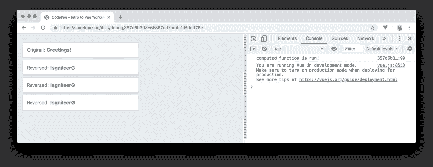
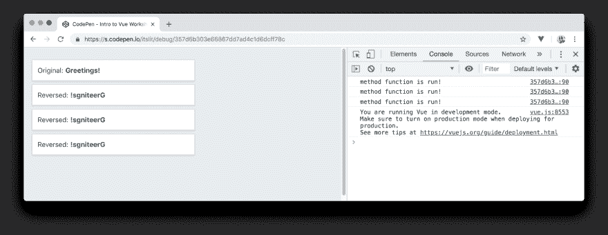
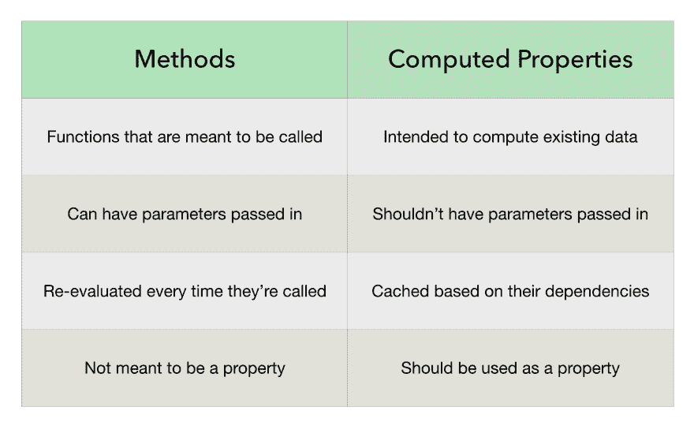

# 30 天的 Vue -方法和计算属性

> 原文：<https://dev.to/djirdehh_83/30-days-of-vue---methods-and-computed-properties-18m8>

[](https://res.cloudinary.com/practicaldev/image/fetch/s--0PlZvSiT--/c_limit%2Cf_auto%2Cfl_progressive%2Cq_auto%2Cw_880/https://thepracticaldev.s3.amazonaws.com/i/qgif3eq20er7lmdr1hcc.png)

> 这篇文章是 Vue 的 [30 天中的一章，这是一个介绍 Vue.js 框架的免费资源。您可以直接从 https://www.fullstack.io/30-days-of-vue/](https://www.fullstack.io/30-days-of-vue/)[网站](https://www.fullstack.io/30-days-of-vue/)查看和下载所有文章。

## 方法

Vue 实例中的方法的行为类似于普通的 JavaScript 函数，只有在显式调用时才会被计算。代替使用方法，我们总是可以在模板中写我们想要的功能变化*内联*。

让我们来看一个例子。我们将重用在 Vue 文档中看到的一个例子，它涉及到从一个字符串中反转一系列字符。我们将首先创建一个 Vue 实例，它包含一个值为`'Greetings!'` :
的`message`属性

```
new Vue({
  el: '#app',
  data: {
    message: 'Greetings!',
  },
}); 
```

在模板中，我们将直接绑定`message`并以相反的状态绑定`message`。我们将反转`message`的值，方法是将属性拆分成一个字符数组(`.split('')`)，反转数组中的元素(`.reverse()`，并将反转后的数组重新组合成一个字符串(`.join('')`)。

```
<html>
  <head>
    <link rel="stylesheet" href="./styles.css" />
    <link rel="stylesheet"
      href="https://unpkg.com/bulma/css/bulma.css" />
  </head>

  <body>
    <div id="app">
      <div class="card">
        <header class="card-header card-header-title">
          <span>Original:</span>
          {{ message }}
        </header>

        <header class="card-header card-header-title">
          <span>Reversed:</span>
          {{ message.split('').reverse().join('') }}
        </header>
      </div>
    </div>
    <script src="https://unpkg.com/vue"></script>
    <script src="./main.js"></script>
  </body>
</html> 
```

在[布尔玛](https://bulma.io/documentation/)给我们的样式的帮助下，我们简单的应用程序看起来如下:

[](https://res.cloudinary.com/practicaldev/image/fetch/s--QrDgaZr3--/c_limit%2Cf_auto%2Cfl_progressive%2Cq_auto%2Cw_880/https://s3-us-west-2.amazonaws.com/s.cdpn.io/1211695/greetings.png)

如上所述，以内联方式指定功能变更本身并没有什么问题。然而，**方法**通常在预期的改变变得难以理解时更适合使用。

我们可以改变上面的例子，在我们的 Vue 实例中使用一个**方法**来帮助反转`message`字符串:

```
new Vue({
  el: '#app',
  data: {
    message: 'Greetings!',
  },
  methods: {
    reverseString(string) {
      return string.split('').reverse().join('');
    },
  }
}); 
```

该方法被命名为`reverseString`，并需要一个有效负载。我们可以在模板中声明这个方法，并传入`message`属性作为有效负载:

```
<html>
  <head>
    <link rel="stylesheet" href="./styles.css" />
    <link rel="stylesheet"
      href="https://unpkg.com/bulma/css/bulma.css" />
  </head>

  <body>
    <div id="app">
      <div class="card">
        <header class="card-header card-header-title">
          <span>Original:</span>
          {{ message }}
        </header>

        <header class="card-header card-header-title">
          <span>Reversed:</span>
          {{ reverseString(message) }}
        </header>
      </div>
    </div>
    <script src="https://unpkg.com/vue"></script>
    <script src="./main.js"></script>
  </body>
</html> 
```

我们的用户界面将像以前一样，显示消息问候，并在其下方显示相反的版本:

[](https://res.cloudinary.com/practicaldev/image/fetch/s--QrDgaZr3--/c_limit%2Cf_auto%2Cfl_progressive%2Cq_auto%2Cw_880/https://s3-us-west-2.amazonaws.com/s.cdpn.io/1211695/greetings.png)

功能方面——上面两个例子实现了同样的事情。方法可能看起来更合适，因为它使模板更干净，更容易理解。

我们还可以通过使用另一个属性——名为 [**computed**](https://vuejs.org/v2/guide/computed.html#Computed-Properties) 属性，获得与上面相同的结果。

## 计算属性

**Computed** 属性用于处理需要在视图中显示的信息的复杂计算。在构建相同的简单应用程序的第三次迭代中，我们将引入一个名为`reverseMessage`的**计算的**属性，它简单地反转了`message`数据属性，就像我们之前做的一样:

```
new Vue({
  el: '#app',
  data: {
    message: 'Greetings!',
  },
  computed: {
    reverseMessage() {
      return this.message.split('').reverse().join('');
    },
  }
}); 
```

在模板中，我们可以呈现`reverseMessage`计算属性的值，就像我们呈现任何其他数据属性一样:

```
<html>
  <head>
    <link rel="stylesheet" href="./styles.css" />
    <link rel="stylesheet"
      href="https://unpkg.com/bulma/css/bulma.css" />
  </head>

  <body>
    <div id="app">
      <div class="card">
        <header class="card-header card-header-title">
          <span>Original:</span>
          {{ message }}
        </header>

        <header class="card-header card-header-title">
          <span>Reversed:</span>
          {{ reverseMessage }}
        </header>
      </div>
    </div>
    <script src="https://unpkg.com/vue"></script>
    <script src="./main.js"></script>
  </body>
</html> 
```

有了这个，我们的应用程序将按照预期运行:

[](https://res.cloudinary.com/practicaldev/image/fetch/s--QrDgaZr3--/c_limit%2Cf_auto%2Cfl_progressive%2Cq_auto%2Cw_880/https://s3-us-west-2.amazonaws.com/s.cdpn.io/1211695/greetings.png)

这就引出了一个问题，使用一个**计算的**属性或者用一个**方法**返回一个值有什么区别？

## 方法与计算属性

在上面的例子中，使用一个**方法**或一个**计算的**属性几乎达到了完全相同的结果。使用**计算出的**属性的关键区别在于**计算出的属性是基于它们所依赖的**来缓存的。

如果我们看一下我们已经声明的`reverseMessage`计算属性，我们可以看到它有一个数据依赖性——`message`属性。

```
computed: {
  reverseMessage() {
    return this.message.split('').reverse().join('');
  },
} 
```

`reverseMessage`的值直接取决于`message`数据属性。当`message`的值改变时，`reverseMessage`也会改变。**计算的**属性很有用，因为只要依赖数据属性(`message`)保持不变(即不变)，多次调用**计算的**属性(`reverseMessage`)将总是返回*相同的缓存值*。

让我们直观地看一个简单的例子。我们可以在**计算的**属性函数中放置一条`console.log()`消息，在函数已经运行时提醒我们:

```
computed: {
  reverseMessage() {
    console.log('computed function is run!');
    return this.message.split('').reverse().join('');
  },
} 
```

在模板中，我们可以多次呈现`reverseMessage`计算的属性:

```
<div id="app">
  <div class="card">
    <header class="card-header card-header-title">
      <span>Original:</span>
      {{ message }}
    </header>
  </div>

  <div class="card">
    <header class="card-header card-header-title">
      <span>Reversed:</span>
      {{ reverseMessage }}
    </header>
  </div>

  <div class="card">
    <header class="card-header card-header-title">
      <span>Reversed:</span>
      {{ reverseMessage }}
    </header>
  </div>

  <div class="card">
    <header class="card-header card-header-title">
      <span>Reversed:</span>
      {{ reverseMessage }}
    </header>
  </div>
</div> 
```

通过运行应用程序并打开我们的浏览器控制台，我们将看到只记录了一次**的`console.log()`消息**:

[](https://res.cloudinary.com/practicaldev/image/fetch/s--MbfbNFku--/c_limit%2Cf_auto%2Cfl_progressive%2Cq_auto%2Cw_880/https://www.fullstack.io/static/content/thirty-days-of-vue/day-08/public/assets/multiple-computed-properties.png)

第一次计算`reverseMessage`属性时，它的值被缓存。对于每一个呈现`reverseMessage`值的其他调用，`message`属性没有改变，所以缓存的结果被简单地返回，而不需要再次运行**计算的**函数。

如果我们重复一个类似的例子，但是在模板中多次调用**方法**，那么`console.log()`消息将在每次方法被声明时运行:

[](https://res.cloudinary.com/practicaldev/image/fetch/s--Pg4f3iTs--/c_limit%2Cf_auto%2Cfl_progressive%2Cq_auto%2Cw_880/https://www.fullstack.io/static/content/thirty-days-of-vue/day-08/public/assets/multiple-methods.png)

总之，虽然可以使用**方法**来代替**计算的**属性，但是如果我们想要*从数据属性中计算*一个值，就必须使用**计算的**属性。一旦我们的应用程序开始拥有数不清的属性，并且每个派生的功能都可能在计算上有些昂贵，缓存就可以帮助我们的应用程序提高性能。

下面的表格强调了使用**方法**和**计算的**属性之间的主要区别:

[](https://res.cloudinary.com/practicaldev/image/fetch/s--6UN3HAk9--/c_limit%2Cf_auto%2Cfl_progressive%2Cq_auto%2Cw_880/https://www.fullstack.io/static/content/thirty-days-of-vue/day-08/public/assets/methods-vs-computed-properties.png)

一个很好的经验法则是:

*   响应变更时使用**方法**(例如，点击按钮、提交表单等。)或者在实例中运行显式的功能更改(例如，从生命周期挂钩中调用一个方法)。
*   使用**计算的**属性进行数据操作(例如，在实例中从未排序的数组创建排序的数组)。

如果你有任何问题，请留下你的评论，我会尽我所能回答你。我在 Twitter 上也总是有空的- [@djirdehh](https://twitter.com/djirdehh) ！

如果你是 Vue.js 的新用户，并且对其他话题感兴趣——请随意查看 https://www.fullstack.io/30-days-of-vue/的。