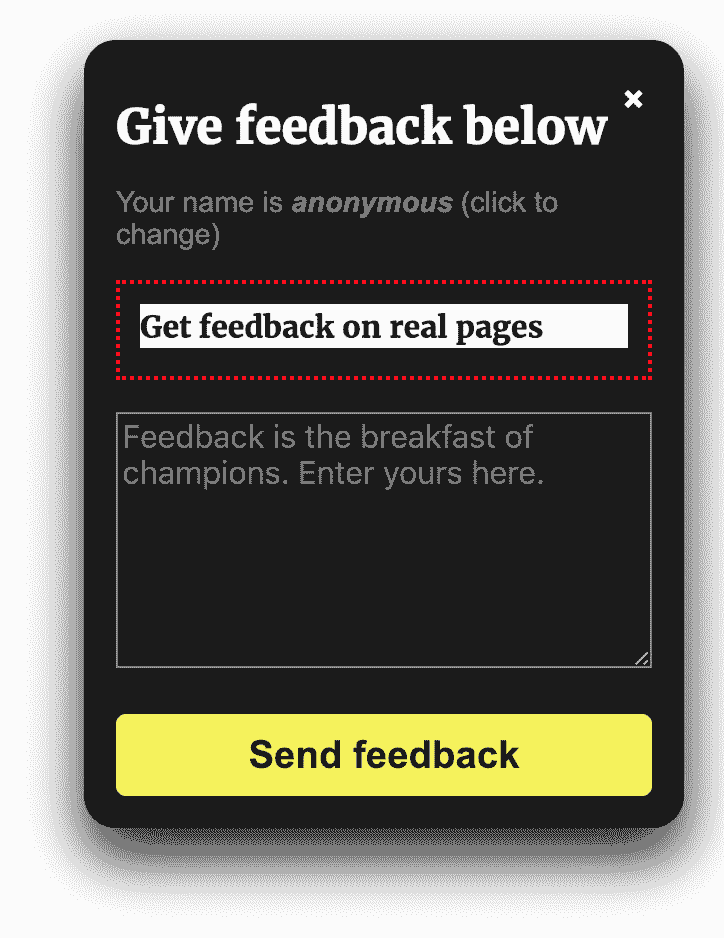
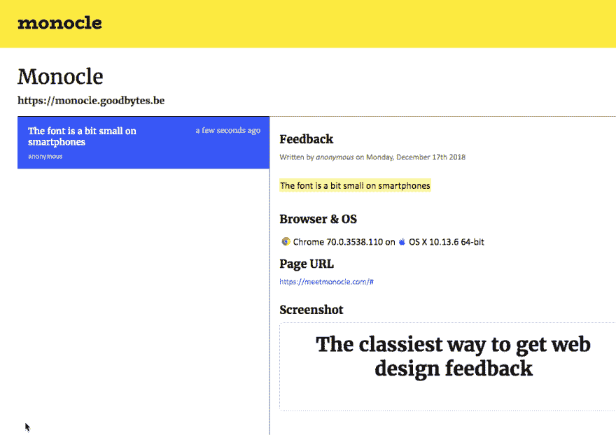

# 辅助项目:MeetMonocle.com

> 原文：<https://dev.to/goodbytes/side-project-meetmonoclecom-214k>

嗨 devs，

为了结合构建有用的东西来学习 firebase，我构建了下面的小应用程序来让你更容易地管理客户反馈。如果你们中的任何人能抽出时间尝试一下并给我反馈，我会很高兴。**我特别想知道这是不是你会用到的东西，或者根本不用。**

*技术堆栈*:vuej+fire base+sass+。

我的一个在网络开发机构工作的朋友找到我，问我是否知道一个好的工具，可以让他们的客户对网上商店给出反馈。我向他们推荐了几款优秀的工具，可以让你上传设计并获得反馈(比如 sketch cloud 或 redpen)。

这不是他们想要的，因为上传了 60 多张桌面、移动，...太麻烦了，所以他们问是否有可能在真实的设备上使用真实的网页作为反馈的基础。

我最终得到了一个可以在几分钟内添加到任何页面的小部件。客户可以点击并提交他们的反馈，而开发人员可以很容易地看到客户使用的浏览器或设备。

小部件如下所示:

开发人员或团队会立即收到反馈:

在[https://meetmonocle.com](https://meetmonocle.com)看看吧

第一个给我一些反馈并在页面中找到开发参考的人将获得一个免费的专业帐户！

如果您对我使用 firebase 的经历感兴趣，或者我能在其他方面提供帮助，请告诉我。