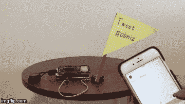

# 用“#obniz”发推文！旗帜会摇动！

> 原文：<https://dev.to/obniz_io/tweet-with-obniz-flag-will-shake-1o2g>

## 工作原理

当有人以“#obniz”为标签发推文时，它会摇旗呐喊。

## 材料

1.  ob niz–1
2.  伺服电机-1
3.  标志–1
4.  电池或 usb 适配器和电缆–1

## 程序

[https://obniz.io/explore/1](https://obniz.io/explore/1)