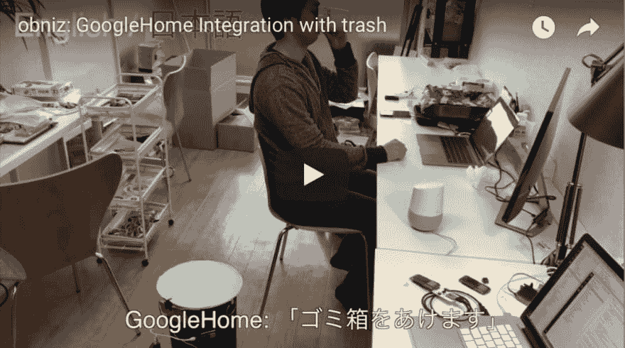
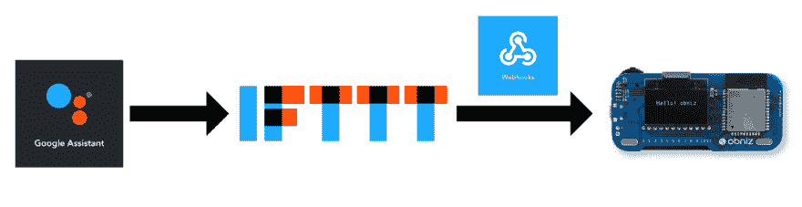
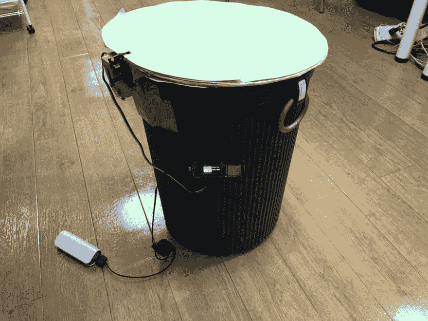
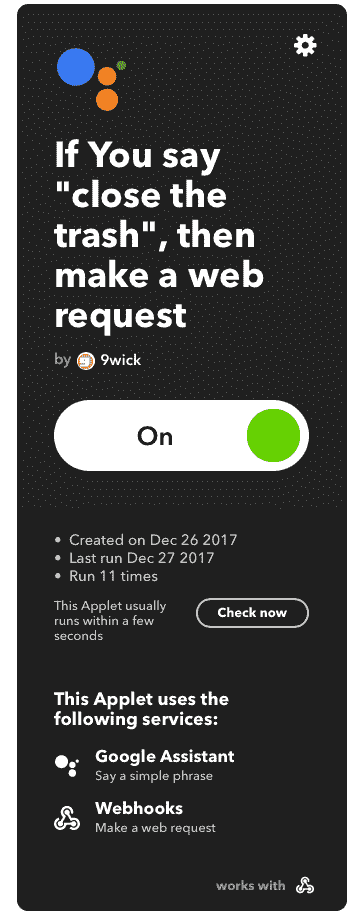

# Google Home 集成

> 原文：<https://dev.to/obniz_io/google-home-integration-3e8c>

## 工作原理

控制垃圾只需说“好的，谷歌打开垃圾！”Google Home 已经集成了 IFTTT。
而且 IFTTT 有 Webhooks 集成。

 
obniz 有一个消息传递 API。
从任何其他网络服务向 obniz 发送消息都很容易。
通过在 IFTTT 上向 obniz 添加 Webbhooks，GoogleHome 集成变得尽可能简单。

## 材料

-obniz–1
-电池或 usb 适配器&线缆–1
-伺服电机&垃圾–1
-步骤
-步骤 1
-将伺服电机连接到 obniz。
-喜欢

1.  io1: GND，
2.  io2: VCC，
3.  io3:发信号，然后启动你的 obniz。

## 第二步

在 IFTTT 上添加 webhook。
[T3】](https://res.cloudinary.com/practicaldev/image/fetch/s--Bpp0pmr5--/c_limit%2Cf_auto%2Cfl_progressive%2Cq_auto%2Cw_880/https://storage.obniz.img/c35c92f27cf3bd011526176456275)

## 第三步

在下面写代码。
并在 HTML 或 nodejs 上运行。

## 程序

[https://obniz.io/explore/5](https://obniz.io/explore/5)