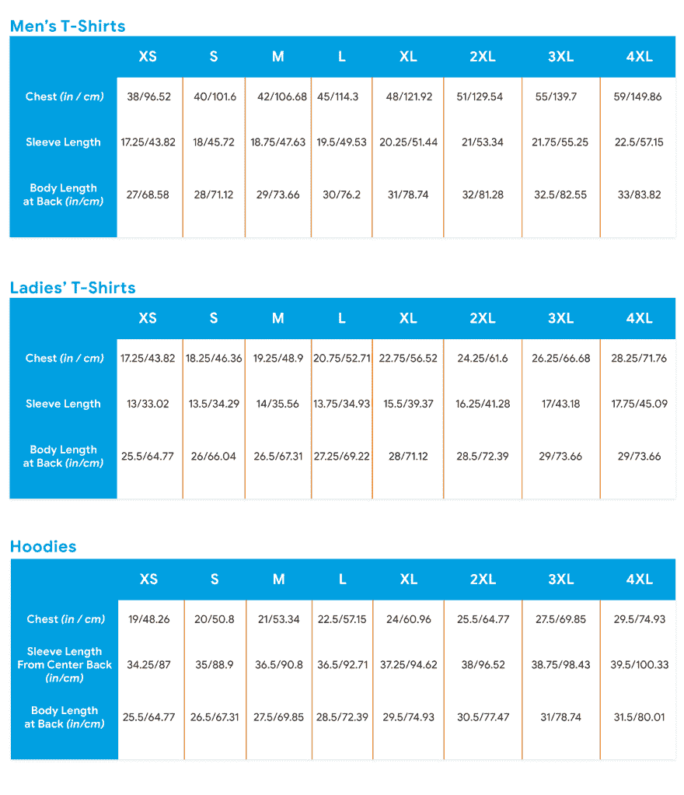

# 我是谷歌代码-2018 年决赛选手-我需要帮助😓

> 原文：<https://dev.to/bauripalash/im-a-google-code-in-2018-finalist---i-need-help--121>

我完全直奔主题

我是今年的谷歌代码决赛选手，我应该得到一件 t 恤和一件连帽衫

#### 我的胸是:45 寸

#### 袖长:22 寸

#### 体长:31 寸

这是他们提供的尺码表:

t 恤尺寸对我来说没问题，XL 更合适，但是没有符合我要求的帽衫尺寸组！！😣😣

我该怎么办？

在指导我如何获得奖品的电子邮件中，提到了联系*Google open source[at]shumsky . com*获取任何与 t 恤/帽衫相关的信息。

我发邮件解释了我的问题，但令人惊讶的是，他们的员工认为 **XL 的帽衫适合我**😒我的意思是，你可以自己看看图表，XL 根本没有达到我的要求！

我试着解释，突然收到一封意外的不在办公室的邮件😯

昨天晚上(印度标准时间 1 月 7 日晚上)，她(我希望是她)回复道:

> 嗨！
> 
> 我今天和工厂谈过了，他们确认了衣服的尺寸，所以请订购你平时穿的尺寸！
> 
> 谢谢，
> 
> [她的名字]

我不太明白她的意思，如果没有符合我要求的尺码，我该如何订购我平时穿的尺码？？😒

我也发邮件给 gci-support，解释了我的问题，但是没有...没有回复！😣

现在，我不明白我该怎么办？请给我一些建议？