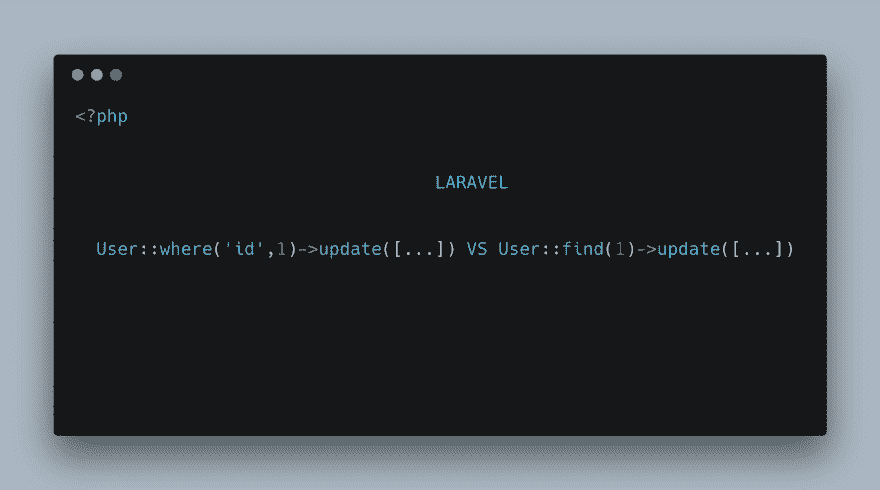
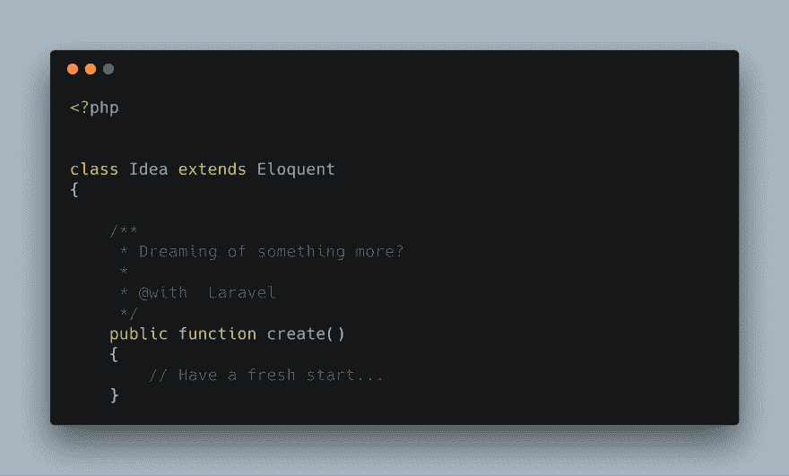

# 知道它是一个模型还是一个建筑者(拉勒韦尔)

> 原文：<https://dev.to/eddymens/knowing-when-its-a-model-or-a-builderlaravel-5725>

`User::where('id',1)->update([])`和`User::find(1)->update([])`做同样的事情，但方式不同。

**Erhn？**

在 Laravel 中使用数据库时，你通常会发现自己要么使用**雄辩的**要么使用低级别的**流畅的查询**。

雄辩提供了使用流畅查询来“对象化”数据库的方法。简单地说，就是用额外的奶酪包装流畅的查询:)。

**一些潜在机制。**

一般来说，关于**流畅查询**的一切都可以在名称空间`Illuminate\Database\Query\Builder`下找到

`Illuminate\Database\Eloquent\Model`下的一切雄辩

**进一步深入雄辩**

 
*如果你知道你知道:)*

口才也有很多部分，主要的吸引点是**模型类、**它自己的**查询生成器类**以及其他重要的类，如**关系**等。

**示例**现在让我们尝试分解几个查询

> `User::where('id',1)` **:** 这条语句开始时是一个雄辩的模型，然后一旦**被调用，返回的实例就是雄辩构建器的实例，这意味着你可以附加更多的查询方法。**NB:****雄辩** **构建器**扩展了**流畅**查询构建器来执行其任务。**
> 
>  **`User::find(1)` **:** 该语句立即返回主键为 **1 NB:** 的记录的模型实例，如果将多个 id 传递给 **find** 方法，例如`find([1,2,3]`，将返回一个雄辩的集合**

 **因此，第一个带有**的查询，其中**方法返回查询构建器的一个实例，这意味着我们可以添加更多的查询构建器方法，以及当被调用的方法不存在于雄辩构建器类中时的流畅查询，例如:`join`方法。

对于第二个查询，我们仍然可以追加模型和查询构建器方法。

**NB:** 有些方法同时存在于构建器和模型类中。

所以你可以想象，如果你有一个模型实例，方法的第一个引用点将来自**模型**类，如果没有找到，将从**查询构建器中查找。**有点像继承中的方法覆盖。但是在这个例子中，这个检查使用了神奇的方法**_ _ call**https://github . com/laravel/framework/blob/5.7/src/Illuminate/Database/口才/模型. php#L1602 。

在**构建器**和**模型**中都存在的方法之一就是更新方法。

这些更新的实现有一些不同，如果模型不存在，模型中的更新会返回 false，并且允许用户传入选项，例如是否设置时间戳。

为什么值得注意呢？

不是说您可能想这样做，而是说由于某种原因，您在模型中覆盖了 update 方法。这意味着只要你有一个**模型**实例，比如上面的例子`User::find(1)->update([...]`，你被覆盖的方法就会被执行。

但是在这种情况下，使用另一种查询，返回一个**构建器**，你的方法将不会运行，因为默认的**构建器**内的更新将被调用。

但是希望您不必覆盖任何方法，而是找到其他更干净的方法来处理您可能遇到的情况。

不过，我希望通过这篇文章揭示的是理解事物如何工作的有用性，以及有一天它会如何派上用场:)

**参考文献**

[**照亮\数据库\雄辩| Laravel API**

_ 编辑说明 _laravel.com](https://laravel.com/api/5.7/Illuminate/Database/Eloquent.html)

[https://github . com/laravel/framework/blob/5.7/src/Illuminate/Database/雄辩/Builder.php](https://github.com/laravel/framework/blob/5.7/src/Illuminate/Database/Eloquent/Builder.php#L1291)

[https://github . com/laravel/framework/blob/5.7/src/Illuminate/Database/口才/模型. php](https://github.com/laravel/framework/blob/5.7/src/Illuminate/Database/Eloquent/Model.php#L1602)

[**雄辩:入门-Laravel-Web 工匠的 PHP 框架**

_ Laravel-Web 工匠的 PHP 框架。_laravel.com](https://laravel.com/docs/5.7/eloquent#updates)**