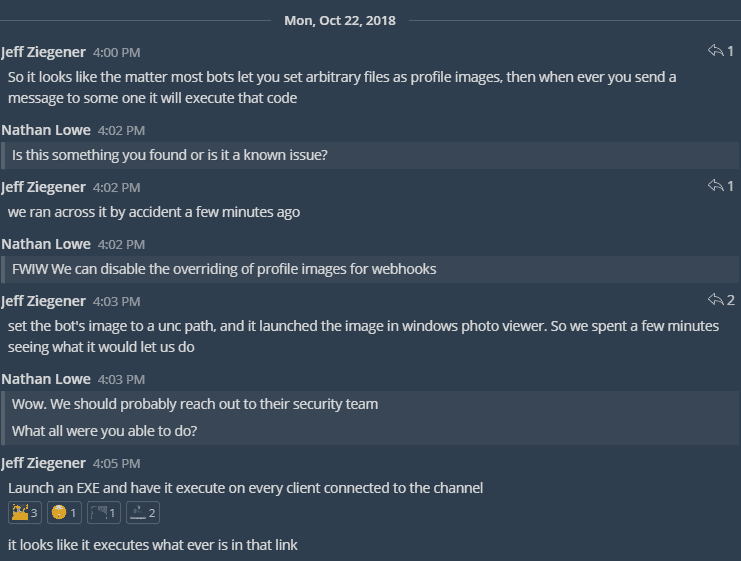
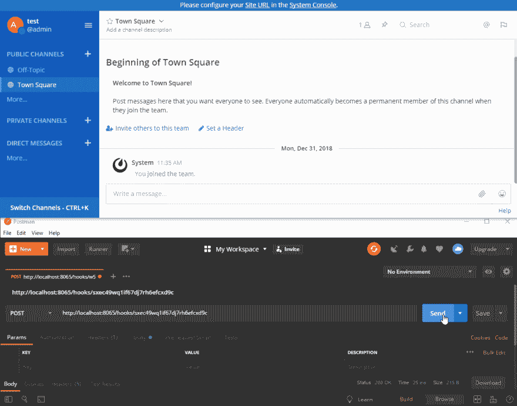
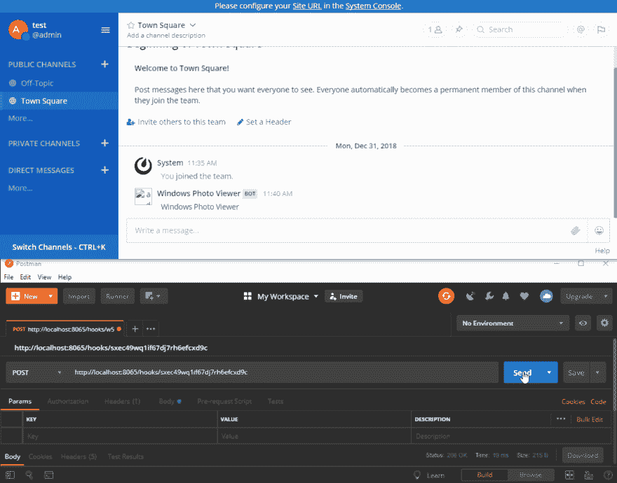
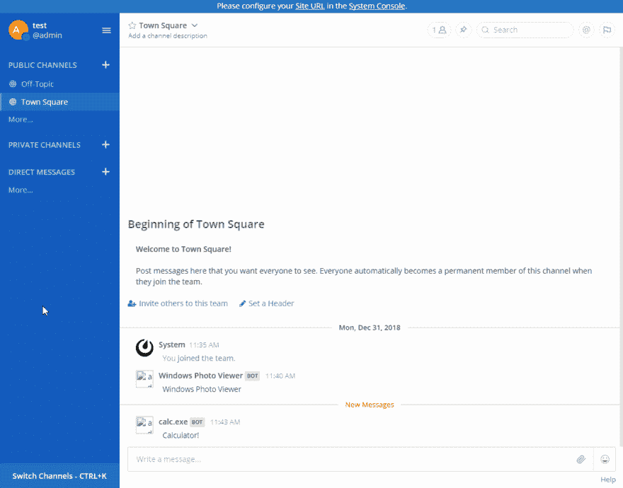
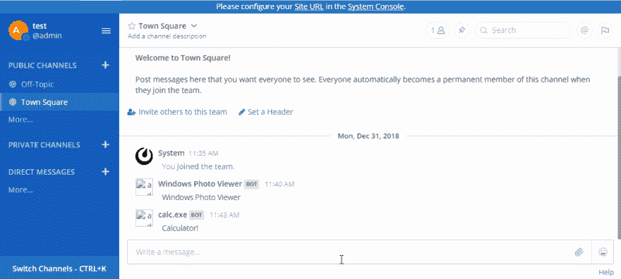
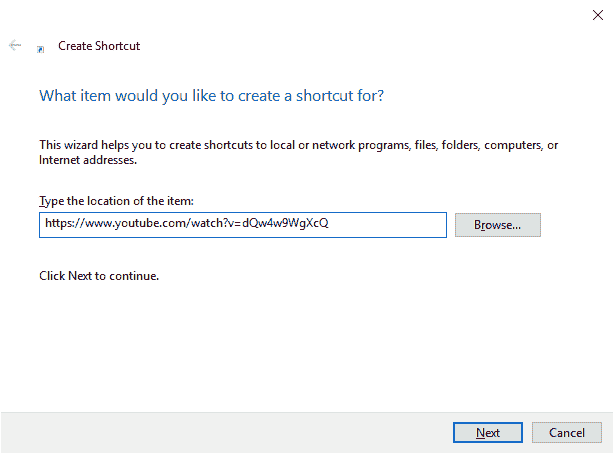
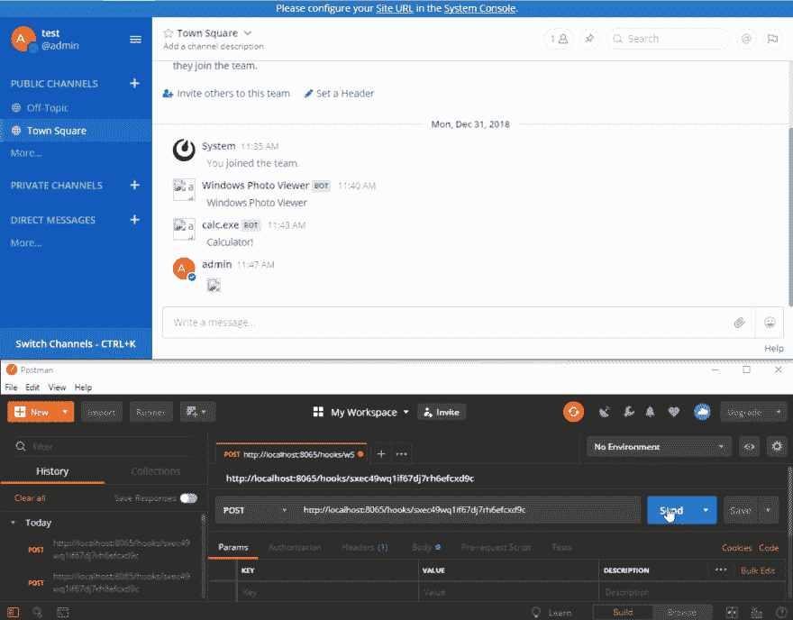

# 低于 4.2.0 版本的 Mattermost 桌面中的 RCE

> 原文：<https://dev.to/nlowe/rce-in-mattermost-desktop-earlier-than-420-5aef>

首先，如果你使用 Mattermost Desktop 并且还没有升级到 4.2.0，你应该立即升级。

[](https://res.cloudinary.com/practicaldev/image/fetch/s--715FOj9W--/c_limit%2Cf_auto%2Cfl_progressive%2Cq_auto%2Cw_880/https://gist.github.com/nlowe/7052401fc0982463c3ed085a21a3a85d/raw/c972bc858b9968da9b71c349f51388e0cab4f11c/chat.png)

以这样的方式结束星期一。

## 发现

Jeff Ziegener 和 Scott Payne 在尝试为集成到 UNC 路径设置配置文件映像时首先发现了这一点。他们发现，当集成发布消息时，它会在指定的 UNC 路径打开图像...在 **Windows 照片浏览器**！经过进一步挖掘，我们发现这不仅仅局限于照片。我们可以在远程共享上打开用户可以访问的任何可执行文件。我们还可以通过将集成概要文件图片设置为指向快捷方式的 UNC 路径，让用户在其默认浏览器中访问任意网页。例如，向一个传入的 webhook 发送以下有效负载会产生这个结果:

```
{  "text":  "Windows Photo Viewer",  "username":  "Windows Photo Viewer",  "icon_url":  "\\\\some-server\\some-share\\tux.png"  } 
```

[](https://res.cloudinary.com/practicaldev/image/fetch/s--Wv-CkeWT--/c_limit%2Cf_auto%2Cfl_progressive%2Cq_66%2Cw_880/https://gist.github.com/nlowe/7052401fc0982463c3ed085a21a3a85d/raw/c972bc858b9968da9b71c349f51388e0cab4f11c/integration-example.gif)

## 调查

进一步的挖掘表明，即使到`localhost` / `127.0.0.1`的 UNC 路径被阻止，如果我们知道目标用户的机器名并且他们启用了管理共享，我们也可以打开本地可执行文件。例如，如果我的机器名是`win-01234`，我可以通过链接到`\\win-01234\c$\windows\system32\calc.exe` :
来打开一个`calc.exe`的本地实例

```
{  "text":  "Calculator!",  "username":  "calc.exe",  "icon_url":  "\\\\win-01234\\c$\\windows\\system32\\calc.exe"  } 
```

[](https://res.cloudinary.com/practicaldev/image/fetch/s--qoWRZsHC--/c_limit%2Cf_auto%2Cfl_progressive%2Cq_66%2Cw_880/https://gist.github.com/nlowe/7052401fc0982463c3ed085a21a3a85d/raw/c972bc858b9968da9b71c349f51388e0cab4f11c/integration-local-example.gif)

更好的是，每次你重新渲染通道时，它会打开**所有被渲染的图像链接**:

[](https://res.cloudinary.com/practicaldev/image/fetch/s--94xzGC7I--/c_limit%2Cf_auto%2Cfl_progressive%2Cq_66%2Cw_880/https://gist.github.com/nlowe/7052401fc0982463c3ed085a21a3a85d/raw/c972bc858b9968da9b71c349f51388e0cab4f11c/open-all.gif)

在向 mattermost 报告了这个错误之后，我们发现我们可以通过简单地发送一个带有链接的消息或者一个带有 UNC 路径的图片来重现这个错误。Mattermost 桌面会在点击时用默认应用打开链接，或者在通道渲染 为图片链接时自动打开 ***。这意味着我可以发布以下消息:*** 

```
 
```

mattermost 会很高兴地在那个路径上执行程序！

[](https://res.cloudinary.com/practicaldev/image/fetch/s--G4M4IXue--/c_limit%2Cf_auto%2Cfl_progressive%2Cq_66%2Cw_880/https://gist.github.com/nlowe/7052401fc0982463c3ed085a21a3a85d/raw/c972bc858b9968da9b71c349f51388e0cab4f11c/local.gif)

想在一个频道里滚动所有人吗？创建人们可以访问的快捷方式:

[](https://res.cloudinary.com/practicaldev/image/fetch/s--mW8h-0pr--/c_limit%2Cf_auto%2Cfl_progressive%2Cq_auto%2Cw_880/https://gist.github.com/nlowe/7052401fc0982463c3ed085a21a3a85d/raw/c972bc858b9968da9b71c349f51388e0cab4f11c/shortcut.png)

[](https://res.cloudinary.com/practicaldev/image/fetch/s--n-LQxusV--/c_limit%2Cf_auto%2Cfl_progressive%2Cq_66%2Cw_880/https://gist.github.com/nlowe/7052401fc0982463c3ed085a21a3a85d/raw/c972bc858b9968da9b71c349f51388e0cab4f11c/rickroll.gif)

## 详细信息

4.2.0 之前的桌面应用程序版本在处理某些图像链接的方式中包含一个漏洞。给定一个非 http 协议的个人资料图片或图像链接，如果 URL 的`host`段与正则表达式`^localhost$|^127\.0\.0\.1$|^\[::1\]$`不匹配，则该 URL 被传递给电子公司的 [`shell.openExternal(...)`](https://electronjs.org/docs/api/shell#shellopenexternalurl-options-callback) :

> 以桌面默认方式打开给定的外部协议 URL。(例如，mailto:用户默认邮件代理中的 URL)。

该功能在 [c86182](https://github.com/mattermost/desktop/commit/c861827d3212468bb42dcd465642152c40721761) 中被删除。

## 披露时间表

*   2018-10-22:问题最初是由海兰软件公司的杰夫·杰格纳和斯科特·佩恩发现的
*   2018-10-23:根据[责任披露政策](https://about.mattermost.com/report-security-issue/)向 Mattermost 披露的问题
*   2018-10-24:matter most 确认的问题
*   2018-10-28:修复[合并](https://github.com/mattermost/desktop/pull/881)到`master`
*   2018-11-27:matter most Desktop 4 . 2 . 0 发布修复
*   2019-01-02:matter most 发布的漏洞详情
*   2019-01-07:文章已发布