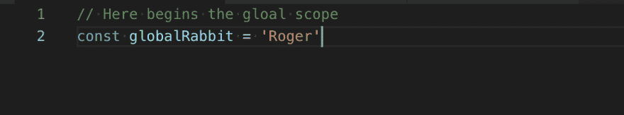
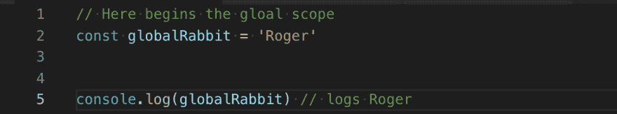
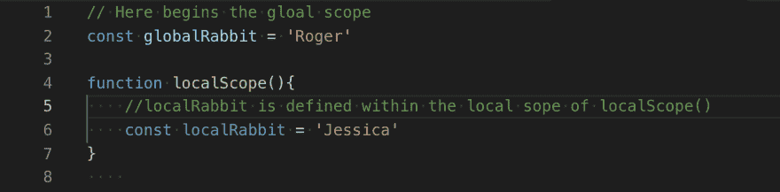
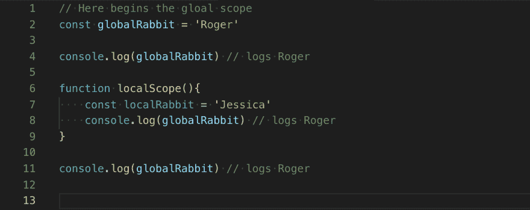
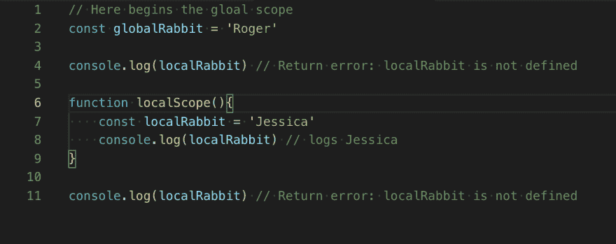

# 理解 JavaScript 中的范围

> 原文：<https://dev.to/mrrogercampbell/understanding-scope-in-javascript-2hk4>

# 快速汇总

全球，本地他们是什么意思。在这篇博文中，我将帮助解释 scope 是如何工作的，以及如何在代码中更好地实现它。

# 要求:

*   对 JavaScript 的基本理解。
*   您选择的文本编辑器。
*   愿意学习。

# 介绍

作用域是 JavaScript 中的一个特性，它允许您指定代码中变量、函数和对象的生命周期、访问和可见性。

为了理解作用域在 JavaScript 文档中是如何工作的，我认为应该首先理解作用域的一些主要好处。

*   Security- Scope 允许您限制对变量和函数的访问，以便只在需要的时候调用它们。
*   减少命名空间冲突——当两个或多个变量共享相同或相似的名称时会发生这种情况。当你正确使用 scope 时，你可以降低神经系统并发症的风险。
*   代码可重用性——当您正确使用局部作用域时，您的代码变得更加动态和可重用，同时减少了可能的副作用。

# 范围类型:

*   全球的
*   当地的

# 全球范围:

当您开始在 JavaScript 文档中编写代码时，您就在全局范围内了。您可以访问任何全局变量函数、对象等。从你的应用程序开始直到它。任何变量、函数、对象等。你在全局范围内定义的是可用的。

下面我在全局范围内定义了一个名为‘glabalRabbit’的变量。

现在我们已经定义了“globalRabbit ”,让我们用 console.log 返回它的定义值。

# 本地范围:

任何时候你创建一个函数并在其中定义一个变量，你都是在创建局部作用域。这意味着，如果您在两个独立的函数中使用相同的变量名，它们不会导致名称空间冲突。尽管在代码中随时使用相同的变量名并不是最佳做法。

在下面的例子中，我创建了一个名为 localScope 的函数，并定义了一个名为 localRabbit 的变量。

现在让我们测试我们的全局范围变量。

下面我们可以看到，当我们在新创建的函数的上面、下面和内部使用 console.log(globalRabbit)时，我们能够返回它的值。

接下来让我们测试一下我们的局部范围变量。

如您所见，当我们尝试 console.log(localRabbit)时，我们只能在定义它的函数内部返回它的值。

# 专业提示

*   当您开始在 JavaScript 文档中键入时，全局范围就开始了。
*   局部作用域是在创建函数时定义的。
*   避免对不同的实例使用相同的变量名。