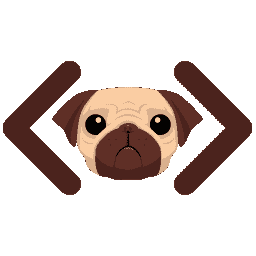
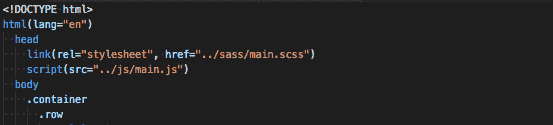
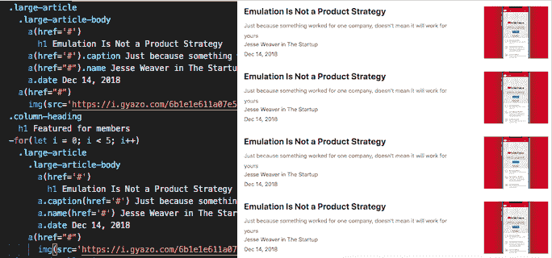

# 让我们学习哈巴狗！

> 原文：<https://dev.to/zukululu/lets-learn-pug-3e90>

[](https://res.cloudinary.com/practicaldev/image/fetch/s--Rr7K5gOm--/c_limit%2Cf_auto%2Cfl_progressive%2Cq_auto%2Cw_880/https://dbalas.gallerycdn.vsassets.io/extensions/dbalas/vscode-html2pug/0.0.2/1532242577062/Microsoft.VisualStudio.Services.Icons.Default)

## 什么是哈巴狗？

**首先，什么是哈巴狗？** [Pug](https://pugjs.org/api/getting-started.html) 是一个模板引擎，它混合了 JavaScript 和 HTML 的语法来编写 HTML 文档。这种混合允许我们做 JavaScript 和 HTML 都可以使用的事情，比如创建和存储变量、创建函数、插入变量、创建和填充 HTML 文档，而不包括元素标签。使用 pug 可以使代码更简洁，因为元素标签被排除了，同时通过允许我们在同一个文件中实现变量和函数来保持 JavaScript 的灵活性。

[](https://res.cloudinary.com/practicaldev/image/fetch/s--F5zUvueA--/c_limit%2Cf_auto%2Cfl_progressive%2Cq_auto%2Cw_880/https://i.gyazo.com/d514df7a32eb3d8ba36da992893bb0e0.png)

元素标签的排除使得代码更加简洁。起初，我有点困惑，并花了更多的时间来确保缩进在正确的位置，但调整后，我不认为我会回到传统的 HTML 文件中键入。由于丢失了结束标记或任何丢失的字符，排除标记也使得调试更容易。Pug 还允许简单的元素创建和添加 id 或类。类名为“hello”的 div 可以简单地输入为。你好。

```
.hello.anotherClass.andAnotherOne
        h1 I have created a div that has 3 classes, and an h1 element inside of that div! 
```

然而，由于引擎不使用任何标签或括号，所以非常强调缩进。不是将内容放在标签中，而是简单地缩进显示哪个元素是子元素/父元素。

起初，当我试图复制 Medium 的网站作为一项课堂作业时，我不太确定如何处理 HTML 文档中的 JavaScript 功能。然而，在创建它并返回查看有多个重复的元素之后，我发现了一个实现一些 JavaScript 代码来减少我的 HTML 中的行的完美地方。

[](https://res.cloudinary.com/practicaldev/image/fetch/s--NUSFUozS--/c_limit%2Cf_auto%2Cfl_progressive%2Cq_auto%2Cw_880/https://i.gyazo.com/9cbfde1dcb90d9c8c0c03e4aeb424005.png)

在这段代码中，您在 for 循环上方看到的代码重复了 5 次，生成了 5 篇文章。不是创建相同代码的 5 个块，而是创建一个 for 循环来创建相同的文章 5 次。因为 pug 可以创建变量，所以可以创建一个数组来存储链接，循环可以用这些 URL 创建这些元素！

我才刚刚开始接触 pug 的皮毛，但是我期待更多地使用它！