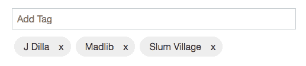
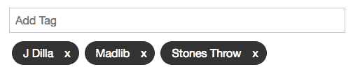
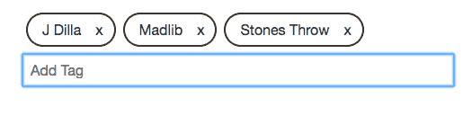
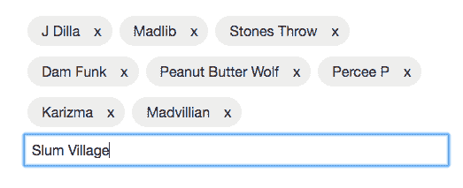

# 单片元件、可组合元件

> 原文：<https://dev.to/busypeoples/monolithic-components-composable-components-pgg>

## 简介

构建可重用的 UI 组件是一项重要的任务，因为我们在规划可重用性时需要考虑很多事情。一方面，我们希望支持定制，另一方面，我们希望避免开发人员做错事情，比如破坏组件或显示无效状态。

为了更好地理解我们需要预先考虑的内容，我们将构建一个重要的 UI 组件来显示标签。我们的`Tags`组件将负责管理和显示标签。

下面的例子都是用 [**超光速粒子**](https://tachyons.io) 和 [**反应**](https://reactjs.org/) 构建的，但是这些想法适用于任何 UI 组件和任何通用样式方法。

## 基础知识

先说一下`Tags`。标签应该能够添加，显示和删除标签。
它还应该能够根据需要设计组件的样式，并为配置这些标签的行为和表示留出一些空间。

我们第一个简单的方法可能是定义一个`<Tags />`组件，它期望一个标签数组并显示这些标签。可选地，应该有添加新标签的能力和删除标签的可能性。最初的 API 实现考虑了所有这些情况。

```
type TagsProps = {
  items: Array<string>,
  onAdd?: (tag: string) => void,
  onRemove?: (tag: string) => void
}; 
```

Enter fullscreen mode Exit fullscreen mode

[](https://res.cloudinary.com/practicaldev/image/fetch/s--ydHGgr-r--/c_limit%2Cf_auto%2Cfl_progressive%2Cq_auto%2Cw_880/https://thepracticaldev.s3.amazonaws.com/i/u6y27bk17qhc4jtgvjux.png)

因此，我们已经可以看到它呈现了一组提供的标签，并显示了一个用于添加新标签的输入元素。这个实现对这些可选类型也有一些假设。如果没有提供`onAdd`函数，我们也不显示输入元素，对于移除标签也是一样。

我们如何设计标签表示的样式？

一种方法是暴露另一个支持定义主题的道具。我们可能会提供两到三个不同的选项，比如`light`、`default`和`dark`。

```
type Theme = "light" | "default" | "dark";

type TagsProps = {
  items: Array<string>,
  onAdd?: (tag: string) => void,
  onRemove?: (tag: string) => void,
  theme?: Theme
}; 
```

Enter fullscreen mode Exit fullscreen mode

使用这个组件的开发人员现在可以在不同的模式之间切换，例如，使用下面的声明将返回一个深色主题标签组件。

```
<Tags
  items={items}
  addItem={this.addItem}
  onRemove={this.removeItem}
  theme="dark"
/> 
```

Enter fullscreen mode Exit fullscreen mode

[](https://res.cloudinary.com/practicaldev/image/fetch/s--0OMRjqZU--/c_limit%2Cf_auto%2Cfl_progressive%2Cq_auto%2Cw_880/https://thepracticaldev.s3.amazonaws.com/i/74ngw7ubr73bp3yilyf8.png)

到目前为止，我们能够设计我们的 API 来处理所有预期的基本用例。但是让我们考虑一下开发人员可能会如何使用这个`Tag`组件。例如，我们如何在标签下面显示输入框呢？目前没有办法用`Tags`组件做到这一点。

## 重构

让我们后退一步，想一想如何让开发人员自由定义输入框的位置。一个快捷的方法是添加另一个属性，它可以定义某种数组形式的排序。但这看起来非常即兴，并留下了出错的空间。我们有更好的方法来解决这个问题。

我们可以通过向用户公开底层构建块来利用组合。`Tags`使用`InputBox`和`Tag`引擎盖下，我们可以出口这些组件，使他们可用。

[](https://res.cloudinary.com/practicaldev/image/fetch/s--ekXnkwlc--/c_limit%2Cf_auto%2Cfl_progressive%2Cq_auto%2Cw_880/https://thepracticaldev.s3.amazonaws.com/i/y5drgenm9a0ngdkotlxd.png)

让我们仔细看看组件是如何构成的。

```
<div>
  <div className="measure">
    {this.state.items.map(item => (
      <Tag title={item} key={item} onRemove={this.onRemove} theme="light" />
    ))}
  </div>
  <div className="measure">
    <TagInput value={this.value} onSubmit={this.onSubmit} />
  </div> </div> 
```

Enter fullscreen mode Exit fullscreen mode

有趣的是，我们不再使用`Tags`组件，我们显式地映射标签，但是我们可以直接使用`TagInput`，因为它独立地处理本地状态。尽管这种方法让开发人员可以控制如何布局标签，但这也意味着我们首先要避免的额外工作。我们如何才能避免映射这些项目，并且仍然能够定义排序？我们需要一个更好的解决方案。

让我们再次定义一个`TagItems`组件。

```
type TagItemsProps = {
  items: Array<string>,
  onRemove?: (tag: string) => void,
  theme?: Theme
};

<TagItems items={items} onRemove={this.removeItem} theme="dark" />; 
```

Enter fullscreen mode Exit fullscreen mode

我们可以从`TagsInput`组件中分离出`TagItems`组件。使用输入组件取决于开发人员，但也允许根据需要定义排序和布局。

```
<div>
  <div className="measure">
    <TagItems items={items} onRemove={this.onRemove} />
  </div>
  <div className="measure">
    <TagInput value="" onSubmit={this.onSubmit} />
  </div> </div> 
```

Enter fullscreen mode Exit fullscreen mode

这看起来已经很明智了。我们可以显式地定义组件的布局和顺序，而不必手动处理任何内部问题。

现在，如果我们考虑进一步的需求，我们可以预见需要为呈现的标签或输入框定义一些特定的样式。我们已经展示了主要的构建模块，但是我们如何调整主题来适应现有的设计呢？

我们的标记组件需要解决在需要时覆盖特定样式方面的可能性。一种可能的方法是添加类或内联样式。

需要回答的更好的问题是，我们的主要构件是否应该关心任何视图信息。一种可能的方法是定义一个回调函数来定义我们实际想要使用的底层构件。也许一些开发人员想添加一个不同的关闭图标？

在我们继续之前，让我们考虑一些关于组件的事实。

我们的`TagInput`组件负责管理本地状态，并在用户按 enter 键时允许访问标签值。

`Tags`组件遍历提供的标签并呈现它们，将移除功能传递给每个`Tag`组件。

有了这些构建模块，我们已经可以确保任何开发人员都可以显示看起来不错的标签。但是，当未来出现一些特定的需求时，我们已经可以看到一些限制。目前，我们已经耦合了状态和视图处理。我们的下一步是从管理状态处理的`TagsInput`组件中分离出实际的`Input`组件，它负责任何视图问题。

现在我们有了更好的理解，让我们看看组件的进一步解耦会给我们带来什么。

```
type InputProps = {
  value: string
};

const Input = ({ value, ...additionalProps }: InputProps) => {
  return (
    <input
      id="tag"
      className="helvetica input-reset ba b--black-20 pa2 mb2 db w-100"
      type="text"
      value={value}
      placeholder="Add Tag"
      {...additionalProps}
    />
  );
}; 
```

Enter fullscreen mode Exit fullscreen mode

上面的代码是我们可能想要提供的最小的构建块。如果需要，它提供了覆盖特定样式甚至`className`属性的可能性。我们也没有定义在这种情况下如何处理 onChange 或 onSubmit。我们的`TagsInput`传递一个 onChange 和 onKeypress 属性，但是在特定情况下，我们可能希望通过一个按钮提交。

我们的`TagsInput`不关心实际的样式，只关心管理状态和提供更新状态以及提交状态的功能。对于本例，我们将提供 render prop，但其他方法(如高阶组件或其他方法)的工作原理相同，因此我们可以在需要时重用状态处理逻辑，并在需要时提供自己的输入组件。在这种情况下，状态处理似乎不值得花费精力，但是我们可能在更高级的实现中做更复杂的事情。它应该强调我们现在可以公开状态和视图处理的事实。开发者土地现在可以根据需要自由组合。为了更好的理解，请看下面的例子。

```
type StateType = { value: string };

class TagInput extends React.Component<TagInputProps, StateType> {
  constructor(props: TagInputProps) {
    super(props);
    this.state = { value: props.value };
  }

  onChange = (e: any) => {
    this.setState({ value: e.target.value });
  };

  onSubmit = (e: any) => {
    e.persist();
    if (e.key === "Enter") {
      this.props.onSubmit(this.state.value);
      this.setState({ value: "" });
    }
  };

  render() {
    const { value } = this.state;
    const {
      onSubmit,
      value: propsTag,
      theme,
      render,
      ...additionalProps
    } = this.props;
    const tagsInput = {
      value,
      onKeyDown: this.onSubmit,
      onChange: this.onChange,
      ...additionalProps
    };
    return this.props.render(tagsInput);
  }
} 
```

Enter fullscreen mode Exit fullscreen mode

我们的`TagItems`组件不做太多事情，它只迭代条目并调用`Tag`组件，正如前面已经提到的。这里我们不需要做太多，我们也可以公开`Tag`组件，因为映射可以在需要时手动完成。

```
type TagItemsProps = {
  items: Array<string>,
  onRemove?: (e: string) => void,
  theme?: Theme
};

const TagItems = ({ items, onRemove, theme }: TagItemsProps) => (
  <React.Fragment>
    {items.map(item => (
      <Tag title={item} key={item} onRemove={onRemove} theme={theme} />
    ))}
  </React.Fragment> ); 
```

Enter fullscreen mode Exit fullscreen mode

## 最后的想法

这个演练和重构会议，使我们能够提供一个整体的`Tags`以及`TagInput`、`Input`、`TagItems`和`Tag`组件。标准的方法是使用`Tags`组件，但是如果需要一些特殊的定制，我们现在可以使用底层的构建模块来根据需要重建行为。

随着即将发布的 hooks，我们甚至可以以更明确的方式公开所有的构建模块。我们可能不再需要`TagInput`组件，我们可以公开一个钩子来代替，并在`Tags`内部使用这个钩子。

当我们需要开始添加像`components={['input']}`或`components={['input', 'tags']}`这样的属性来指示我们想要显示哪些组件以及以何种顺序显示时，这是一个暴露底层构建块的好指标。

我们可以观察到的另一个有趣的方面是，在将一个整体分割成更小的块之后，我们的顶层`Tags`可以被用作默认实现，即更小的构建块的组合。

```
type TagsProps = {
  items: Array<string>;
  onRemove: (e: string) => void;
  onSubmit: (e: string) => void;
  theme?: Theme;
};

const Tags = ({ items, onRemove, onSubmit, theme }: TagsProps) => (
  <React.Fragment>
    <div className="measure">
      <TagItems items={items} onRemove={onRemove} theme={theme} />
    </div>
    <div className="measure">
      <TagInput
        value=""
        onSubmit={onSubmit}
        render={props => <Input {...props} />}
      />
    </div>
  </React.Fragment> ); 
```

Enter fullscreen mode Exit fullscreen mode

我们现在可以开始添加一些标签。

[](https://res.cloudinary.com/practicaldev/image/fetch/s--D0Dvr0-D--/c_limit%2Cf_auto%2Cfl_progressive%2Cq_auto%2Cw_880/https://thepracticaldev.s3.amazonaws.com/i/xfq83p9k0jnoqoh6dyrq.png)

点击找到原文大意

***如果您有任何问题或反馈，请在此留言或通过 Twitter 联系:***