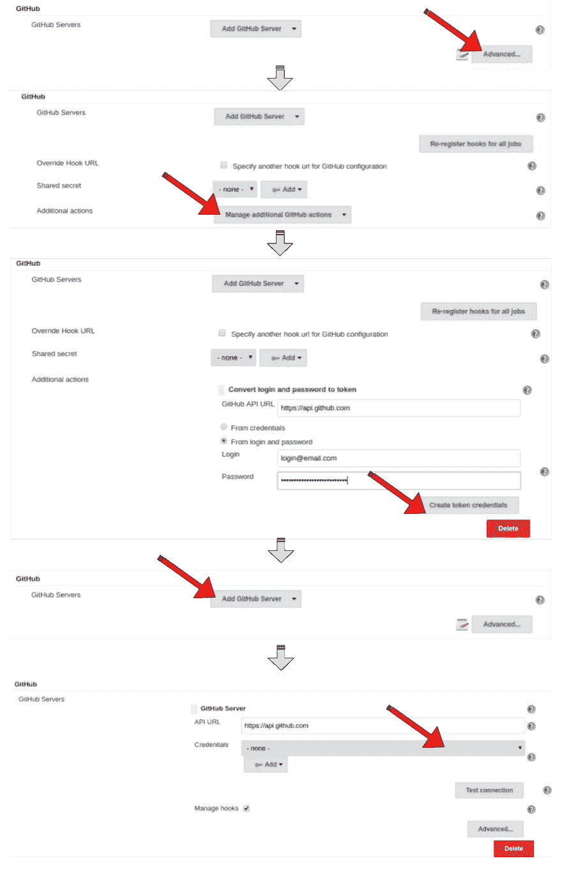
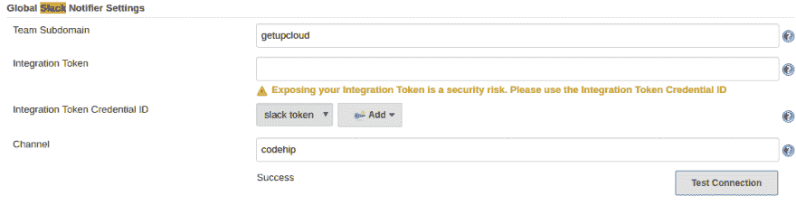
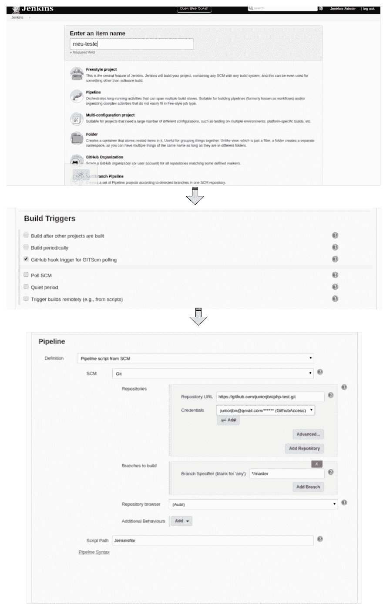
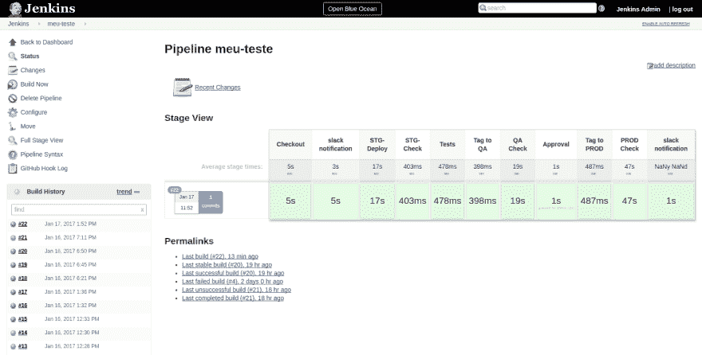
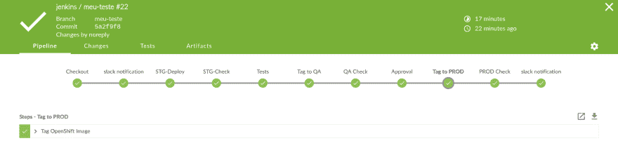

# 更聪明地工作，而不是更努力

> 原文：<https://dev.to/juniorjbn/work-smarter-not-harder-3c24>

让我们花点时间想想上面这张图。拿球的人可能花了更多的时间才开始。他可能收到了一些关于他起步较晚和其他人的初步结果的不好的反馈。然而，在这条线的稍远处，他赶上并超过了其他人，从那以后，他们之间的差距一直在扩大。

> 考虑到这一点，使用一个工具来自动化和集成从“推送”到“部署”的所有管道将会加快您的工作，并为您的团队提供快速失败和快速修复的能力。即使这需要你多花一点时间来设置，它也会为你在将来赢得一些距离。
> 
> 你可能已经听说过 Jenkins，这是一个很棒的工具，有很多插件，我们已经在这篇文章中介绍过[。
> 好了，现在我们要把它和 Github、Openshift、Slack 连接起来。不仅仅是工作，你的团队也会被整合。](https://blog.getupcloud.com/from-dev-to-prod-image-promotion-made-easy-8fb1b0f9a705)

首先，在我们的平台上拥有您自己的 Jenkins 非常简单:一旦您在应用程序上选择了它，几秒钟后它就可以使用了。

这里有一个例子。让我们考虑一个 PHP 示例应用程序，在 3 个环境中:开发、QA 和生产。我们的开发环境将是唯一要构建的环境，之后，Jenkins 将运行测试并标记其映像以用于 QA，并将等待人工批准以将更改推广到生产。

> 为了不把事情弄糟，我写了另一篇文章，标题是 [创建并标记图片](https://blog.getupcloud.com/creating-app-from-image-with-tag-8fb1b0f9a705) **，但是如果你对这个任务感到舒服，继续走下去。**

授予 jenkins 在 openshift 上管理应用程序的权限: *oc 策略
添加角色到用户管理系统:服务帐户:Jenkins:默认*

之后，需要设置 Jenkins 来连接和集成您的
帐户和应用程序，所以让我们开始吧:

**配置 jenkins openshift 插件:**使用我们的映像，我们已经将您的
凭证和配置导出到 jenkins，所以只需转到插件区域，安装
github 和 slack 插件，并更新所有其他插件。

**配置 jenkins github 插件:**在“[管理 Jenkins](http://jenkins-meu-teste.getup.io/manage) 区你可以这样设置。*提示:您需要先生成令牌*。

**配置 jenkins slack 插件:**生成你的香奈儿令牌->
[https://api.slack.com/tokens](https://api.slack.com/tokens)并填写表格。

**使用管道选项创建新的 jenkins 项目:**

**Jenkinsfile 示例:**

> 这个 Jenkinsfile 几乎不言自明。它与 openshift
> 的集成就像变魔术一样，只需设置好部署配置和项目名称，瞧！一切都是相互联系的，你可以从这里自由地管理你的项目。版本控制和控制一切尽在掌握。
> 
> 在“批准”阶段，使用“提交者”参数来设置允许与之交互的用户。
> 在标签上，QA 是 DEV 标签，PROD 是 QA 标签不是 DEV。
> 在你的项目中使用环境变量，这样你的应用在不同的环境中会有不同的行为，但是使用相同的应用。

* *手动构建:* *让我们看看神奇之处！

 
在你的作业里面，点击运行你的构建！

**配置 Github Webhook:** 因为已经设置了 Github 插件，所以不需要每次都点击 build 按钮。一个 github webhook 就可以设置好了，只需要去你的项目设置*([https://github.com/](https://github.com/)***用户/项目***/设置/hooks)* 然后像这样添加一个新的 web hook
*(http://***jenkinsURL***/github-web hook/)。*

你现在需要的只是编码、提交和推送来启动你的管道，从现在到永远，你只需要编码，你只需要考虑你的产品和你的客户。快乐的顾客意味着你的生意能赚更多的钱，这反过来会让你更快乐。

Jenkins 有很多其他插件，比你想象的要多，你可以根据自己的需要自由调整。

奖金:我一直在使用一个新的詹金斯界面称为“蓝海”。它是材料设计，并为 Jenkins 带来了漂亮的界面…自己看吧:

 
旧界面或当前界面:(

 
新建 UI 项目

 
管道视图:D

> 你已经走了这么远，谢谢你！

了解更多信息:

— [带 openshift 的管道](https://blog.openshift.com/pipelines-with-jenkins-2-on-openshift/)

— [Openshift Jenkins 插件](https://github.com/openshift/jenkins-plugin)

— [詹金斯 CI](https://wiki.jenkins-ci.org/display/JENKINS/Home)

* * *

> *在你走之前…再想想！*要取得新的成就，需要新的方法！

* * *

*   詹金斯
*   [持续集成](https://blog.getupcloud.com/tagged/continuous-integration?source=post)
*   [Openshift](https://blog.getupcloud.com/tagged/openshift?source=post)
*   [Kubernetes](https://blog.getupcloud.com/tagged/kubernetes?source=post)
*   [管道](https://blog.getupcloud.com/tagged/pipeline?source=post)