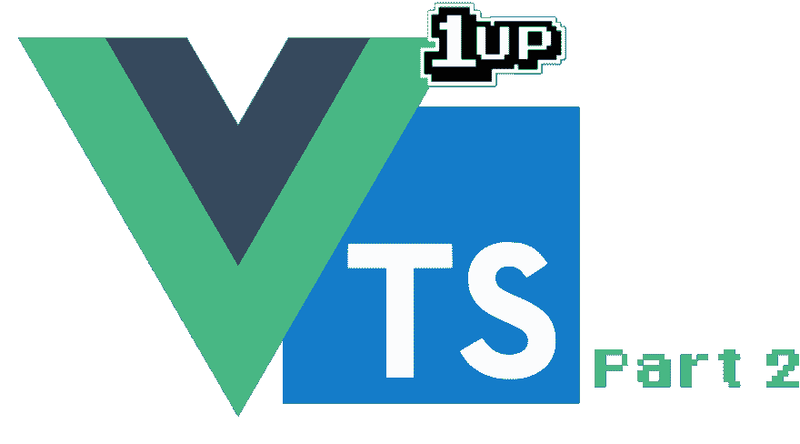

# 用 Typescript 升级 VueJS 项目(第 2 部分):将组件翻译成 Typescript

> 原文：<https://dev.to/fernalvarez590/level-up-your-vuejs-project-with-typescript-part-2-translating-components-to-typescript-3b64>

#### 如果您错过了第 1 部分，请访问以下帖子:

[用 Typescript 升级您的 VueJS 项目(第 1 部分):安装 Typescript](https://dev.to/lordferquad/level-up-your-vuejs-project-with-typescript-part-1-installing-typescript-3f7l)

对于本部分的完成版本，使用项目回购的以下分支:

[jefer590/upgrade-vuejs-ts 系列](https://github.com/jefer590/upgrade-vuejs-ts-series/tree/03/translate-components-to-ts)

在第 1 部分中，我们准备了使用 Typescript 的项目，并且只是安装+配置。对你们中的许多人来说，这可能被认为是“无聊”的部分，我理解这一点！为了弥补这一点，在这一部分我们将翻译几乎所有的 VueJS 文件(主视图+组件)来使用 Typescript！让我们开始吧。

### 翻译“Hello.vue”组件—单个文件组件

对于这个组件，我们将只用 TS 替换

当我们打开这个文件时，我们注意到这个文件非常简单:

*   组件数据只是一个名为 text 的带有字符串的变量
*   只有一个名为 textUpper 的计算属性使用文本

请记住这一点，因为我们将删除该组件的所有脚本部分，我们将使用 TS 重写该组件，从以下内容开始: