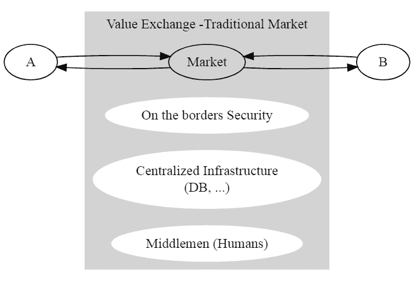
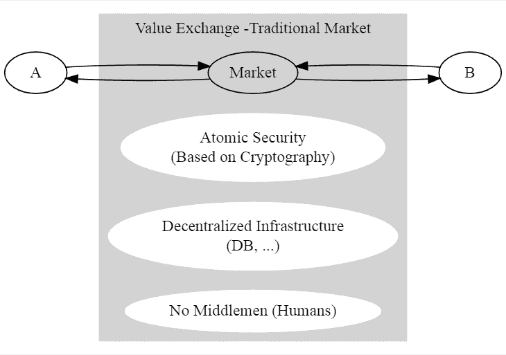

# 为什么基于区块链的系统比你想象的更高效

> 原文：<https://dev.to/nicolabernini/why-blockchain-based-systems-are-more-efficient-than-you-might-think-4b6k>

我们最近见证了网络如何深刻地改变了各种商业，包括市场实现的方式:网络驱动的市场通常遵循这种模式

在这个方案中，我着重于实现的一些具体方面:安全性、基础设施和人的因素。让我们更详细地分析它们

## 安全

通常在边界上实施安全措施，以确定可以进行计算的“安全区域”。

典型的工具包括认证、角色(管理员、用户……)、权限管理

## 集中式基础设施

依靠集中式基础设施实现了高计算和存储效率:计算和存储只需执行一次，因为不需要复制。

实际上，这并不完全正确，因为硬件可能(并且将会)发生故障，所以某种程度的冗余(尤其是对于存储而言)对于实现所需的容错级别来说最终是必要的。

## 人为因素

这种系统被设计成将人包含在循环中:系统管理员、数据库管理员……是系统正常工作所必需的。

* * *

# 区块链如何成为游戏改变者

区块链，很大程度上像网络一样，是一种引发技术革命的工具，影响了上述所有方面。新方案如下图所示

## 安全

在基于区块链的生态系统中，不再有边界和“安全区”,因为整个区块链在设计上是安全的，因为它是作为一个独特的加密系统构建的

*   身份通过密钥的方式进行跟踪(不再有可能是弱密码、窃听认证系统等)
*   存储的数据是数字签名的，所以安全性是在尽可能精细的级别上实施的
*   业务逻辑(例如智能合同)是不可变的和透明的

## 分散的基础设施

冗余是任何区块链实现的核心，因此，即使这使得整个系统的计算效率比集中式系统低得多，但它在设计上更具容错性和安全性

此外，区块链被设计为在不可信的环境中工作:这意味着通常不需要“特殊节点”或特定假设来支持区块链的工作。假设的环境类型由节点组成，这些节点

*   不信任彼此
*   可以随时加入和离开
*   可能有敌对的，狡猾的，不公平的行为

## 人为因素

这可能是与非区块链系统的更大区别:不需要人工管理来运行区块链。

当然，区块链是作为软件实现的，所以仍然需要开发人员(修复漏洞、新功能……)[从我的特定角度来看，这很好:)]但不再需要上述系统管理员和数据库管理员这样的角色

* * *

# 正确而公平地计算

这篇长长的介绍对于讨论这篇文章的核心主题很重要:比较非区块链和区块链系统的效率。

区块链批评者使用的一个论点是，它以一种效率较低的方式解决了一个已经有解决方案(本质上是集中式数据库)的问题，他们只通过查看集中式与分散式场景中的存储成本来支持这一论点:

*   集中式数据库解决方案复制存储几次以实现容错，并以集中的方式保持不同副本的同步

*   区块链数据库不仅复制信息 O(N ),其中 N =网络节点的数量(注意:我们还没有谈到分片),而且在基于工作证明(PoW)的共识场景中，在能够实际存储数据(即向链中添加块)之前，有必要花费大量的努力(计算能力和能量)来解决难题

仅仅比较这两个方面，而不考虑全局，在我看来是一种选择偏差

更公平的比较是，集中式解决方案成本中至少包括以下附加项目

1.  人为因素的成本:数据库管理员、系统管理员……运行集中式基础设施所需的技术人员的所有(相当高的)工资，你不需要运行区块链

2.  备份成本:对于某些非常重要的数据，标准冗余通常是不够的

3.  部分分散化的成本:集中化实际上是一个风险因素，如果地震、洪水……袭击了您的数据中心，您会怎么办？您可能将最重要的数据分布在地理位置遥远的数据中心，因此您需要额外的成本来监控、维护和运行这些基础设施

4.  灾难恢复的成本:成功的黑客、数据泄露、备份恢复……

5.  基础设施管理成本:由于集中式基础设施比分散式基础设施更脆弱，因此需要监控、维护、管理…

另一方面，在区块链上，目前花费了大量努力来提高系统的效率，例如

*   从工作证明转移到利益证明，例如以太坊 2.0 (Serenity)
*   实现更好的可扩展性(通过分片、电子邮件等)

最后，让我们考虑价格的长期趋势:

1.  由于技术进步，与技术相关的成本很可能会随着时间的推移而降低:计算能力将变得越来越便宜，由于核聚变反应堆、太阳能的更好利用，能源可能会遵循同样的趋势，……而人力成本不能(也不会)降低超过某个阈值，我相信，考虑到当前的社会形势，我们已经非常接近这个阈值了

2.  与风险相关的成本通常难以评估，而且其计算通常基于(相当多的)主观假设，因此设计出一个更稳健的系统，需要更少甚至不需要风险评估

因此，区块链似乎也受到趋势的青睐:

*   首先，它需要更少的人为因素(主要是开发人员),并且会变得越来越有计算效率，从而缩小与集中式系统在这方面的差距

*   第二，相对于脆弱的中央系统，一个更稳健甚至更好的抗脆弱系统(感谢 Nicholas Nassim Taleb 的启发:)在风险管理方面有很大优势

* * *

结论

所以总结起来，我看到的权衡有以下几点

1.  技术+能源成本与人为因素成本
2.  风险管理与效率

因此

*   集中式系统可能仍然具有较低的技术+能源成本来运行其标准活动，因为它们计算效率高，但它们需要人力成本(数据库管理员、系统管理员等)
    此外，它们是脆弱的系统，因此它们可能会在许多方面出现故障(黑客攻击、硬件故障、bug 等)，因此它们需要额外的监控、维护、恢复、风险评估等成本

*   区块链系统在设计上更加健壮/抗脆弱和自主，它们不需要人力来管理，更不需要维护(硬件故障也会影响区块链节点，但更换要容易得多),因此人力、维护和风险评估成本要少得多，代价是技术+能源成本增加

参见关于[介质](https://medium.com/@nicolabernini_63880/why-blockchain-based-systems-are-more-efficient-than-you-might-think-109794099f84)的原始文章