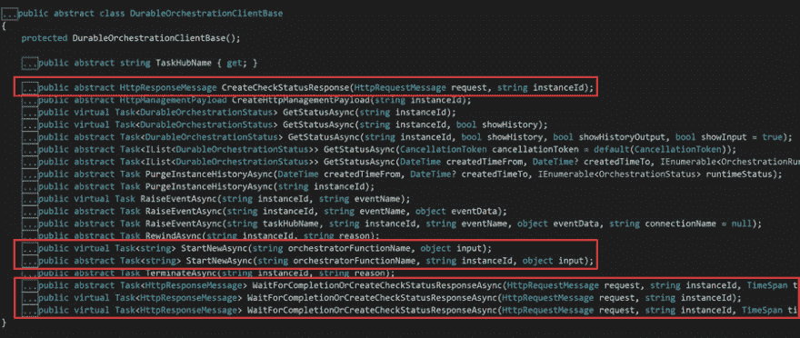

# 发现持久函数 API -启动编排(DurableOrchestrationClient 第 1 部分)

> 原文：<https://dev.to/xpirit/discovering-the-durable-functions-api-starting-orchestrations-durableorchestrationclient-part-1-52ic>

## durableorchestration client(Base)class-Starting&等待完成

这篇文章是探索持久函数 API 系列博客的第一部分。

在下面链接的视频中，我正在查看来自 [`DurableOrchestrationClient` ( `Base` )](https://github.com/Azure/azure-functions-durable-extension/blob/master/src/WebJobs.Extensions.DurableTask/DurableOrchestrationClientBase.cs) 类的方法，了解如何启动一个新的编排实例，以及如何检索实例的状态和结果:

*   `StartNewAsync(string orchestratorFunctionName, object input)`
*   `StartNewAsync(string orchestratorFunctionName, string instanceId, object input)`
*   `CreateCheckStatusResponse(HttpRequestMessage request, string instanceId)`
*   `WaitForCompletionOrCreateCheckStatusResponseAsync(HttpRequestMessage request, string instanceId)`
*   `WaitForCompletionOrCreateCheckStatusResponseAsync(HttpRequestMessage request, string instanceId, TimeSpan timeout)`
*   `WaitForCompletionOrCreateCheckStatusResponseAsync(HttpRequestMessage request, string instanceId, TimeSpan timeout, TimeSpan retryInterval)`

这是视频，如果你喜欢它，请竖起大拇指，订阅我的频道，这样你会收到新视频的通知:

[https://www.youtube.com/embed/mRDesdK3W8Q](https://www.youtube.com/embed/mRDesdK3W8Q)

### 资源

*   GitHub 回购:[github.com/marcduiker/demos-azure-durable-functions](https://github.com/marcduiker/demos-azure-durable-functions)。
*   微软文档:[持久函数 HTTP API](https://docs.microsoft.com/en-us/azure/azure-functions/durable/durable-functions-http-api) 。
*   微软文档:[可选的 uri 参数和默认值](https://docs.microsoft.com/en-us/aspnet/web-api/overview/web-api-routing-and-actions/attribute-routing-in-web-api-2#optional-uri-parameters-and-default-values)。

### 链接到本系列的其他帖子

*   启动业务流程(DurableOrchestrationClient 第 1 部分)
*   [检索业务流程状态(DurableOrchestrationClient 第 2 部分)](https://dev.to/marcduiker/discovering-the-durable-functions-api-retrieving-the-orchestration-status-durableorchestrationclient-part-2-40kc)
*   [清除&终止编排(DurableOrchestrationClient Part 3)](https://dev.to/marcduiker/discovering-the-durable-functions-api-purge-terminate-orchestrations-durableorchestrationclient-part-3-59g6)