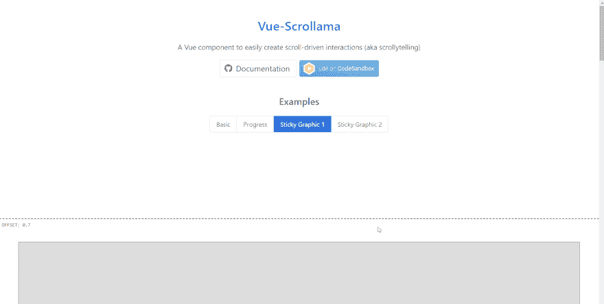
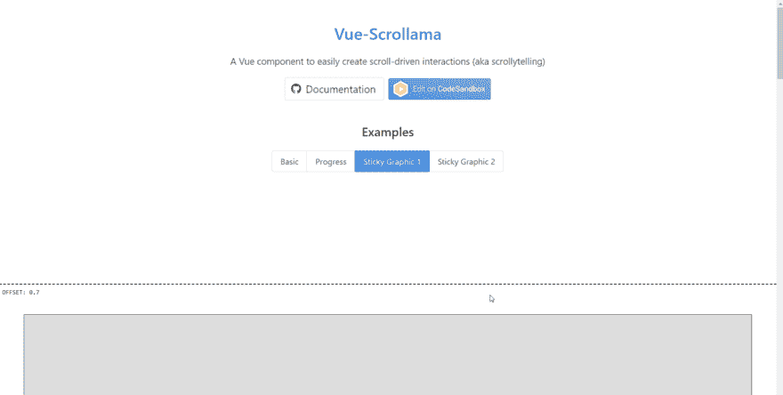
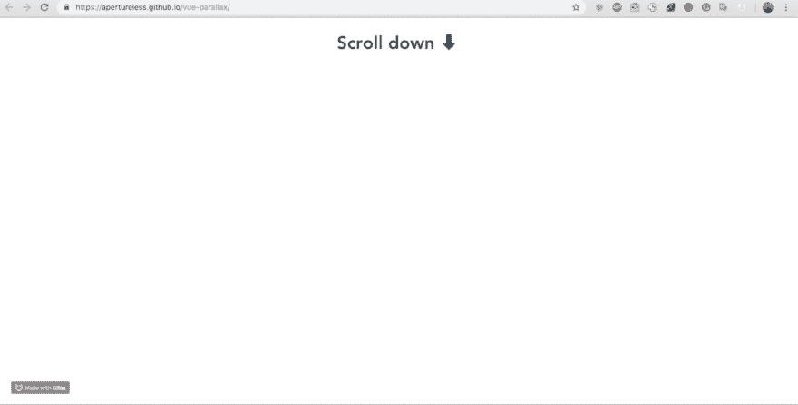
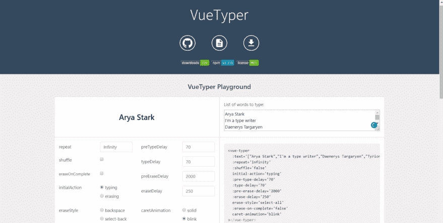
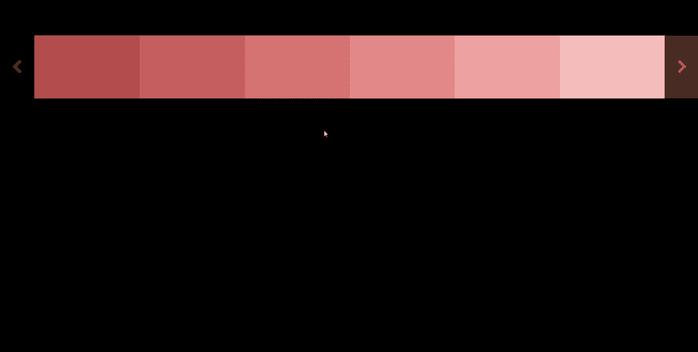
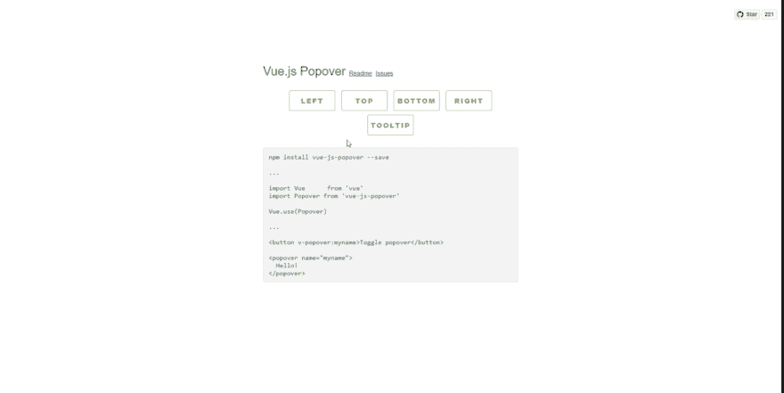
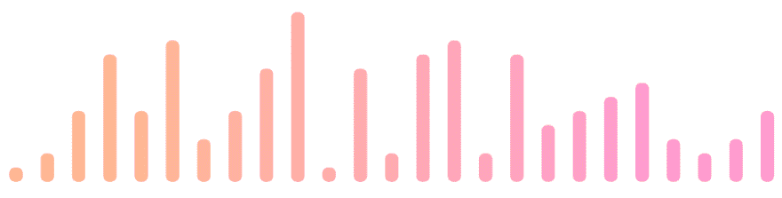
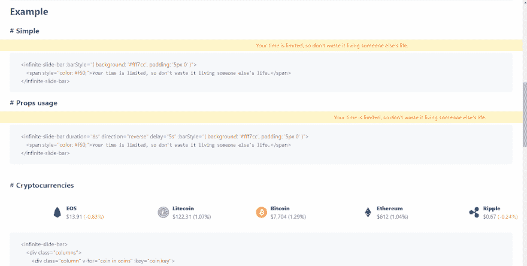

# 2019 年 8 Vue.js UI 组件

> 原文：<https://dev.to/kris/8-vuejs-ui-component-for-2019-3k02>

#### 特色 Vue 课程

[从头开始学习 Vue.js:构建&测试电影应用](https://www.educative.io/collection/5024793980043264/5629499534213120?affiliate_id=5312887308419072)

谈到 web 应用程序开发，Vue.js 正迅速成为开发人员的最爱。这个现代的、新鲜的 JavaScript 库在 GitHub 上有超过 123，000 颗星，这对开发人员来说是一个引人注目的选择，因为它可以很容易地集成到现有的项目中。它很快。它非常强大。您可以用它从头开始构建一个动态的、可伸缩的、可维护的单页面应用程序。

作为一个 JavaScript 框架，Vue.js 允许您轻松地将动态数据呈现到 DOM，将数据绑定到 DOM 元素，并管理/维护应用程序的状态(本地存储)，而无需用户重新加载浏览器。它是首选的，因为它是轻量级的、模块化的，并且需要最少的配置。它的速度也非常快，文件也很小。开发人员可以很容易地将它放到任何项目或现有的框架中。

随着 Vue.js 慢慢成为更多开发者选择的框架，这里有 8 个 UI 组件值得关注，并希望在 2019 年集成到你的项目中。在每个组件的末尾，我都添加了一个到组件 GitHub 存储库帐户的链接，以防您想投稿。

### [甜蜜的情态](https://sweet-modal-vue.adepto.as/)

模态是给你的 web 应用程序的用户体验添加一些不同的东西的好方法。Sweet Modal 给了你这么多很棒的 Modal 供你选择，很多肯定会让你的 web 应用程序与众不同。它们可以用于通过表单收集数据，或者只是传递一个警告，每个项目都需要一个好的模型。GitHub 上有超过 500 颗星星，绝对值得一看。

GitHub:[https://github.com/adeptoas/sweet-modal-vue](https://github.com/adeptoas/sweet-modal-vue)

### [滚动镜头](https://vue-scrollama.now.sh/#/basic)

Vue Scrollama 是一个组件，可以让你轻松地在网页上进行滚动驱动的交互，给用户一种故事般的体验。有了这个组件，视觉效果就说明了一切。它也是非常可定制的，将有助于一些惊人的网络应用。

github:https://github . com/shenoy/view-scroll ama

### [【vista-视差】](https://apertureless.github.io/vue-parallax/)

视差是一个伟大的方式来添加活力和独特性到您的 web 应用程序，Vue-parallax 让您轻松地在您的 Vue 项目上实现一个，它是完全可定制的。GitHub 上有超过 300 颗星，这个组件有定期维护，背后有一个正在成长的社区。

github:https://github . com/openness/view-parallax

### [视图型](https://cngu.github.io/vue-typer/)

打字机效果有一些特别之处，它吸引用户，就像大多数伟大的 UI 组件一样，吸引用户创造更好的体验。别忘了，该组件是非常可定制的，有许多选项来改变字体类型，大小，打字速度和其他许多事情，使您的 web 应用程序完美？

github:https://github . com/cngu/view-typer

### [视图滑块](http://vue-slider.surge.sh/)

图片吸引用户，滑块是展示图片的好方法。Vue-slider 给了我们一个非常现代的反应灵敏的“网飞”风格的滑块，它一定会让你的 web 应用程序脱颖而出。

GitHub:[https://github.com/fanyeh/vue-slider](https://github.com/fanyeh/vue-slider)

### [vista . js popver](http://vue-js-dropdown.yev.io/)

弹出窗口和工具提示——很重要但却没有得到充分重视的 UI 组件。这些都是向用户展示信息的好方法，而不会分散他们对你想要展示给他们的主要内容的注意力。Vue.js popover 允许我们为 web 应用程序的不同元素添加有创意的动画工具提示和弹出窗口。

GitHub:[https://github.com/euvl/vue-js-popover](https://github.com/euvl/vue-js-popover)

### [视图栏](https://deviavir.github.io/vue-bar/)

说到数据，表示很重要。使用 Vue-bar 创建可定制的、现代的、优雅的、有吸引力的条来表示您的 web 应用程序中的数据变得更加容易。

GitHub:[https://github.com/DeviaVir/vue-bar](https://github.com/DeviaVir/vue-bar)

### [Vue 无限滑动条](https://biigpongsatorn.github.io/#/vue-infinite-slide-bar)

一个非常小众的 UI 组件，无限滑动条让你以一种全新的方式向用户显示通常会很无聊的普通信息。

github:t1]https://github . com/biigpongstorn/view-infinite-slide-bar

### 优秀奖

一些用户界面组件没能上榜，但绝对值得关注。

*   [检视黑暗模式](https://www.vuedarkmode.com/)

这个由各种 UI 组件组成的组/集合为您的 Vue 项目添加了一个深色主题，用不同颜色的图标和元素来补充它们。非常适合在你的 web 应用程序中添加黑暗模式，或者简单地将其与设计混合。

就是这样，8 个惊人的 vue . js UI 组件你现在就可以在你的项目中实现。你还在等什么？

#### 这个故事发表在[的《创业](https://medium.com/swlh)，传媒最大的创业刊物，拥有+406714 人关注。

#### 订阅接收[我们这里的头条](http://growthsupply.com/the-startup-newsletter/)。

* * *