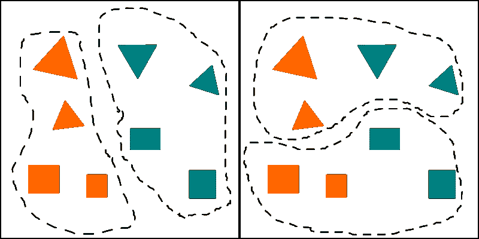

# 抽象

> 原文：<https://dev.to/stereobooster/abstraction-1987>

开发人员一直在谈论抽象。例如:

> 抽象的目的不是含糊不清，而是创造一个新的语义层次，在这个层次上，一个人可以绝对精确。
> 
> -艾德加尔湖

或者

> 比起错误的抽象，我更喜欢复制。
> 
> - [桑迪·梅斯](https://www.sandimetz.com/blog/2016/1/20/the-wrong-abstraction)

或者

> 我们如何创建隐藏特定 UI 部分实现细节的抽象？
> 
> -- [Dan Abramov](https://overreacted.io/the-elements-of-ui-engineering/)

还有，丹在他的一条推文中提到了“抽象阶梯”。我在之前的帖子中使用了[中的“抽象塔”。开发者说的“抽象”是什么意思？](https://dev.to/stereobooster/complexity-5d62)

## 什么是抽象？

> 抽象，分离或“抽象”的认知过程，在许多事物中观察到的共同特征或关系，或这种过程的产物。被抽象的东西——即**抽象**或抽象——有时被认为是一个概念(或“抽象观念”)，而不是一种属性或关系。
> 
> -- [英国](https://www.britannica.com/science/abstraction)

我还查了牛津字典、[、【韦氏词典】、](https://www.merriam-webster.com/dictionary/abstract)[九月](https://plato.stanford.edu/entries/computer-science/#AbstCompScie)，但它们都不是特别有用。

一个更简短的定义是- **抽象**是细节去除过程的产物。请注意，它没有具体说明要删除哪些细节，为什么要删除以及如何删除。这是一个相当宽泛的定义，当程序员使用单词抽象时，它可能意味着很大范围的事情。让我们看看什么。

### 抽象为模型

当我们需要在应用程序中表示真实(或不真实)的对象时，我们通常只选择一些我们关注的属性(细节)。这种试图表现某种东西的行为叫做建模。我们只关注一些精选的细节，而*丢弃其他细节*，我们进行抽象。

**举例**:在关系数据库中将实体建模为表，在 OOP 中将实体建模为类，[在高级类型系统中将实体建模为类型](https://www.youtube.com/watch?v=XpDsk374LDE)。

### 抽象为实现细节隐藏

当我们构造一些 API 或接口或契约并隐藏它是如何完成的，所以我们可以在不改变 API 的情况下改变实现。我们隐藏实现*细节*，例如*将它们从视线中移除*，我们进行抽象。

**示例**:高级语言，抽象出在硬件级如何实现的实现细节；一个以 SQL 形式公开 API 的关系数据库，我们不需要知道它使用什么算法和数据结构。

有时候抽象隐藏了不同的抽象，所以我们有**层抽象**也被称为抽象之塔或抽象之梯。

如果我们仍然需要理解它是如何在引擎盖下完成的，这就叫做“漏抽象”。例如，关系数据库中的索引通常实现为 BTrees，这就是为什么查询`LIKE abc%`，而`LIKE %abc`会很慢。

### 抽象为概括

我们可以只注意群体的一些共同的细节，所以我们可以在一个类别中加入群体，并对整个群体做出判断。我们*去掉*不常见的*细节*，我们抽象。

正如你所看到的，关注细节的选择可以改变我们将得到的群体。从这个意义上说，抽象是一种观点。

**示例**:OOP(继承)层次结构中的基类；

### 问题具有宽泛的定义

正如我们所看到的，在软件开发中，很多事情可以被认为是抽象的，这可能会令人困惑(我认为)。我们需要区分不同类型的抽象吗？他们是相似还是只是看起来相似？我不知道。

### 错误的抽象

有时候我们会听到“错误的抽象”这样的短语。是什么让抽象变得错误(或糟糕)？抽象错误是指我们选择关注错误的细节。例如，当两段代码具有语法相似性(例如，看起来相似)，但不一定具有相同的目的时——这里引入抽象可能是一个大错误(这就是 Sandi Metz 所说的)。

当我们说“关注错误的细节”时，我们需要明白“错误”取决于上下文。当上下文发生变化时，抽象最终可能会出错，例如，引入了新的需求，而我们的旧抽象不再适合新的上下文。

## 抽象思维

抽象正在超越软件开发。这是一个认知过程。抽象思维和分类思维一样有缺点。我们需要意识到这一点。

### 不同的事物看似相似

当我们进行抽象时，我们可以选择这样一组细节，这样不同的事物就可以看起来相似。比如摩天轮 vs 汽车，两个都有轮子，你都可以骑，但是只能用一个从一个地方移动到另一个地方。

### 相似的事物看似不同

当我们抽象时，我们可以选择这样一组细节，使得相似的事物开始看起来不同。例如，鲸鱼与海波鱼的关系比鲨鱼更密切。

### 不同人可以选择不同的抽象

抽象就像坐标系统——它可以被任意选择，因此，这可能是混乱的来源。

## 进一步阅读

*   ”[什么意思？凯夫林·亨尼的《T1》](https://www.youtube.com/watch?v=EbIEtV_31-w)
*   扎克·特尔曼的《论抽象》
*   罗恩·普莱斯勒的《论抽象的本质》
*   "抽象路径:从经验到概念"