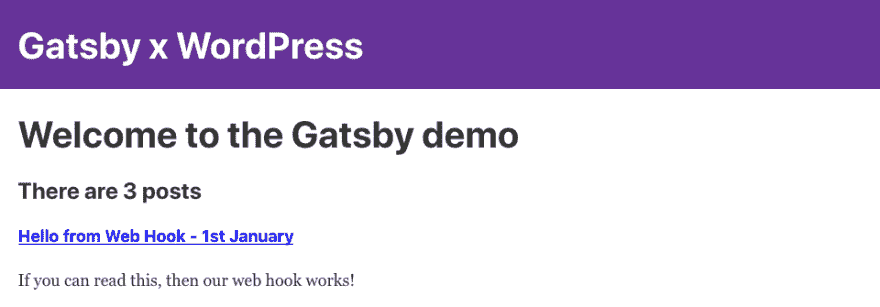
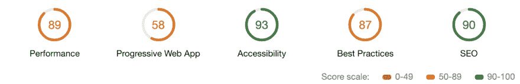
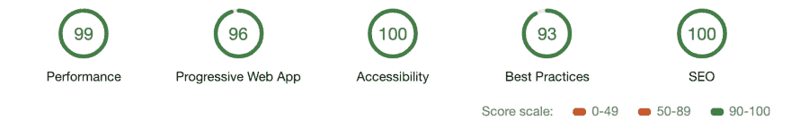

# 盖茨比和 WordPress: Yarr！弯刀和网钩！

> 原文：<https://dev.to/booyaa/gatsby-and-wordpress-yarr-cutlasses-and-webhooks-31a3>

*Billy Huynh 在[Unsplash](https://unsplash.com/photos/saS98jKhVjA)T3 拍摄的照片*

我们快完成了！我们需要做的就是让 WordPress 告诉 Netlify 我们发布了什么新帖子。为此，我们将使用 webhooks。

*   在 Netlify ( `Build & Deploy > Continuous Deployment > Build hooks > Add build hook`)中设置 webhook
*   去你的 WordPress 站点的管理页面(`Settings > Webhooks > Add webhook`)
    *   **动作:**发布 _ 发布
    *   **字段:** ID(挑一个字段，哪个都无所谓)
    *   **URL:** 粘贴您的网络链接

注意:这只会导致新帖子的站点重建，您需要创建一个单独的 webhook 事件来触发页面。不过，如果可以的话，可以等到你的下一篇文章。盖茨比也会把这些变化加入到帖子中。

你可以通过在 WordPress 中创建一个新的帖子来测试这个作品。在 WordPress 中点击 publish 之后，您应该会立即在 Netlify 中看到一个新的构建工作。一旦建立，你应该看到你的新职位！

[](https://res.cloudinary.com/practicaldev/image/fetch/s--2DDx5ObI--/c_limit%2Cf_auto%2Cfl_progressive%2Cq_auto%2Cw_880/https:/booyaa.wtf/img/gxw-webhook-post.png)

让我们单击部署按钮来发布站点。如果有任何错误，请查看 Netlify 站点的部署部分中的日志。

## 奖励材料:你和你的孩子谈过 PWAs 吗？

我们从来没有比较过我们的“入门”Gatsby 站点的性能如何。安装和配置离线网站，我们可以击败 WordPress.com 股票网站的默认灯塔(谷歌浏览器开发工具)评级。让我们做最后一件事！

注意:这是盖茨比[文档](https://www.gatsbyjs.org/docs/add-offline-support-with-a-service-worker/#add-offline-support-with-a-service-worker)中的说明副本。

安装插件`npm install --save gatsby-plugin-offline`

启用`gatsby-config.js`中的离线插件。

```
 {
      resolve: `gatsby-plugin-manifest`,
      options: {
        // details omitted
      },
    },
    'gatsby-plugin-offline',
  ],
} 
```

Enter fullscreen mode Exit fullscreen mode

注意:离线插件必须在清单插件之后。

最后，添加代码来通知用户，当服务人员有更新时，他们需要刷新页面:

```
exports.onServiceWorkerUpdateFound = () => {
  const answer = window.confirm(
    `This application has been updated. ` +
      `Reload to display the latest version?`
  )

  if (answer === true) {
    window.location.reload()
  }
} 
```

Enter fullscreen mode Exit fullscreen mode

让我们比较一下灯塔审计，首先是我们的股票 WordPress 博客:
[](https://res.cloudinary.com/practicaldev/image/fetch/s--CgN9JOAW--/c_limit%2Cf_auto%2Cfl_progressive%2Cq_auto%2Cw_880/https:/booyaa.wtf/img/gxw-lighthouse-1.png)

而现在我们的盖茨比现场`*drum roll*`
[](https://res.cloudinary.com/practicaldev/image/fetch/s--L1MzfD9u--/c_limit%2Cf_auto%2Cfl_progressive%2Cq_auto%2Cw_880/https:/booyaa.wtf/img/gxw-lighthouse-2.png)

这真是太神奇了，我们只用了几个简单的步骤就把网站变成了一个兼容的、高性能的渐进式网络应用程序(PWA)。这在很大程度上是因为您在运行`gatsby new`时获得了优秀的样板文件。

根据最近的统计，团队和社区创造了 [86](https://www.gatsbyjs.org/starters/?v=2) 个盖茨比首发。一定会有适合你需求的首发。

如果你卡住了，你可以看看下面的 Git hash: [`b1a4cc77a3d5ff0b0ad364ed5eff57fce30da5cf`](https://github.com/booyaa/wordsby/commit/b1a4cc77a3d5ff0b0ad364ed5eff57fce30da5cf)

*要进入系列的下一部分，点击当前标记(黑点)旁边的灰点。*