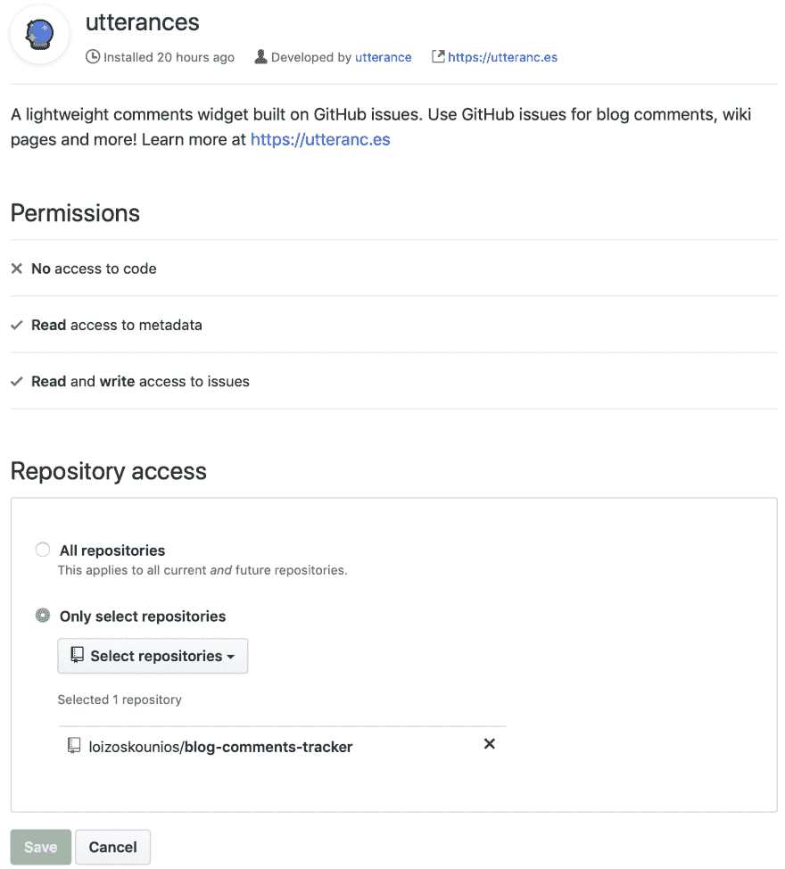
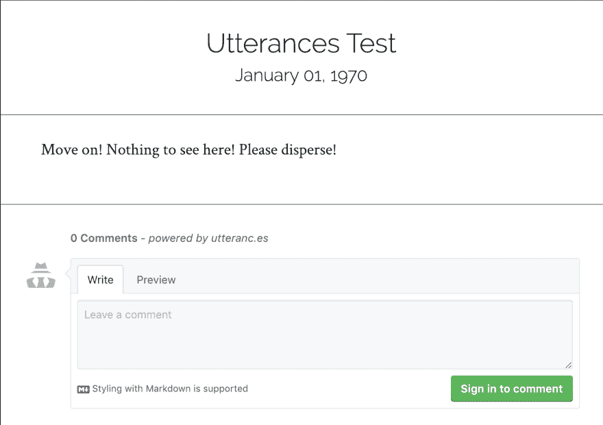

# GitHub 支持的博客评论

> 原文：<https://dev.to/loizoskounios/blog-comments-powered-by-github-3dp2>

当我处于开发博客的最后阶段时，我开始寻找处理评论的最佳方式。在翻了一遍通常的嫌疑人名单(比如 [Disqus](https://disqus.com) )之后，我又碰到了一系列关于使用 GitHub 进行评论这个话题的博文( [1](http://artsy.github.io/blog/2017/07/15/Comments-are-on/) 、 [2](http://donw.io/post/github-comments/) 、 [3](https://nemethgergely.com/using-github-for-comments-on-your-blog/) 、[更多](https://www.google.com/search?q=using+github+for+blog+comments))。当我继续挖掘时，我注意到前面提到的博客帖子中有一个共同的模式——由于 Disqus 速度慢、臃肿且侵犯隐私，人们放弃 Disqus 而选择 GitHub 解决方案。我现在确信利用 GitHub 是正确的选择。

所以我开始记下所有必要的组成部分。比如处理 GitHub API 的速率限制，设计评论部分的样式，自动为每篇博客文章创建一个 GitHub 问题，等等。然后我遇到了[话语](https://utteranc.es)。

## 话语

在你的博客上拥有一个 GitHub 支持的评论区，并把它打包成一个 GitHub 应用程序。它是[开源](https://github.com/utterance/utterances)，甚至带有黑暗主题！我已经在[我的博客](https://cergos.io)上整合了它，并且可以确认整个过程是完全无痛的。下面是我设置它必须采取的步骤列表。

### 创建公共 GitHub 资源库

第一步是[创建一个公共的 GitHub 库来存放我博客的评论](https://github.com/loizoskounios/blog-comments-tracker)。

[](https://res.cloudinary.com/practicaldev/image/fetch/s--Tem0vcYI--/c_limit%2Cf_auto%2Cfl_progressive%2Cq_auto%2Cw_880/https://thepracticaldev.s3.amazonaws.com/i/len8xhxcjct2tsmoyl19.png)

### 安装话语 App

然后我必须将[话语 GitHub 应用](https://github.com/apps/utterances)安装到我上面创建的存储库中。

[](https://res.cloudinary.com/practicaldev/image/fetch/s--xW8SVqPl--/c_limit%2Cf_auto%2Cfl_progressive%2Cq_auto%2Cw_880/https://thepracticaldev.s3.amazonaws.com/i/dlam2q3vplaa9ppsypzl.png)

### 生成脚本标签

然后，我使用了话语网站上的[配置部分来生成脚本标签，稍后我会将它加载到我的博客上。在我的例子中，脚本标签如下:](https://utteranc.es#configuration) 

```
<script src="https://utteranc.es/client.js"
        repo="loizoskounios/blog-comments-tracker"
        issue-term="title"
        theme="github-light"
        crossorigin="anonymous"
        async>
</script> 
```

Enter fullscreen mode Exit fullscreen mode

### 加载脚本

剩下的就是我把脚本加载到我的盖茨比博客上。幸运的是，在 React 中设置它相当容易。

要在 React 中加载脚本，我必须手动创建脚本元素，并将其作为子元素添加到其他元素中。我使用了`document`全局变量来创建脚本元素，并使用 React `ref`来保存对包含脚本元素的组件的引用。这就是我最后做的，去掉了所有多余的噪音(比如 Gatsby 静态查询、样式化组件等)。

```
import React from 'react';

class Comments extends React.Component {
  constructor(props) {
    super(props);

    this.commentsEl = React.createRef();
    this.state = { status: 'pending' };
  }

  componentDidMount() {
    const scriptEl = document.createElement('script');
    scriptEl.onload = () => this.setState({ status: 'success' });
    scriptEl.onerror = () => this.setState({ status: 'failed' });
    scriptEl.async = true;
    scriptEl.src = 'https://utteranc.es/client.js';
    scriptEl.setAttribute('repo', 'loizoskounios/blog-comments-tracker');
    scriptEl.setAttribute('issue-term', 'title');
    scriptEl.setAttribute('theme', 'github-light');
    scriptEl.setAttribute('crossorigin', 'anonymous');
    this.commentsEl.current.appendChild(scriptEl);
  }

  render() {
    const { status } = this.state;

    return (
      <div className="comments-wrapper">
        {status === 'failed' && <div>Error. Please try again.</div>}
        {status === 'pending' && <div>Loading script...</div>}
        <div ref={this.commentsEl} />
      </div>
    );
  }
}

export default Comments; 
```

Enter fullscreen mode Exit fullscreen mode

### 最终结果

这是一篇虚拟博文的最终结果。

[](https://res.cloudinary.com/practicaldev/image/fetch/s--uCk9fp9S--/c_limit%2Cf_auto%2Cfl_progressive%2Cq_auto%2Cw_880/https://thepracticaldev.s3.amazonaws.com/i/sw2beq6w3d5s5s4miipg.png)

如果你想看看这个东西是如何工作的，话语已经集成在我的博客中了。随意把它当成游乐场。