# 你应该阅读的 10 个伟大的科技博客(由女性撰写)

> 原文：<https://dev.to/tdwright/10-great-tech-blogs-you-should-read-that-are-written-by-women-303d>

最近，我一直在寻找更多由女性撰写的技术博客。在今天的帖子中，我分享了 10 个我最喜欢的话题，从 Kubernetes 到 web accessibility。这份清单符合我的个人品味，但其目的是确保我们不会忽视这样一个事实，即你不需要成为一个男人，就能在你的科技游戏中处于领先地位。

*只想要名单？点击这里！*

[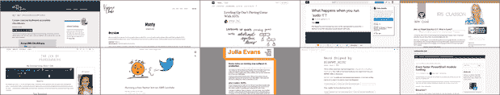](https://res.cloudinary.com/practicaldev/image/fetch/s--MJ7kdsAR--/c_limit%2Cf_auto%2Cfl_progressive%2Cq_auto%2Cw_880/https://i0.wp.com/blog.tdwright.co.uk/wp-content/uploads/2019/01/montage.png%3Ffit%3D620%252C118)

## 背景

去年 12 月，我写了一篇关于努力成为科技界女性更好的支持者的帖子。它得到了比我预期的更多的反对，从那以后我一直在思考我的下一步行动。

让我震惊的一件事是，我自己的博客(这是一个人们仍在使用的词，对吗？)是非常男性主导的。在这方面，我似乎并不孤单。也许我读到的观点是无知的产物。或许我可以通过让人们更难忽视那些碰巧是女性的优秀开发人员来帮助消除这些疑虑。

出发点必须是扩大我自己的阅读清单，所以我发了一条推特征求建议:

> 托马斯·赖特@ TD Wrighthive mind-我正在寻找一些新的科技博客来阅读，尤其是一些由女性撰写的新的科技博客。👩‍💻
> 
> 我的兴趣主要是后端、云和。NET，但我也喜欢通配符。🃏:所以，如果你认为我应该读谁的书，就来找我吧！😀22:27PM-2018 年 12 月 19 日76

起初一切都很平静，我有点沮丧。但是之后 [Elana Tee](https://twitter.com/elanatee) 提出了一些很好的建议——所有这些我都包括在下面。(谢谢 Elana！🙏)在推动下，我继续挖掘，开始发现越来越多的东西。

我选择了十个我最喜欢的来展示在这篇文章中。对于每一篇文章，我都尽量给出少量的背景信息，并强调了我最近最喜欢的文章。如果你喜欢的话，可以读一读，订阅一下。

## 开始之前…

在我开始列举之前，我想解释一下我的标准。我不想在这里列出一个明确的清单。其实是很私人的事情。

任何认识我的人都会意识到，我只推荐自己喜欢/觉得有用的东西。(显然“你的里程可能会有所不同”，但我就是觉得自己没有资格从个人经历之外做推荐。)这里有一点很重要，因为我不是想说我挑选的博客比我找到但没有挑选的好。

我非常清楚的一件事是，我的口味偏向后端和开发运营，而不是前端或设计。考虑到这一点，我不希望我下面的选择被解释为对前端工作价值的任何形式的[判断。事实上，让我公开声明，我将前端人员视为开发人员，就像后端开发人员一样。](https://www.theguardian.com/technology/2017/mar/14/tech-women-code-workshops-developer-jobs)

同样，我倾向于更技术性的博客(和特定的帖子)。普通读者会知道，我真的像重视技术技能一样重视专业技能(又名“软技能”)，但这不是这篇文章的内容。如果我试图改变对女性在科技领域的看法，我需要提请注意这样一个事实，即女性在做阿尔法书呆子的事情，以及展示她们的人际交往和组织能力(刻板印象已经断言女性擅长这些)。

影响我选择的另一个因素是最近的活动水平。我发现一些非常聪明的女性写的大量优秀博客已经过时了。现在，不要误解我，我过去也有过翻滚杂草博客——我知道它们有时会成为一个沉重的负担。这次我没有包括这些旧博客，因为我想庆祝女性博客*现在*。

## 博客

哇，这么多开场白！不管怎样，事不宜迟，让我们来看看名单…

### 1。–冗长(赖薇)

[Vicky Lai 博客](https://vickylai.com/verbose/)讲述了使用包括 Linux、AWS 和 Go 在内的各种技术制作东西。我最喜欢她最近的帖子是关于在 AWS 上创建一个 Twitter 机器人。

[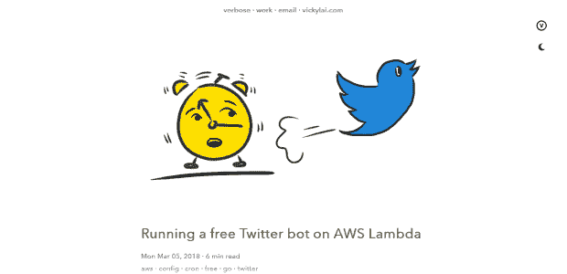](https://vickylai.com/verbose/running-a-free-twitter-bot-on-aws-lambda/)

<figcaption>[在 AWS Lambda 上运行免费 Twitter 机器人](https://vickylai.com/verbose/running-a-free-twitter-bot-on-aws-lambda/)</figcaption>

这篇文章很好地介绍了在 AWS 中使用 Lambda 制作一些很酷很有用的东西所需的所有关键步骤。一路上，Vicky 介绍了一些读者以前可能没有遇到过的有用的技术。

我非常喜欢 Vicky 的博客，因为她经常用深思熟虑的食物类比来解释一些非常抽象的想法。这使得它们很容易被记住。

维基也有一个独立的博客，[HerOneBag.com](https://heronebag.com/blog/)，在那里她发布了自己只带一个包旅行的经历。

### 2。朱莉娅·埃文斯

Julia Evans 的博客讲述了非常广泛的后端技术，包括 Rust、Ruby 和 Python。那里也有一些 Linux-y 的东西。

尽管有大量的技术可供我选择，但我选择展示的这篇文章是相当不可知论的。这是关于当我们将新软件引入高正常运行时间系统时，我们如何管理风险。

[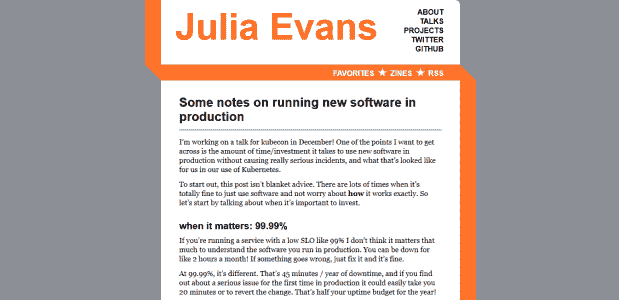](https://jvns.ca/blog/2018/11/11/understand-the-software-you-use-in-production/)

<figcaption>[生产中运行新软件的一些注意事项](https://jvns.ca/blog/2018/11/11/understand-the-software-you-use-in-production/)</figcaption>

关于 Julia Evans 的另一件事是，她在她的[巫师杂志](https://wizardzines.com/)网站上写非常酷、非常有用的老派杂志。(它们太棒了，我甚至花了很多钱买了其中一个高级的。)

### 3。CS 基地(Vaidehi Joshi)

Vaidehi Joshi 在 2017 年每周一写了一篇关于计算机科学基础话题的文章，她的文章令人惊叹。通过使用她自己的学习经验作为起点，Vaidehi 同情地引导读者通过一些非常核心的概念。

我选择强调后面的一个主题。这本抽象语法树指南于 2017 年 12 月出版。

[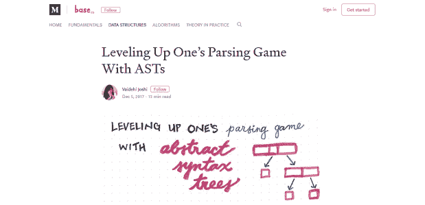](https://dev.to/vaidehijoshi/leveling-up-ones-parsing-game-with-asts-4ha)

<figcaption>[用 ASTs 练级解析游戏](https://dev.to/vaidehijoshi/leveling-up-ones-parsing-game-with-asts-4ha)</figcaption>

我喜欢文本中穿插的手绘笔记和图表有助于软化主题，使其更容易理解。(这里有一定程度的嫉妒——我的书法糟透了！)

更重要的是，在一年的时间里，每周都致力于这样一个新职位，令人印象深刻。其结果是一个免费的资源，可以与任何教科书相媲美。

### 4。时尚&代码(四月之夜)

April Speight 的博客大多是关于非技术话题的，但也写一些技术话题。她的博客很新，但她似乎真的很喜欢它。我选择的这篇文章是她的一篇技术性更强的文章，我认为这可能是我们以后可能会看到更多这类文章的一个标志。

[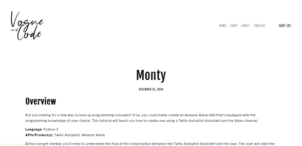](https://www.vogueandcode.com/blog/projects/monty)

<figcaption>[天魔](https://www.vogueandcode.com/blog/projects/monty)</figcaption>

我喜欢这样的帖子，有人拿着一堆技术，向你展示如何以很酷的方式将它们结合起来。April 出色地完成了每一步，并带领读者走过每一步。

### 5。编程的禅(阿里·斯皮特尔)

Ali Spittel 博客讲述了 web 开发(包括 React)以及非技术技能(比如公开演讲)。她还写了一些关于写博客的非常有用的帖子。

然而，我选择强调的这篇文章，是她如何将终端提升到下一个水平的一次演练:

[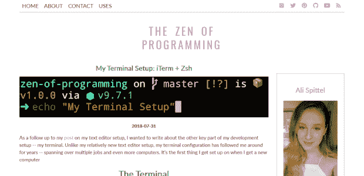](https://zen-of-programming.com/terminal-setup)

<figcaption>[我的终端设置:iTerm+Zsh](https://zen-of-programming.com/terminal-setup)</figcaption>

我真的很喜欢阿里的帖子有多实用。它们包含代码、截图和示例。另外(正如普通读者所知)，我非常喜欢让我的编码环境*变得如此*——像这样的帖子是我个人的克星！

### 6。杰西·弗雷泽勒的博客

Jessie Frazelle 关于容器的博客(尤其是。Docker 和 Kubernetes)，安全和开源。现在，作为一个更像 FaaS 的人，恐怕我对集装箱了解不多。从我所了解的情况来看，我很清楚杰西是一个重要的重量级人物。

出于这篇博文的目的，我选择的例子实际上是关于在 Linux 系统上使用 Go 作为脚本语言。

[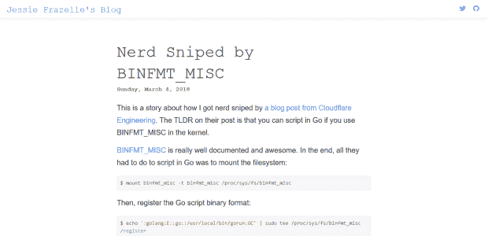](https://blog.jessfraz.com/post/nerd-sniped-by-binfmt_misc/)

<figcaption>[书呆子被 BINFMT _ MISC](https://blog.jessfraz.com/post/nerd-sniped-by-binfmt_misc/)</figcaption>

这篇帖子是对 Cloudflare 工程团队的一个帖子的回应，我真的很喜欢 Jessie a)承认受到了[的攻击](https://xkcd.com/356/)，然后 b)将他们帖子的内容浓缩成六行。此外，能够在终端环境中使用任意语言编写脚本非常酷。

### 7。爱上代码(艾里斯·克拉森)

Iris Classon 写了一些关于微软技术的博客，包括 ASP.NET、Powershell、Windows 和 Azure。实际上有点奇怪的是，我以前没有遇到过 Iris，因为她的兴趣和我的大致相同。

Iris 经常使用的一种格式是回答读者向她提出的“(不那么)愚蠢的问题”。她用的是视频和文字的混合，我觉得挺有趣的。我选择的这篇文章是这个系列中的一篇，是关于 Kusto 的。

[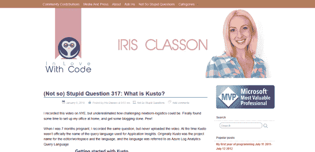](http://irisclasson.com/2019/01/05/not-so-stupid-question-317-what-is-kusto/)

<figcaption>[(不那么)蠢问题 317:什么是 Kusto？](http://irisclasson.com/2019/01/05/not-so-stupid-question-317-what-is-kusto/)</figcaption>

当我第一次看到 Iris 的博客时，我选择了一个不同的帖子，但当她发布这个帖子时，我不得不把它换了进来，因为这是我不久前不得不问的一个问题。

另外:我声明，我不认为 Application Insights 团队已经做了很好的工作来说明这种分析语言叫做 Kusto。当我(最终)建立连接时，它无疑使查找文档和教程变得更加容易。

另一件事:我对生完孩子不到一个月就发布视频的人完全敬畏。当我儿子那么小的时候，我累得无法思考，更不用说创作足以录制视频了！

### 8。林赛的 A11y(林赛·科帕奇)

Lindsey Kopacz 的博客主要是关于网页可访问性的。它与列表中的其他博客略有不同，因为它主要是前端相关的。然而，我对可访问性情有独钟(这是我博士学位的主题)，而且这是一个很棒的博客，所以我必须把它包括进来！

我选择的这篇文章是一个典型的例子，主题是制作看起来很酷的自定义复选框，人们仍然可以使用屏幕阅读器和键盘输入(即不是鼠标)来访问它们。

[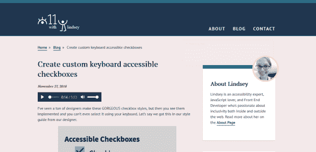](https://www.a11ywithlindsey.com/blog/create-custom-keyboard-accesible-checkboxes)

<figcaption>[创建自定义键盘辅助复选框](https://www.a11ywithlindsey.com/blog/create-custom-keyboard-accesible-checkboxes)</figcaption>

我喜欢林赛的写作，是因为她对一个经常被忽视的领域给予了权威和关注，而没有让可能没有意识到这些问题的读者感到内疚。她显然对此充满热情，但仍保持实事求是和务实的态度，我认为这可能是温和地推动人们做出更好行为的最佳方式。

### 9。萨菲娅·阿卜杜拉

[Safia Abdalla 的博客](https://dev.to/captainsafia)内容广泛，包括 Git、Linux 和 Python。在今年早些时候短暂中断后，她最近重新开始发帖。在此之前，她运行了一个很棒的系列，研究常见的 Linux 实用程序是如何工作的，并用`strace`把它们放到显微镜下。这是我选择的一个例子:“当你运行`sudo !!`时会发生什么？”

[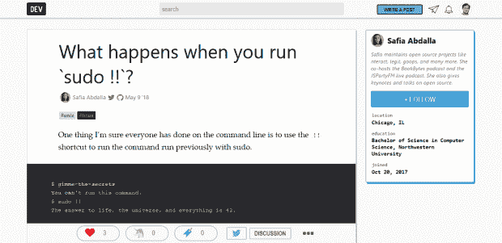](https://dev.to/captainsafia/what-happens-when-you-run-sudo--2ah7)

<figcaption>[跑](https://dev.to/captainsafia/what-happens-when-you-run-sudo--2ah7) `[sudo !!](https://dev.to/captainsafia/what-happens-when-you-run-sudo--2ah7)` [会发生什么？](https://dev.to/captainsafia/what-happens-when-you-run-sudo--2ah7)</figcaption>

我从来没有想过这种问题，但当有人指出时，我总是很好奇。萨菲亚用大量的例子很好地仔细剖析了它。

### 10。netnerds.net(克里斯·勒梅尔)

Chrissy LeMaire 的博客主要是关于 SQL Server 和 Powershell 的。当我们考虑到她是 [dbatools](https://dbatools.io/) 和 [dbachecks](https://dbatools.io/introducing-dbachecks/) Powershell 模块的主要维护者时，这并不奇怪。

我从 Chrissy 的博客中选择的这篇文章是关于她如何能够使用压缩技术来大幅提高其中一个模块的加载时间。

[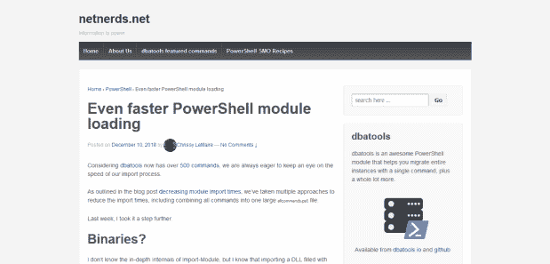](https://blog.netnerds.net/2018/12/even-faster-powershell-module-loading/)

<figcaption>[甚至更快的 PowerShell 模块加载](https://blog.netnerds.net/2018/12/even-faster-powershell-module-loading/)</figcaption>

作为一个开源项目的维护者，我总是着迷于为我们的开发伙伴改善体验而进行的“幕后”工作。这篇文章是一个很好的例子，也是一个很好的技术参考。

## 倒影

我想展示一些女性写的科技博客，试图进一步规范伟大的开发人员有时是女性的想法。在为此做研究的过程中，我学到了很多东西，并写下了一大堆我需要尝试的事情。例如，我需要重温围棋——这似乎是最近所有酷孩子都在用的东西！

给我留下深刻印象的一件事是女性作家所涵盖的非常不同的语言和主题范围。我想这不应该让我感到惊讶——我的意思是我以前和女人说过话！😉但是我想我可能期待一些女性特质在这个过程中消失？没门儿。在过去的几周里，我读了几个博客，里面有关于时尚的文章和技术文章。更多的人在其他方面充满了(女性)个性。这真是令人耳目一新。

我想我感到惊讶的潜在因素是，我认为自己的作品是完全中立的。不是的。当你是主导群体的一员时，你不会注意到自己说话有口音。我含蓄地期望所有的技术博客都使用和我习惯的阅读和写作一样的声音和注册，但这只是因为我过去读过的绝大多数技术博客都是由那些看起来听起来和我很像并且和我有很多共同兴趣的人写的。

我认为这个让我吃惊的事实不仅仅是在博客方面。尤其是，它让我想到了我们在发布工作机会广告时使用的语言。如果我们对自己(即男性)的沟通方式有隐含的期望，我们可能会意外地暗示这份工作是给像我们这样的人做的。我们必须接受这样一种观点，即一个角色的最佳开发人员很可能不是男性，因此，我们需要注意我们使用的语言给人留下的印象。

在这篇文章的研究过程中，我还注意到了在博客之外的媒体上制作技术内容的女性数量。例如播客、Youtube 和直播。我试图弄清楚这是否与女性有关(尤其是有色人种女性？)或者仅仅是因为除了我之外，这个世界对每个人来说都在继续前进！亲爱的读者，我很想听听你对此的看法。

我最后的反思是悲伤的。在我的研究中，我看到了太多的博客帖子，在这些帖子中，女性要么在讲述不愉快的经历(包括性骚扰)，要么在积极考虑离开这个行业。在这篇文章中，我的目的是赞美杰出女性对我们职业的贡献，但似乎不可能完全避免女性得到不公平待遇的事实。也许这是一个我改天再来讨论的话题。

## 鳍

我希望我已经成功实现了我的主要目标。我提到的 10 个博客都是顶尖技术内容的例子。事实上，我最终不得不从一长串名单中筛选出 10 个，这正好显示了我们的女同事们产生了多少高质量的内容。

我假设我提到的所有博客都是出于和我大致相同的原因:尝试和我们的同龄人分享我们学到的酷东西。然而，当一个在科技界没有得到充分代表的人写博客时，它也有助于提高他们特定群体的知名度。换句话说，它有助于消除人们对程序员的刻板印象。我希望通过展示这些博客，我已经以我自己的方式帮助提高了他们在这方面的效率。

*   如果你是一个正在阅读这篇文章的男人，我希望我已经帮助你注意到了可能会改变你对女性程序员看法的内容。
*   如果你是一名女性，我希望这些博客能让你感觉不那么孤立，或许能让你更多地融入社区。

我很可能会在未来写另外 10 篇由女性撰写的技术博客。如果你知道我应该包括的人(即使是你！)，请在评论里告诉我。