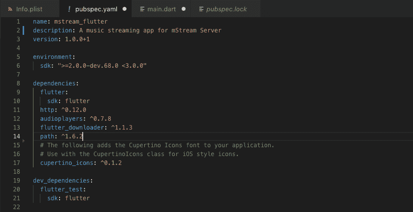

# 颤振发展:第一天-选择组件

> 原文：<https://dev.to/irosthebeggar/flutter---making-a-music-app-day-1---choosing-packages-28e7>

[在第 0 天，我运行了颤振环境](https://dev.to/irosthebeggar/flutter-development-day-0-4585)

## 目标

选择并测试制作 [mStream](https://github.com/IrosTheBeggar/mStream) 音乐应用程序所需的软件包

## 包裹生态系统

您可以在:[https://pub.dartlang.org/](https://pub.dartlang.org/)搜索镖包

在 Dart 中处理包裹与在 NPM 中处理包裹非常相似。你只需在`pubspec.yaml`文件中写入包名和版本，Flutter 环境就会自动安装。一些软件包要求你编辑 Android 和 iOS 目录中的配置文件，但是到目前为止，所有的指令都很容易执行。

*我的 pubspec.yaml 文件:*

## 一个音乐 App 需要的包

我将测试以下软件包。这些应该涵盖音乐同步和流媒体应用的所有核心功能:

*   HTTP 请求:[恰当命名的 HTTP 库](https://pub.dartlang.org/packages/http)
*   文件路径构造器:[路径库](https://pub.dartlang.org/packages/path)
*   文件下载:[下载管理器](https://dev.toflutter_downloader)
*   音乐播放:[音频播放器库](https://pub.dartlang.org/packages/audioplayers)

## HTTP，路径，&下载

HTTP 和 path 库很容易设置和测试，并且完全按照预期工作。这里没什么有趣的报道。

下载管理器也工作得很好，但我很想看看它在同步大量文件时表现如何。

## 音乐播放

音乐播放更复杂。audioplayers 库提供了一个易于使用的 api 来创建多个可以从远程服务器流式播放的音频播放器。拥有多个音频播放器对于无缝播放至关重要。当一个播放器正在播放时，另一个播放器可以缓存播放列表中的下一首歌曲。

audioplayers 库不与任何原生音频控件绑定。因此，有必要为 iOS 和 Android 编写一些本机代码来处理锁屏小工具之类的事情。有另一个名为 [audio_service](https://github.com/ryanheise/audio_service) 的库处理这些事情，但它只适用于 Android，破坏了 iOS 版本

## 结论

Dart 包管理器与 NPM 非常相似。Dart 软件包管理器网站甚至看起来像 NPM 网站。如果你熟悉节点/NPM，你将毫无问题地开始学习颤振基础知识。

几年前为 Android 开发时，我花了一天多的时间才让 http 库工作起来。借助 Flutter，我能够在短短几个小时内测试 Android 和 iOS 上的多个库。

Dart 生态系统似乎也已经有了很多核心库。我很快就找到了文档完备的包，用于 HTTP 请求、下载管理等基本功能。我唯一的抱怨是音频库仍然不成熟。然而，考虑到媒体的复杂性和新的波动，这并不奇怪。

# 下一步

就像我上面说的，媒体处理库还不成熟。我打算在所有其他功能完成后，为应用程序开发媒体流。这样，我可以在以后重新评估媒体库。现在，我冒着在一个失去支持的不成熟的库上开发的风险。如果发生这种情况，我将不得不选择一个新的库，然后重写所有代码。

目前，开发将集中在浏览音乐目录和在设备间同步文件上。这将是让应用程序处于可用状态的最快途径。从这里开始，mStream 用户可以使用任何移动音频应用程序来播放同步后的文件。