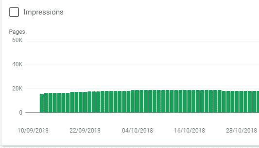
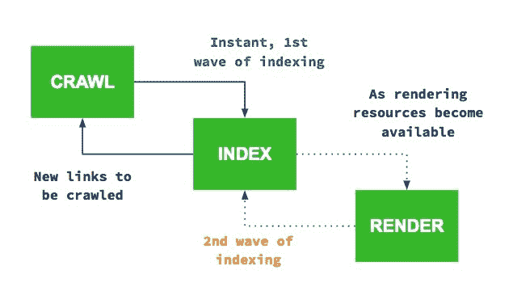
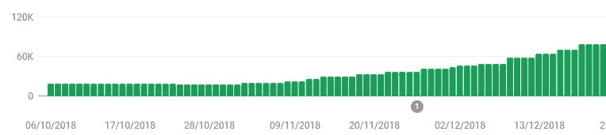
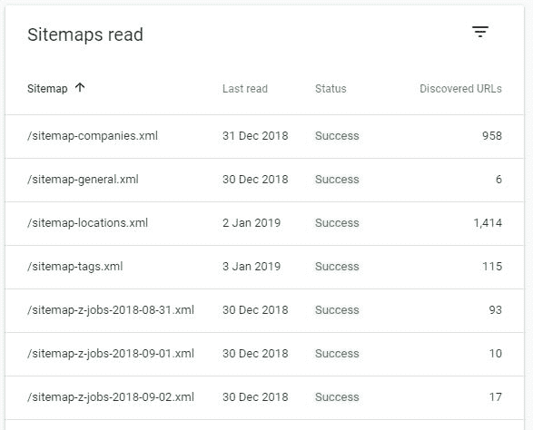
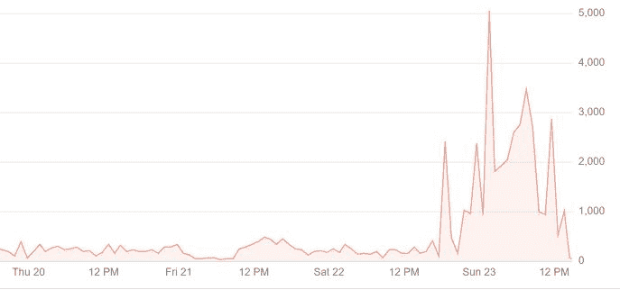
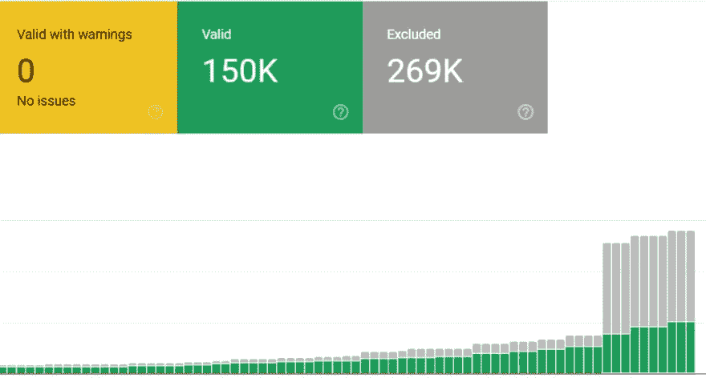

# 如何获得 250k+的网页被谷歌索引

> 原文：<https://dev.to/kunnendavid/how-to-get-250k-pages-indexed-by-google-57ep>

当创建 Devsnap 时，我非常天真。我用 create-react-app 做前端，用 GraphQL 做后端。客户端渲染的经典 SPA。

我知道对于这种网站，我会让谷歌索引很多页面，但我并不担心，因为我知道谷歌机器人现在正在渲染 JavaScript，并会很好地索引它

哦，我错了。

一开始，一切都很好。谷歌一点一点地索引网页，我获得了第一个有机流量。

[](https://res.cloudinary.com/practicaldev/image/fetch/s--NrV4VLCT--/c_limit%2Cf_auto%2Cfl_progressive%2Cq_auto%2Cw_880/https://thepracticaldev.s3.amazonaws.com/i/tbckeuwotch56sr6hv2v.png)

但是不知何故，索引真的很慢。谷歌每分钟只能索引 2 页。我以为过一段时间它会加速，但事实并非如此，所以我需要做些什么，因为我的网站依赖谷歌快速索引大量页面。

# 1。输入 SSR

我从实现 SSR 开始，因为我偶然发现了一个谷歌人的话，他说客户端渲染的网站必须被索引两次。Google Bot 首先查看初始 HTML，然后立即跟踪它能找到的所有链接。第二次是在它将所有内容发送给渲染器之后，渲染器返回最终的 HTML。这对谷歌来说不仅成本高昂，而且速度缓慢。这就是为什么我决定让 Google Bot 拥有初始 HTML 中的所有链接。你可以在这篇伟大的文章中找到关于这个主题的更深入的信息。

[](https://res.cloudinary.com/practicaldev/image/fetch/s--IpSQsN1p--/c_limit%2Cf_auto%2Cfl_progressive%2Cq_auto%2Cw_880/https://thepracticaldev.s3.amazonaws.com/i/jiie4ygnge5jlc6nk96r.jpg)

我就是这样做的，按照[这本](https://medium.freecodecamp.org/demystifying-reacts-server-side-render-de335d408fe4)神奇的指南。我原以为实现 SSR 需要几天时间，但实际上只花了几个小时，而且结果非常好。

[](https://res.cloudinary.com/practicaldev/image/fetch/s--DFKqWal5--/c_limit%2Cf_auto%2Cfl_progressive%2Cq_auto%2Cw_880/https://thepracticaldev.s3.amazonaws.com/i/zp8p56n8aid324v4m0k0.JPG)

如果没有 SSR，我只能在大约 20k 的索引页面上工作，但是现在它已经稳步增长到 100k 以上。

*但还是不够快*

谷歌没有索引更多的网页，但它仍然太慢了。如果我曾经想让这些 25 万页被索引，并快速发现新的职位发布，我需要做得更多。

# 2。输入动态网站地图

有了这么大的网站，我想我必须以某种方式指导谷歌。我不能仅仅依靠谷歌一点一点地抓取所有的东西。这就是为什么我在 Go 中创建了一个小服务，每天创建两次新的网站地图，并上传到我的 CDN。

由于网站地图被限制在 50k 页，我不得不把它分开，只关注那些有相关内容的页面。

[](https://res.cloudinary.com/practicaldev/image/fetch/s--evn3n3hJ--/c_limit%2Cf_auto%2Cfl_progressive%2Cq_auto%2Cw_880/https://thepracticaldev.s3.amazonaws.com/i/i36qstybkd9byhw1bp5w.JPG)

提交后，谷歌瞬间开始抓取速度加快。

*但还是不够快*

我注意到谷歌机器人访问我的网站的速度更快了，但仍然只有每分钟 5-10 次。我在这里并没有真正与#1 进行索引比较，因为我一天后才开始实现#3。

# 3。输入删除 JavaScript

我在想为什么还是这么慢。我的意思是，有其他网站也有很多页面，他们也设法做到了。

这时候我想到了#1 的说法。合理的做法是，谷歌只为每个网站分配特定数量的资源用于索引，而我的网站仍然非常昂贵，因为即使谷歌看到了初始 HTML 中的所有链接，它仍然必须将其发送给渲染器，以确保没有任何内容需要索引。当还剩下 JavaScript 时，它不知道所有的东西都已经在初始 HTML 中了。

所以我所做的就是移除机器人的 JavaScript。不要在不知道它是做什么的情况下使用它。请参见下面的 JSON-LD。

```
if(isBot(req)) {
    completeHtml = completeHtml.replace(/<script[^>]*>(?:(?!<\/script>)[^])*<\/script>/g, "")
} 
```

在部署了这一变化后，谷歌机器人立即变得疯狂。它现在每秒爬行 5-10 页，不是每分钟。

[](https://res.cloudinary.com/practicaldev/image/fetch/s--wg_A9xy0--/c_limit%2Cf_auto%2Cfl_progressive%2Cq_auto%2Cw_880/https://thepracticaldev.s3.amazonaws.com/i/77kz23tc3jz5n14boefk.JPG)

[](https://res.cloudinary.com/practicaldev/image/fetch/s--AgTSHPlW--/c_limit%2Cf_auto%2Cfl_progressive%2Cq_auto%2Cw_880/https://thepracticaldev.s3.amazonaws.com/i/fj531qkcyjhuk47r0adz.JPG)

[](https://res.cloudinary.com/practicaldev/image/fetch/s--N5B3mRVM--/c_limit%2Cf_auto%2Cfl_progressive%2Cq_auto%2Cw_880/https://thepracticaldev.s3.amazonaws.com/i/4hvq6vyju2l3lfwms0d3.JPG)

这是目前的结果。因为我最近才实现了这些改变，所以仍然有很多页面已经被抓取了，但是还没有被索引(灰色条)。然而，我对结果非常满意。

让谷歌索引所有页面后，性能也提高了很多。

[](https://res.cloudinary.com/practicaldev/image/fetch/s--pS_3dEHp--/c_limit%2Cf_auto%2Cfl_progressive%2Cq_auto%2Cw_880/https://thepracticaldev.s3.amazonaws.com/i/62qvba66iljh4e2h0dky.JPG)

#### JSON-LD

不要拿掉它！在我的例子中，JSON-LD 被添加在上面的代码片段之后。所以要格外小心，不要把它拿掉。

# 结论

如果你想让 Google 索引一个大网站，只需要输入最终的 HTML，去掉所有的 JavaScript(当然 JSON-LD 除外)。