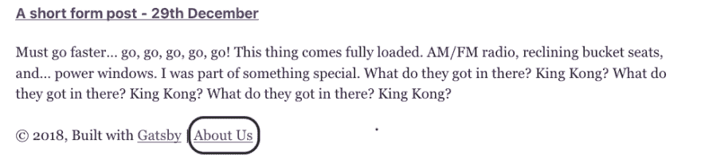
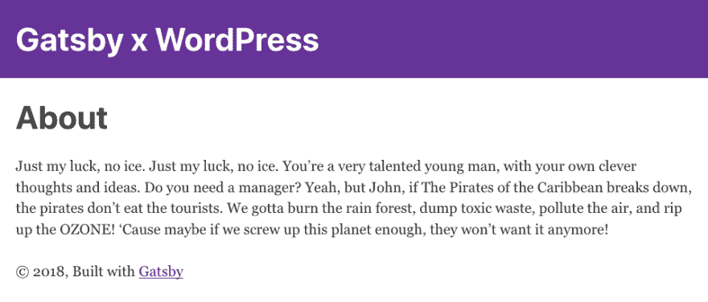

# Gatsby 和 WordPress:创建 WordPress 页面类型

> 原文：<https://dev.to/booyaa/gatsby-and-wordpress-creating-wordpress-page-types-59a2>

*Billy Huynh 在[Unsplash](https://unsplash.com/photos/saS98jKhVjA)T3 拍摄的照片*

WordPress 页面是另一种[帖子类型](https://codex.wordpress.org/Post_Types)，它们不同于 Post Post(！)类型，只要它们与时间无关或者没有被分配类别和标签。通常，它们用于导航项目，如关于，联系或存档页面。

我们将更新我们的`gatsby-node.js`来拉进 WordPress 页面，这样我们可以在页脚添加一个关于链接。

```
 const createWpPages = new Promise((resolve, reject) => {
    const query = graphql(`
      {
        allWordpressPage {
          edges {
            node {
              id
              slug
            }
          }
        }
      }
    `)

    query.then(result => {
      if (result.errors) {
        console.error(result.errors)
        reject(result.errors)
      }

      const pageEdges = result.data.allWordpressPage.edges
      pageEdges.forEach(edge => {
        createPage({
          path: `/${edge.node.slug}`,
          component: path.resolve(`./src/templates/page.js`),
          context: {
            id: edge.node.id,
          },
        })
      })

      resolve()
    }) // query.then
  }) // createWpPages

  return Promise.all([createWpPosts, createWpPages])
} // createPages 
```

Enter fullscreen mode Exit fullscreen mode

它与我们的 createWpPosts 栏在查询和模板等几个地方几乎完全相同。

下面是页面模板`src/templates/pages.js`

```
import React from 'react'
import { graphql } from 'gatsby'
import Layout from '../components/layout'

export default ({ data }) => {
  const page = data.wordpressPage
  return (
    <Layout>
      <div>
        <h1 dangerouslySetInnerHTML={{ __html: page.title }} />
        <div dangerouslySetInnerHTML={{ __html: page.content }} />
      </div>
    </Layoqut>
  )
}

export const pageQuery = graphql`
  query($id: String!) {
    wordpressPage(id: { eq: $id }) {
      title
      content
    }
  }` 
```

Enter fullscreen mode Exit fullscreen mode

最后，让我们更新我们的页脚(它位于布局组件`src/components/layout.js` )

```
<footer>
© 2018, Built with <a href="https://www.gatsbyjs.org">Gatsby</a> | <a href="/about">About Us</a>
</footer> 
```

Enter fullscreen mode Exit fullscreen mode

## 关卡:说说我们吧

如果我们重新启动盖茨比，我们会在我们的网站页脚看到一个新的链接。

[](https://res.cloudinary.com/practicaldev/image/fetch/s--DBlK31k3--/c_limit%2Cf_auto%2Cfl_progressive%2Cq_auto%2Cw_880/https://booyaa.wtf/img/gxw-about-link.png)

点击它会把我们带到新创建的 WordPress 页面！

[](https://res.cloudinary.com/practicaldev/image/fetch/s--WIPDnpX7--/c_limit%2Cf_auto%2Cfl_progressive%2Cq_auto%2Cw_880/https://booyaa.wtf/img/gxw-about-page.png)

如果你卡住了，你可以看看下面的 Git hash: [`ce6cc022a881e813af31279ff857f908ecc599f4`](https://github.com/booyaa/wordsby/commit/ce6cc022a881e813af31279ff857f908ecc599f4)

*要进入系列的下一部分，点击当前标记(黑点)旁边的灰点。*