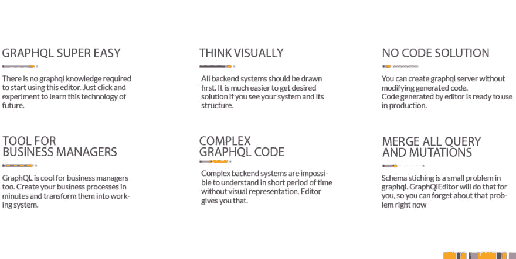

# 介绍可视化 GraphQL 编辑器——绘制您的 GraphQL 模式

> 原文：<https://dev.to/graphqleditor/introducing-visual-graphql-editor---draw-your-graphql-schema-2p5l>

介绍我们最新的开源项目——可视化 GraphQL 编辑器
这个简单的工具可以让你从块中创建 GraphQL 模式，或者从 URL 中可视化现有的模式—[https://github.com/slothking-online/graphql-editor](https://github.com/slothking-online/graphql-editor)

