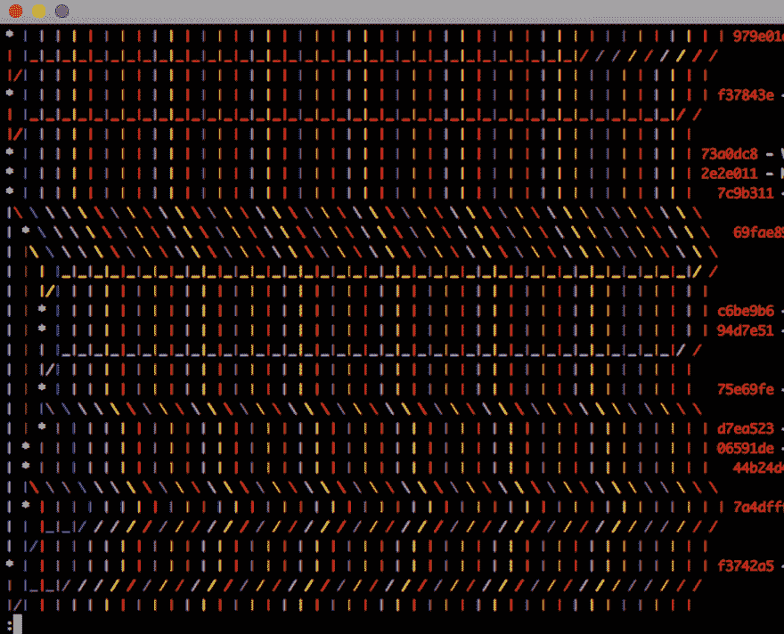

# 我们如何在聪明的发明中使用 Git？

> 原文：<https://dev.to/brightdevs/how-do-we-use-git-at-bright-inventions-2ea0>

尽管在 Bright Inventions，我们使用了许多技术并在多个软件栈上工作，但我们有一些在所有项目和栈中通用并被广泛接受的实践。其中之一是我们如何使用源代码控制，即 Git。我们工作流程的某些部分是高度主观的，有些甚至可能被认为是有争议的或次优的。让我来指导您完成我们的流程，并解释一些基本原理。

## 分支模型

Git 有几种分支模型或流程。有些人无法想象没有[成熟的 GitFlow](https://www.atlassian.com/git/tutorials/comparing-workflows/gitflow-workflow) 的项目。有些是铁杆信徒。我们介于两者之间。我们的流程主要基于[功能分支](https://www.atlassian.com/git/tutorials/comparing-workflows/feature-branch-workflow)——我们在`master`有主线，我们主要在致力于单一功能的短命分支中工作。当特性准备就绪时(理想情况下，已经在评审之后[，我们尽可能多地挤压它的提交，然后将挤压的提交(或提交)重新放在 master 上。然后它被合并到 master 中。](https://brightinventions.pl/blog/what-are-code-reviews-for/)

让我们将这个流分解成一些更小的块。

### 初始工作

我们分配了一个新的标签/问题(理想情况下，因为我们已经从计划列表中选择了它)。假设我们对 remote `master`进行了更新，我们开始为我们的问题创建一个特性分支:

```
git checkout -b PROJ-123 
```

Enter fullscreen mode Exit fullscreen mode

我们经常使用的惯例是根据描述我们特性的 JIRA 标签来命名特性分支，但是我们不要拘泥于此，只要这个名称清楚地传达了分支是关于什么的。这很重要，因为我们也将把这个特性分支推到远程存储库，如果我们要与其他人合作，这尤其重要。

然后，让工作开始。每当我们在实现中达到一个稳定点时(但不一定是端到端完成的)，我们将我们的变更提交到我们的特性分支。[早承诺，常承诺](http://blog.beanstalkapp.com/post/147799908084/commit-early-commit-often)，他们说，我们也同意。这可能意味着我们每小时都有一些提交，这完全没问题，只要我们对提交的命名足够好，以便我们理解历史，并能够在需要时恢复。这里没有严格的规定，因为这个树枝仍然是我们的私人草坪，在`master`之外。

```
git add .
git commit -m "WIP invoices listing; filtering UI done" 
```

Enter fullscreen mode Exit fullscreen mode

但是，私有并不意味着仅限于本地。为了数据安全和备份，以及持续集成给我们带来的好处(见后面)，我们将这些私有的变更推送到远程存储库中我们的特性分支的远程副本。我们永远不应该让工作处于未提交状态，不应该在一天结束时被推到远程回购，这只是为了确保我们的工作不会丢失，如果我们需要请一周意外的病假，或者万一我们的设备一夜之间发生了什么不好的事情。

```
git push
# or, for the first push of the new feature branch
git push --set-upstream origin PROJ-123 
```

Enter fullscreen mode Exit fullscreen mode

### 准备好东西

当我们的工作功能完整时(或者处于可以进行同行评审的状态)，出于评审人员的考虑，我们应该通过[粉碎](https://medium.com/@slamflipstrom/a-beginners-guide-to-squashing-commits-with-git-rebase-8185cf6e62ec)检查点的修改和修复来稍微清理一下 Git 历史。我们通过使用[交互式重定基础](http://gitready.com/advanced/2009/02/10/squashing-commits-with-rebase.html)来做到这一点。这也是将我们的代码与主线同步的一个好时机，通过将我们的 rebase 定位到当前的`master`提示，当我们在特性分支:
上工作时，它可能已经离开了

```
git fetch # make sure we know the state of the origin
git rebase -i origin/master 
```

Enter fullscreen mode Exit fullscreen mode

重定基数是一个复杂的过程。如果我们面前有想象或绘制的树枝树，就更容易推理了——我强烈推荐初学者使用。使用 rebase，我们从树枝附着的地方“切掉”我们正在处理的树枝，并把它移植到另一个指定的地方(在我们的例子中是`master`的尖端)。逐个提交地应用更改。从某种意义上说，我们指示 Git 在另一个起点上从特性分支重做我们的工作。因此，如果我们在我们的特性分支中更改了一个变量名，这个变量名来源于提交`A`，当它是`master`的尖端时，Git 试图将这个更改准确地应用到当前的`master`尖端，不管它是什么。它应用标准的冲突解决技术，因此可能会失败。我们需要用解决传统合并的方式来解决冲突。然而，与合并相反，rebase 创建新的提交，假装工作发生在比实际发生的时间更晚的时间和基线上。我想这是最有争议的部分——让我稍后在[讨论这个问题。](#buts)

在重定基础之后，我们将我们的工作简化为一个或几个有意义的提交，并应用于最近可用的变更之上。我们需要与世界分享我们重新调整的变化。这一次，简单的`git push`失败了，因为使用 rebase 我们重写了分支历史，并且我们与已经推送的内容不同步(我们已经放弃了之前推送的 WIP 风格的提交，取而代之的是一些新的和闪亮的提交)。所以我们做了另一件事，有些人可能会认为这是有争议的——我们强制推送我们的特性分支，这样那些被丢弃的提交也会被远程存储库遗忘:

```
git please 
```

Enter fullscreen mode Exit fullscreen mode

等等，什么？没有这样的 Git 命令。这里我们使用的是`git push --force-with-lease` 的自定义别名[。它没有普通的`--force`那么激进，因为它只能覆盖我们在本地副本中已经知道的提交——如果远程上还有我们不知道的提交，我们将被拒绝。普通的`--force`会在不通知我们的情况下覆盖它们，所以如果我们和其他人在特性分支上合作，我们很可能会破坏他们的工作。其实我相信`--force`根本不应该有。我看不出强迫推有什么合法的理由，`--force-with-lease`应该是唯一允许的强制方法。而当我们把它别名为`please`(注意是 push+lease 的缩写)的时候，我们也更善良，更少...固执己见的😆。](https://medium.freecodecamp.org/git-please-a182f28efeb5)

### 复习时间

当我们的变更存在于远程存储库时，我们现在可以进行同行评审了。在 Bright，我们都是 JetBrains 的狂热爱好者，所以显然我们使用 [Upsource](https://www.jetbrains.com/upsource/) 来实现这个目的。我们的评论方法已经在这里描述过了[，所以让我们在这里跳过它。然而，重要的是，代码审查可能会导致现在重新基础的特性分支中更多的提交，这很好，包括更多的 WIP 风格的提交。让我们继续在分支上工作，直到成功地完成审查。理想情况下，我们应该经常对`master`进行重新调整，以确保我们的功能分支仍然与主线保持同步，但是它在我们的流程中有一个主要缺点——当它所附加的提交被重新调整时，Upsource 往往会丢失对代码的注释。记住这一点，我们正在寻找便利性与不兼容风险之间的正确平衡。](https://brightinventions.pl/blog/what-are-code-reviews-for/)

在评审完成之后，如果需要的话，所有评审相关的提交可以再次被压缩，并且分支应该再次基于最新的`master`。是时候合并成`master`和推送:
了

```
git checkout master
git merge --ff-only PROJ-123
git push 
```

Enter fullscreen mode Exit fullscreen mode

技术上不需要`--ff-only`标志，但这是一个健全性检查，我们实际上正确地进行了重新基础，整个合并实际上将是对`master`的一个[快进操作](https://ariya.io/2013/09/fast-forward-git-merge)，而不是两个提交行的经典合并。我们甚至可以[将其配置为默认的合并行为](https://medium.com/@mvuksano/git-tips-use-only-fast-forward-merges-with-rebase-c80c9d260a83)。

有替代技术的基础上有。如果我们想将特性分支的所有提交压缩成一个，我们可以运行`git merge --squash feature-branch`而不是 rebase+merge pair。效果在概念上是一样的，所以使用你方便的东西。

这项工作现在已经完成了，但是在去吃午饭之前，我们还应该做一件事——我们应该清理我们的存储库，删除我们不再需要的远程特性分支。除非我们这样做，否则随着时间的推移，我们的 Git 树将变得越来越难阅读，我们的工具将需要努力工作来正确绘制它，我们的 CI 将需要跟踪无用的东西，我们的大脑将需要过滤掉它们。让我们摆脱它:

```
git push origin --delete PROJ-123 
```

Enter fullscreen mode Exit fullscreen mode

现在正式到了午餐时间😉。

## 但氏

### 但是他们说[改基不好](https://medium.com/@fredrikmorken/why-you-should-stop-using-git-rebase-5552bee4fed1)！

Rebase 是有争议的，主要是因为它改写了历史，使我们的变化出现在不同的时间表，然后当它实际发生在开发商身上。这是我们将要接受的一个事实，主要是因为我们发现，当开发人员在他们的本地机器上引入变更时，推理代码库的状态并不重要。然而，重要的是它何时被引入主线(在我们的例子中是`master`)并被部署。当我们的历史趋向于线性，而不是经历许多交错的提交行和“合并的合并”提交时，更容易对此进行推理，这种情况往往发生在合并是首选行为的存储库中。

[](https://res.cloudinary.com/practicaldev/image/fetch/s--XKCtB00I--/c_limit%2Cf_auto%2Cfl_progressive%2Cq_auto%2Cw_880/https://thepracticaldev.s3.amazonaws.com/i/0boqexakinp7awm5qr39.png)

在我们的场景中，在到达`master`之前，变更并没有真正引入到代码库中。这是我们最关心的时刻。Rebase 和 merge 一样精确，所以让我们保持简单。

不过，这里有一个罪犯。Rebase 在新的基础上分别应用每一个提交，所以这意味着我们可以解决多个冲突。更重要的是，如果我们需要随着时间的推移进行多次重新定基(即，因为`master`在我们的变更被评审时走得更远)，我们需要多次重复这个冲突解决过程。这是一个部分由[re resere 技术](https://hackernoon.com/fix-conflicts-only-once-with-git-rerere-7d116b2cec67)解决的痛苦。但是最好的缓解方法是在定义任务的范围和规模时小心谨慎。分工明确的任务足够小，以确保实现不会持续很长时间:不到一天可能是一个很好的目标阈值，但显然——[这取决于](http://blog.consulting101book.com/it-depends/)。良好分割的任务(在良好架构的代码库中)也足够独立于其他计划的变更，因此冲突的数量足够低，可以处理它。在某些情况下，这并不容易，但这是值得的——精心计划的任务的影响是深远的，并且几乎涉及软件开发过程的所有方面。

### 但是如何在一个特性分支上协作呢？

事实上，我们正在强制推进我们的功能分支，这意味着历史正在改变。所以如果有人依赖它，我们可能会打破他们的工作流程。如果需要多人处理工作，如何分担工作是一个有效的问题，尽管我们已经确定了小任务和分工明确的任务的重要性，但这并不像看起来那么常见。在大多数情况下，在一个特性准备好推向`master`之前，需要在这个特性上进行协作，这可能意味着它没有被足够精细地分割。请注意，“准备推送到`master`”并不一定意味着“准备发货给客户”。有许多技术可以将这两者分离，[功能切换](https://martinfowler.com/articles/feature-toggles.html)是我们在 Bright 最有经验的一种。

但是如果我们真的需要和其他人共享同一个特性分支，我们可以在特性分支中使用合并和“经典的”Git 协作技术，并在重新基于 master 之前去掉它。Git 是一只强大的野兽。最终，合并仍然是一个完全有效的技术，如果我们确信我们甚至需要在`master`上使用它，没有小猫会死。Git 中偶尔出现的一段非线性历史可能不会让它立即变得不可读。

## 发布模式

我们相信尽早部署，经常部署(T2)原则，只要对我们和我们的客户可行。这就是为什么我们总是投资于自动化和连续交付过程——我们永远不需要手工或从开发人员的机器上运行任何构建。这通常意味着我们能够将到达`master`的每一个提交部署到我们的应用程序的登台环境中。我们要求我们的客户尽可能多地使用这些暂存环境，以便我们可以在它们进入生产环境之前检测出未解决的 bug。在大多数情况下，我们也使用分期构建来满足我们的内部需求，即我们目前正在开发的移动应用程序连接到分期后端环境，我们在那里运行演示等。

这些事实要求我们尽可能保持`master`分支的健康状态，因为如果`master`坏了，实际上可能会影响很多人的工作。我们认为这是一件好事。为了帮助完成这个订单，我们为每个分支机构设置了运行 [TeamCity](https://www.jetbrains.com/teamcity/) 的持续集成服务器，因此我们的特色分支机构的测试会持续运行，并且在变更到达`master`之前也是如此。这包括在真实数据库引擎上运行的集成测试，或者对后端的实际 HTTP 调用。Docker 使这些事情比以前容易得多——但这将是另一篇文章的主题。

我们总是释放后端和 web 项目的每一个提交，这对任何人都无害(假设我们在部署时没有严重的停机)。对于移动应用程序，在大多数情况下，我们出于务实的原因避免这样做——构建和发布周期较长，因为涉及到第三方(Android 的 Google Play 和 iOS 的 TestFlight ),也因为客户在收到所有更新通知时感到烦恼。对于活动项目来说，每天都有十几个提交并不罕见。因此，对于 iOS 和 Android 项目，我们倾向于在 TeamCity 中设置一个预定的触发器，每天晚上发布更改，如果我们需要更快地发布更改，我们可以随时按下构建服务器上的按钮。

## 生产维护

当这些更改在试运行构建或试运行环境中经过实战测试，并且客户接受了它时，我们会将其推广到生产环境中——同样，使用基于 TeamCity 的自动化流程，这些流程与用于部署到试运行的流程相同，只是在大多数情况下只翻转了一个标志。我们需要手动触发动作——只要我们认为时机合适，就点击“运行”按钮。

发布到生产环境的代码需要标记，以便我们可以继续开发，但仍然有足够的知识返回到发布的位置，以准备任何热修复，以防出现问题。我们根据应用程序的生命周期模型进行不同的标记。

对于后端或基于 web 的解决方案，我们不需要关心以前的版本——我们关心的是当前发布的版本。我们使用`production`分支(这是除了`master`之外唯一的长寿分支)，在部署完成后强制重置到`master`的释放点:

```
git push --force-with-lease origin master:production 
```

Enter fullscreen mode Exit fullscreen mode

对于移动应用程序，更新周期不是那么明显，在某些情况下，我们需要同时跟踪许多发布的版本，我们使用 Git 标签，这些标签不变地指向构建并发布到商店的提交。我们使用版本号作为标签名:

```
git tag release1.3
git push --tags 
```

Enter fullscreen mode Exit fullscreen mode

这两种解决方案都为我们提供了一种直接的方式，将我们的开发环境重置到 Git 时间线中与需要“尽快”发布的 bug 修复相关的点。

## Git 工装

尽管本文中的所有命令都引用了简单的老式命令行界面，但是如果我们不是 CLI 迷，使用可视化工具来使我们的生活变得更容易并没有什么错。不过，有一个极其重要的条件。我们需要理解我们的工具在 Git 命令方面到底做了什么，否则我们就不是 Git 用户，而只是我们盲目信任的工具的囚徒。但是工具的智能取决于这些工具的使用者——一个人不会仅仅因为买了一把好画笔就能画出世界级的画作。

我个人的偏好是原始 Git 和 WebStorm/IntelliJ 内置支持的混合。我从 IDE 提交是因为它很简单，但是我从 CLI 返回是因为我需要感觉到控制。但这是主观的，每个人都需要找到自己的工具禅。

如果您决定在某种程度上使用 CLI，为了方便起见，这里有一组我们经常使用的有用别名。您可以将它粘贴到您的`.gitconfig`文件中，该文件很可能位于您的“home”目录中。

```
 [alias]
    st = status
    ci = commit
    ciam = commit -am
    br = branch
    co = checkout
    lg = log -p
    lol = log --color --graph --decorate --pretty=format:'%C(red)%h %Cgreen%cr %Cblue(%an)%C(yellow)%d%Creset %s' --abbrev-commit --all
    lola = log --color --graph --pretty=format:'%Cred%h%Creset -%C(yellow)%d%Creset %s %Cgreen(%cr) %C(bold blue)<%an>%Creset' --abbrev-commit --all
    unstage = reset HEAD
    reseth = reset --hard
    please = push --force-with-lease
    halp = reflog --date=iso # halp is more than help 
```

Enter fullscreen mode Exit fullscreen mode

有一个伟大的推动！

最初发布于 [brightinventions.pl](https://brightinventions.pl/blog/)

由亚当吧、网络佬@光明发明
[个人博客](https://whatwebcando.today/) [推特](https://twitter.com/NOtherDev) [邮箱](//adam.bar@brightinventions.pl) [Github](https://github.com/NOtherDev)