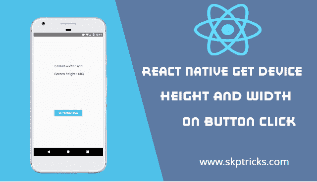
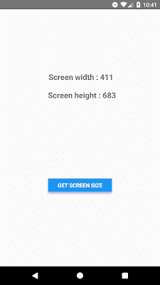

# 点击按钮时反应本机获取屏幕宽度反应本机获取设备高度宽度

> 原文：<https://dev.to/skptricks/react-native-get-device-height-width-on-button-click-19ld>

来源: [React Native 获取设备高度宽度点击按钮](https://www.skptricks.com/2019/01/react-native-get-device-height-width-on-button-click.html)

本教程解释了**如何在 react 原生应用**中获取按钮点击时的设备宽度和高度。在 react native 中，我们有默认的类，即**维度、**，它是“ **react-native** 包的一部分。这个 dimension 类有助于以非常简单的方式*检测 android 或 ios 设备的屏幕宽度和高度*。

首先， ***从“react-native”包中导入维度类。【T2***

```
import {Dimensions } from "react-native"; 
```

您可以使用以下方式获得设备的宽度和高度:

**获取设备屏幕宽度:**

```
 const screenWidth = Math.round(Dimensions.get('window').width); 
```

**获取设备屏幕高度:**

```
const screenHeight = Math.round(Dimensions.get('window').height); 
```

[](https://2.bp.blogspot.com/-3s72Ha578q4/XC7skslyGoI/AAAAAAAACSg/NVnlCq9rcC4c_1zVIiiPZP3j2zeghYHAQCLcBGAs/s1600/device.png)

## 在 React Native 中点击按钮获取设备高度宽度:

在本教程中，我们将显示设备屏幕的宽度和高度，当用户点击按钮。

* *步骤 1: ** 创建一个新的 react native 项目，如果你不知道[如何在 react native 中创建新项目，就按照这个教程](https://www.skptricks.com/2018/06/how-to-create-your-first-react-native-application.html)做。

**步骤 2:** 在你最喜欢的代码编辑器中打开 index.android.js / index.ios.js，擦除所有代码，按照本教程操作。

* *第三步:** 通过 react，react-native 包导入所有需要的组件。

```
import React, { Component } from "react";  
import { Platform, StyleSheet, View, Text, Button, Dimensions } from "react-native"; 
```

**Step-4:** 在 App 类内部创建一个构造函数，并在构造函数块内部定义状态，在这里捕捉设备屏幕的宽度和高度。

```
constructor() {  
super();  
this.state = { screenWidth: "", screenHeight: "" }  
} 
```

**第 5 步:* *App ** 类内创建名为**getScreenSize** 的函数。该功能捕捉设备屏幕宽度&高度，最终在屏幕上显示尺寸。

```
 getScreenSize = () => {  
const screenWidth = Math.round(Dimensions.get('window').width);  
const screenHeight = Math.round(Dimensions.get('window').height);  
this.setState({ screenWidth: screenWidth, screenHeight: screenHeight })  
} 
```

* *第 6 步:** 实现 render 方法，并放置在 render 块内的布局设计下方。

```
 render() {  
return (  
<View style={styles.container}>  
<View style={{ marginTop: 150 }}>  
<Text style={styles.headerText}> Screen width : {this.state.screenWidth}</Text>  
<Text style={styles.headerText}>Screen height : {this.state.screenHeight}</Text>  
</View>  
<View style={{ flex: 1, justifyContent: 'center', alignItems: 'center' }}>  
<View style={[{ width: "40%", margin: 10 }]}>  
<Button  
              onPress={this.getScreenSize}  
              title="Get screen size"  
/>  
</View>  
</View>  

</View>  
);  
} 
```

* *步骤 7 : ** 应用下面的样式表设计。

```
const styles = StyleSheet.create({  
  container: {  
    flex: 1,  
// justifyContent: 'center',  
//alignItems: 'center'  
},  
  headerText: {  
    fontSize: 20,  
    textAlign: "center",  
    margin: 10,  
    fontWeight: "bold"  
},  
}); 
```

## app . js 的完整源代码

当用户点击 react 本地应用
中的按钮时，让我们看看帮助显示设备屏幕宽度和高度的完整源代码

```
/\*\*  
 \* Sample React Native App  
 \* https://github.com/facebook/react-native  
 \* @flow  
 \*/  

import React, { Component } from "react";  
import { Platform, StyleSheet, View, Text, Button, Dimensions } from "react-native";  

export default class App extends Component {  

  constructor() {  
super();  
this.state = { screenWidth: "", screenHeight: "" }  
}  

  getScreenSize = () => {  
const screenWidth = Math.round(Dimensions.get('window').width);  
const screenHeight = Math.round(Dimensions.get('window').height);  
this.setState({ screenWidth: screenWidth, screenHeight: screenHeight })  
}  

  render() {  
return (  
<View style={styles.container}>  
<View style={{ marginTop: 150 }}>  
<Text style={styles.headerText}> Screen width : {this.state.screenWidth}</Text>  
<Text style={styles.headerText}>Screen height : {this.state.screenHeight}</Text>  
</View>  
<View style={{ flex: 1, justifyContent: 'center', alignItems: 'center' }}>  
<View style={[{ width: "40%", margin: 10 }]}>  
<Button  
              onPress={this.getScreenSize}  
              title="Get screen size"  
/>  
</View>  
</View>  

</View>  
);  
}  
}  

const styles = StyleSheet.create({  
  container: {  
    flex: 1,  
// justifyContent: 'center',  
//alignItems: 'center'  
},  
  headerText: {  
    fontSize: 20,  
    textAlign: "center",  
    margin: 10,  
    fontWeight: "bold"  
},  
}); 
```

**截图:**

[](https://2.bp.blogspot.com/-rOuRbOiFaLQ/XC7rDib-L-I/AAAAAAAACSQ/UfOw2pS_Tawca87Y6emLXGCkiKvljhM1ACLcBGAs/s1600/Screenshot_1546578692.png)

这都是关于 **React Native 获取设备高度宽度按钮点击演示**。感谢你阅读这篇文章，如果你有任何问题，有关于这篇文章的另一个更好的有用的解决方案，请在评论区写消息。