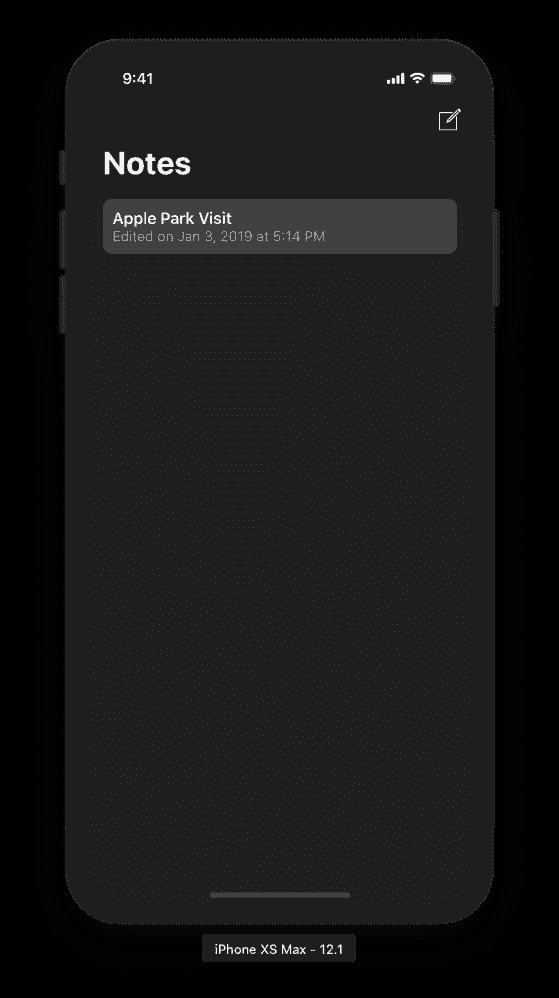
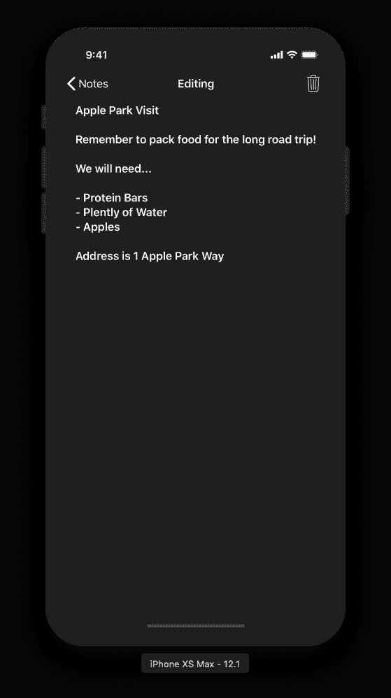
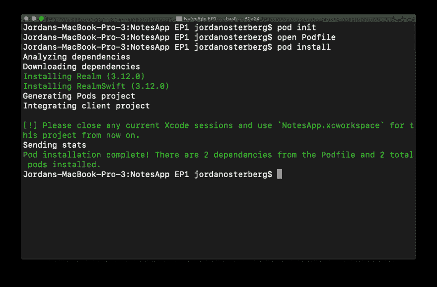

# Realm 数据库指南——在 Swift 中为 iOS 构建 Note 应用程序

> 原文：<https://dev.to/jordanosterberg/-realm-database-guide---building-a-note-app-in-swift-for-ios-4dbl>

如果你更喜欢视频而不是书面文章，这篇文章是我制作的一个视频的书面版本。内容是一样的。T3】

[https://www.youtube.com/embed/XVm_6977jcE](https://www.youtube.com/embed/XVm_6977jcE)

这个视频是一系列视频中的第一个，我希望它能教你如何使用 iOS 框架和工具，如 Siri 快捷方式、CloudKit 等。如果你有一个特定的框架或特性，你想看看这个系列的封面，请随时写信给我，地址是 Jordan[dot]oster Berg[at]shadow systems[dot]tech，或 Twitter [@josterbe1](https://twitter.com/josterbe1) 。

#### 目录

1.  [简介](#introduction)
2.  [安装依赖关系](#installing-dependencies)
3.  [型号](#the-model)
4.  [实现领域](#implementing-realm)
5.  [结论](#conclusion)

事不宜迟，让我们来看看我们将在本系列中构建的应用程序...

### 简介

[](https://res.cloudinary.com/practicaldev/image/fetch/s--PZsuufN2--/c_limit%2Cf_auto%2Cfl_progressive%2Cq_auto%2Cw_880/https://thepracticaldev.s3.amazonaws.com/i/4nzrs0ttu43ski89l51g.png)
[T6】](https://res.cloudinary.com/practicaldev/image/fetch/s--mat_o_XQ--/c_limit%2Cf_auto%2Cfl_progressive%2Cq_auto%2Cw_880/https://thepracticaldev.s3.amazonaws.com/i/5n4lyx3ec29mz1hgvir4.png)

我们有笔记列表，当我们点击其中一个时，我们可以阅读并开始编辑或删除它。很简单。如果你下载了 [starter 项目](https://github.com/JordanOsterberg)，你会注意到，当你点击“Apple Park Visit”笔记时，当你进出 NoteDetailController 时，笔记不会持续。也就是说，当您编辑注释时，注释的内容不会保存。

这就是我们将在本文中使用[领域数据库](https://realm.io)构建的内容。我使用 Realm 才两年，我发现它的简单性超过了使用第三方库的成本。事实上，我把大部分个人开发时间都用在了 macOS 和 iOS 上的应用程序中(见[https://count downs . download](https://countdowns.download))。

### 安装依赖项

为了开始使用 Realm，我们需要使用 [CocoaPods](https://cocoapods.org) 安装它。CocoaPods，如果你不知道的话，CocoaPods 是一个在 iOS 领域广泛使用的依赖管理工具。如果你的 Mac 上还没有安装 CocoaPods，你可以使用`sudo gem install cocoapods`命令开始安装。现在，打开项目文件夹，以及该目录中的终端窗口。

输入`pod init`，然后输入`open Podfile`。

在新创建的“Podfile”中，我们需要写一些文本来通知 CocoaPods 你想在你的项目中安装什么库。

在`# Pods for NotesApp`下面，写这两行:

```
pod 'Realm', '~> 3.12.0'
pod 'RealmSwift', '~> 3.12.0' 
```

在您写完这些行之后，您的 Podfile 应该看起来像这样:

```
platform :ios, '12.0'

target 'NotesApp' do
  use_frameworks!

  # Pods for NotesApp
  pod 'Realm', '~> 3.12.0'
  pod 'RealmSwift', '~> 3.12.0'

  target 'NotesAppTests' do
    inherit! :search_paths
  end

  target 'NotesAppUITests' do
    inherit! :search_paths
  end

end 
```

现在我们已经添加了我们的依赖项，让我们让 CocoaPods 用`pod install`来安装它们

当你第一次使用 CocoaPods 时，这个**将**需要一些时间。别担心，CocoaPods 只是下载一些初始组件。不会每次你`pod install`都这样。

一旦该命令执行完毕，您的终端窗口将如下所示:

[](https://res.cloudinary.com/practicaldev/image/fetch/s--DHZLkdxJ--/c_limit%2Cf_auto%2Cfl_progressive%2Cq_auto%2Cw_880/https://thepracticaldev.s3.amazonaws.com/i/gcrwub50q7seobhpbjhx.png)

之后，如果你已经打开了`NotesApp.xcodeproj`，关闭它。使用 CocoaPods 时，必须使用`.xcworkspace`文件，而不是默认的`.xcodeproj`文件。打开`NotesApp.xcworkspace`文件，前往`Note.swift`。

### 模型

这个类包含了我们的笔记模型对象，它包含了一些基本的属性:

```
class Note {

    var identifier: String
    var content: String
    var lastEdited: Date

    init(
         identifier: String = UUID().uuidString,
         content: String,
         lastEdited: Date = Date()) {
        self.identifier = identifier
        self.content = content
        self.lastEdited = lastEdited
    }

} 
```

标准模型代码，这里没什么特别的。

在同一个文件中，我们还有一个对我们的 Note 对象的扩展，它是名为`Writeable`
的协议的子类

```
extension Note: Writable {

    func write(dataSource: DataSource) {
        self.lastEdited = Date()

        dataSource.store(object: self)
    }

    func delete(dataSource: DataSource) {
        dataSource.delete(object: self)
    }

} 
```

在`write`和`delete`函数内部，您会注意到我们有一个`DataSource`属性。`DataSource`是一个通用协议，有助于在我们代码的更高层次上尽可能抽象地修改数据。

下面是协议定义:

```
protocol DataSource {

    func store<T>(object: T)
    func delete<T>(object: T)

} 
```

如果你不熟悉泛型，我们的每个函数都有一个`T`参数，这意味着它可以是任何类型的对象。这在我们的项目中使用得并不多，但是可以进一步发展和使用它来创建多个数据源，这些数据源对它们可以存储的对象有不同的约束。

我们在`NoteDataSource`中实现我们的`DataSource`协议。这里也没有什么特别的，除了一个小花絮，我想说明一下。

每当我们`store`或`delete`对象时，我们使用下面的调用来调用`NotificationCenter` :

```
NotificationCenter.default.post(name: .noteDataChanged, object: nil)

// We also have this extension of Notification.Name to make sending and receiving this notification simple.

extension Notification.Name {

    static let noteDataChanged = Notification.Name(rawValue: "noteDataChanged")

} 
```

本质上，无论何时存储或删除任何注释，我们都会通知任何侦听器我们的数据已经更改，因此他们可以相应地更新他们的 UI。

我们所有的模型文件和类都准备好了，让我们开始实现 Realm 吧！

### 实现境界

将 Realm 与我们的项目集成有三个步骤:

1.  [创建领域对象](#creating-the-realm-object)
2.  [我们的领域对象和我们的原始笔记对象之间的桥梁](#bridging-between-our-realm-object-and-our-primitive-note-object)
3.  [开始用领域](#begin-retrieving-and-modifying-data-with-realm)检索和修改数据

#### 创建领域对象

这一步相对简单。让我们创建一个名为`RealmNote.swift`的新 Swift 文件。在`RealmNote.swift`内部，导入 RealmSwift 框架并创建一个类声明，如下所示:

```
import RealmSwift

class RealmNote: Object {

} 
```

我们将子类化 Realm 的`Object`类，这将允许我们在 Realm 数据库函数中使用`RealmNote`。

现在，添加笔记模型中的三个属性:

```
@objc dynamic var identifier: String = ""
@objc dynamic var content: String = ""
@objc dynamic var lastEdited: Date = Date() 
```

变量声明的`@objc dynamic`部分向 Objective-C 公开了我们的属性，领域的许多 iOS 层都是用 Objective-C 编写的。它还允许 Realm 监听我们的`RealmNote`对象的变化。

为了结束我们的类，覆盖`class func` primaryKey，它返回一个值为“identifier”的可选字符串(`String?`)。这通知 Realm】的主键，一种唯一标识我们对象的方式，存储在“标识符”属性中。

一旦你完成了这些步骤，你的`RealmNote`将看起来像这样:

```
class RealmNote: Object {

    @objc dynamic var identifier: String = ""
    @objc dynamic var content: String = ""
    @objc dynamic var lastEdited: Date = Date()

    override class func primaryKey() -> String? {
        return "identifier"
    }

} 
```

第一步到此为止。

#### 我们的领域对象和我们的原始笔记对象之间的桥梁

我们有两个独立的模型对象:`Note`和`RealmNote`。RealmNote 在处理 Realm 时在内部使用，以保持我们的模型层与我们的 UI 解耦。通过使用两个独立的对象，如果将来需要的话，我们可以不使用 Realm。

在`RealmNote.swift`文件中，创建一个扩展名为`RealmNote` :

```
extension RealmNote {

} 
```

现在，在扩展中创建一个`convenience init`，它接受一个`Note`作为它唯一的属性。这将允许我们通过使用一个`Note`对象来创建`RealmNote`对象。

```
convenience init(note: Note) {
    self.init()

    self.identifier = note.identifier
    self.content = note.content
    self.lastEdited = note.lastEdited
} 
```

很好，现在，为了结束`RealmNote.swift`，在从`RealmNote` :
初始化的扩展中创建一个`Note`变量

```
var note: Note {
    return Note(realmNote: self)
} 
```

如果 Xcode 给你一个关于 Note 初始化器的错误，不要担心，我们将会修复它。

前往`Note.swift`，在那里我们将写下我们的桥的另一半。这段代码本质上和`RealmNote`的扩展是一样的。

```
extension Note {

    convenience init(realmNote: RealmNote) {
        self.init(identifier: realmNote.identifier, content: realmNote.content, lastEdited: realmNote.lastEdited)
    }

    var realmNote: RealmNote {
        return RealmNote(note: self)
    }

} 
```

太好了，这是第二步。我们现在可以从`Note`访问`RealmNote`，从`RealmNote`访问`Note`。这也意味着这段代码完全有效:

```
Note(content: "Example").realmNote.note.realmNote.note.realmNote.note.realmNote
// and so on... 
```

玩笑归玩笑，让我们用第三步完成我们的申请。

#### 开始用领域检索和修改数据

在类声明之前进入`NoteDataSource.swift`，和`import RealmSwift`。在修改、删除和检索领域对象之前，我们需要一个领域数据库实例。将`NoteDataSource`的初始化替换为:

```
var realm: Realm

init() {
    // Load our data
    self.realm = try! Realm()
} 
```

这将创建一个领域数据库实例。在生产中，您可能不想使用 bang(！)运算符，因为如果数据库不可用，应用程序将会崩溃。

接下来，让我们编辑`store`函数，将对象实际存储到我们的数据库中。

用境界写作很简单:

```
try? self.realm.write {

} 
```

在代码块内部，我们可以更新数据库中的对象。写这个:

```
self.realm.add(note.realmNote, update: true) 
```

这将在数据库中创建一个新的`RealmNote`,或者更新一个现有的(如果有的话)。就是这样！我们现在将对象存储在领域数据库中(调用 note 的写函数是在`NoteDetailController.swift`中执行的，如果你想看实际用来执行这个写的函数。)

现在，让我们编写我们的`delete`函数。由于我们编写桥的方式(无论何时从`Note`创建`RealmNote`都不咨询领域)，我们必须使用注释的标识符直接从数据库中获取对象，而不是使用它的`realmNote`属性。

这很简单:

```
if let realmNote = self.realm.object(ofType: RealmNote.self, forPrimaryKey: note.identifier) {

} 
```

这要求 Realm 从数据库中检索一个带有标识符或主键的对象。

这可能有点古怪。出于某种原因，如果我们在 Realm 上使用传统的`write`函数，应用程序会崩溃。作为一种变通方法，这段代码完全有效，本质上执行与`write` :
相同的任务

```
self.realm.beginWrite()
self.realm.delete(realmNote)
try? self.realm.commitWrite() 
```

我们开始写入，删除对象，然后提交写入。

至此，我们已经构建了一个功能良好的笔记应用程序！

### 结论

我希望你喜欢这篇关于如何使用 Realm 数据库的教程。我在制作它的过程中得到了很多乐趣，我迫不及待地想开发这个系列，并随着时间的推移为我们的应用程序添加更多功能，如 Siri 快捷方式、CloudKit 等等。感谢阅读。