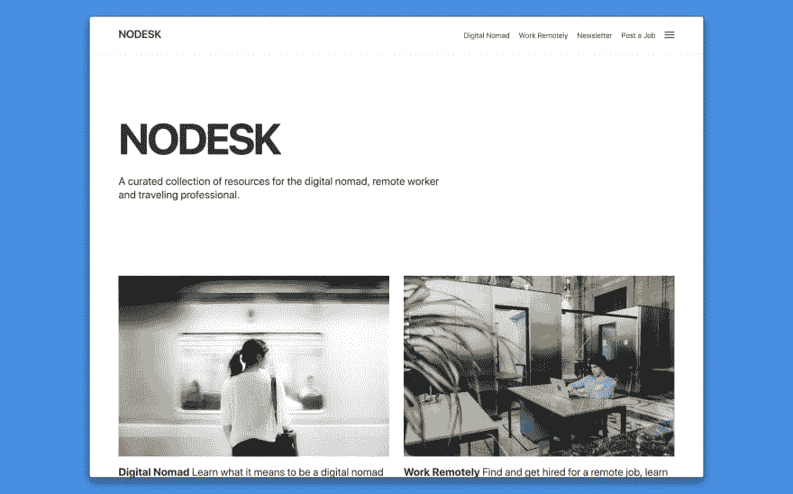

# 最佳数字游牧和远程工作阅读 2018

> 原文：<https://dev.to/3reps/the-best-digital-nomad-and-remote-work-reads2018-4d>

## 这一年，数字游牧成为主流，远程工作成为工作的未来

<figure>

<figcaption>Illustration by Katerina Limpitsouni on unDraw</figcaption>

</figure>

去年在 [NODESK](https://nodesk.co) 上，我发表了 448 篇关于数字游民和远程工作的文章，以及偶尔的另类文章。根据 NODESK 观众最喜欢阅读和分享的内容，以及我认为最有趣的故事，这些都是最受欢迎的。

* * *

2018 年的大部分时间都是关于数字游牧生活方式成为主流，以及远程工作和完全分布式团队的兴起，这是对现代工作场所的直接回应。

> 通过强迫绝大多数不喜欢或讨厌开放式办公室的人进入这种配置，我们正在大规模地浪费人类的健康和潜力。他们的工作质量下降，工作满意度下降。为了什么？因为少数人喜欢这种配置？因为拍几张照片会好看？因为这会给拜访办公室的陌生人留下深刻印象？离开这里。开放式办公室是一个非常糟糕的主意

有数字游牧者写的关于他们的生活方式和远程工作好处的个人故事。例如，Charles Patterson 的[账户](https://medium.com/@charlespattson/designing-remote-the-best-decision-ive-made-in-my-life-17d6766ab373)说远程办公是他们做出的最好决定。

另一个有趣的故事是费利克斯·克劳斯决定去流浪，把他的行李减少到一个手提箱、一个手提包和一个背包。费利克斯接着进行了[一年回顾](https://krausefx.com/blog/one-year-nomad?curator=NODESK)，并得出结论:

> 一年前的今天，我决定扔掉我的东西，住在一个手提箱里。这是从一个我没想到会持续很久的实验开始的。然而，365 天没有一个固定的家，我不打算改变我目前的设置。

随着这些新出现的在异国他乡寻求冒险的数字游牧民，出现了新的问题，比如如何使用蹲式厕所。

除了数字游牧民，还有一些关于一些最具创新性和领先的分布式团队公司的文章，如 [GitLab](https://www.inc.com/cameron-albert-deitch/2018-inc5000-gitlab.html?curator=NODESK)

> 这家总部位于旧金山的初创公司为软件开发人员提供工具，它的每一名员工都在家工作。三年前，这是九个人。今天，GitLab 在 45 个国家的 350 名员工使用视频通话和聊天来保持持续的联系。

和[视觉](https://www.inc.com/jeff-bercovici/invision-2018-company-of-the-year-nominee.html?curator=NODESK)。

> 运营实际上并没有让公司慢下来。InVision 现在有 800 名员工(一年前不到 500 人)，估值为 10 亿美元，随着下一轮融资的临近，这一数字还会增加。以这些标准来衡量，InVision 已经比 Slack 在被 Inc .评为 2015 年年度公司时更大了。

GitLab 和 InVision 是远程工作*大规模运作*的典型例子。但是远程工作有许多陷阱，而且当一家公司实施失败时，远程工作的想法经常受到指责。幸运的是，Andreas Klinger 组织了一个关于如何管理远程团队的[速成班](http://klinger.io/post/180989912140/managing-remote-teams-a-crash-course?curator=NODESK)。

随着远程工作的兴起，求职者面临的问题是如何找到一份远程工作——[NODESK remote job board](https://nodesk.co/remote-jobs/)是今年访问量最大的板块——但当你与来自世界各地的数百甚至数千名求职者竞争时，如何获得一份远程工作。

> 老亚历克西斯·奥哈尼安🚀@ alexisohanian远程工作是工作的未来。2018 年 10 月 18 日 23 点 23 分

安德鲁·戈布兰的文章总结了申请远程工作时应该避免的最大错误，并提供了 Doist、Buffer、InVision、Toggl 和 Timely 招聘专家的建议。

对于求职者来说，这不仅仅是找到一份远程工作，还包括如何选择职业和做出正确的职业决策。

> 这篇文章实际上不是我给你的职业建议，而是一个框架，我认为它可以帮助你做出职业决定，实际上反映了你是谁，你想要什么，以及我们今天快速变化的职业前景。你不是这方面的专家，但你肯定比我们这些没有自知之明的大叔更有资格判断什么对你最好。

2018 年，关于成为数字游牧者和远程工作的积极方面的故事比比皆是。但是随着对游牧民族关注的增加，出现了关于这种生活方式阴暗面的个人描述。这些是 2018 年最有影响力的故事，我希望有抱负的游牧民族能从中吸取教训。

Amir Salihefendic 分享了他关于在远程工作场所的孤立、焦虑和抑郁的个人故事。必读。

Martin De Wulf [写道](https://hackernoon.com/the-stress-of-remote-working-38be5bdcf4da?curator=NODESK)尽管远程工作有很多好处，但是压力很大，对他们的心理健康和人际关系都有影响。

还有一个问题是[远程工作](https://news.ycombinator.com/item?id=15994294)或成为[数字游牧者](https://old.reddit.com/r/digitalnomad/comments/9y9d84/a_digital_nomad_is_not_respected_at_my_job_is_it/?curator=NODESK)是否会损害你的职业生涯，以及数字游牧者对国内外社区的影响，正如 Paris Marx 在[中讨论的那样【数字游牧者不是未来](https://medium.com/@parismarx/digital-nomads-are-not-the-future-be360c7911b4?curator=NODESK)。

基于这些主题，我发现有两种数字流浪者。有些人即将*到*某事，有些人正*离开*某事。前者寻求满足自己的冒险精神，后者寻求为自己创造更好的生活。这两种数字流浪者都可能经历生活方式的艰辛，但后一种人应该注意到，正如更多人指出的那样，[旅行并不能治愈心灵的不满](https://medium.com/personal-growth/travel-is-no-cure-for-the-mind-e449d3109d71?curator=NODESK)。

所有这些故事的要点是:作为一个数字流浪者或远程工作并非没有困难。就像生活中的所有事情一样，当你祈祷下雨的时候，你也要处理好泥巴。那是它的一部分。

液体错误:内部

NODESK 上最受欢迎的另类文章之一是 Naval Ravikant 关于如何致富(不走运)的 Twitter 帖子。

> 海军[@海军](https://dev.to/naval)如何致富(不走运):2018 年 5 月 31 日上午 08:23

最后，这篇关于安东尼·鲍代恩丰富生活的文章《最后一个好奇的人》是必读的。

* * *

我肯定我错过了一些东西，但如果你想了解更多关于数字游牧者和远程工作的信息，可以在这里查看 2018 年包括往年的所有 448 篇文章。

您还可以订阅 NODESK 简讯，每两周将 NODESK 的精华直接发送到您的收件箱。

如果你今年正在寻找一个新的机会，我在 [NODESK 工作论坛](https://nodesk.co/remote-jobs)上为你提供在家或世界各地远程工作的自由的领先公司和创业公司策划了最好的新远程工作。你也可以访问[加密货币职位](https://cryptocurrencyjobs.co/)来获得区块链和加密领域的远程职位。

如果您有任何功能需求、建议或总体反馈，请通过电子邮件或在 [Twitter](https://twitter.com/NODESKco) 上联系我。我的 DMs 永远是开放的。让我知道我如何能帮助你作为一个数字流浪者，远程工作者或在你寻找一个远程工作。

<figure>

<figcaption>Illustration by Katerina Limpitsouni on unDraw</figcaption>

</figure>

**祝福 2019 年。我希望你离下一次冒险只有几天了！**