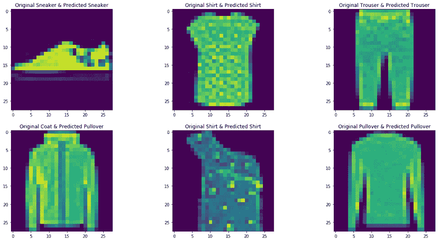
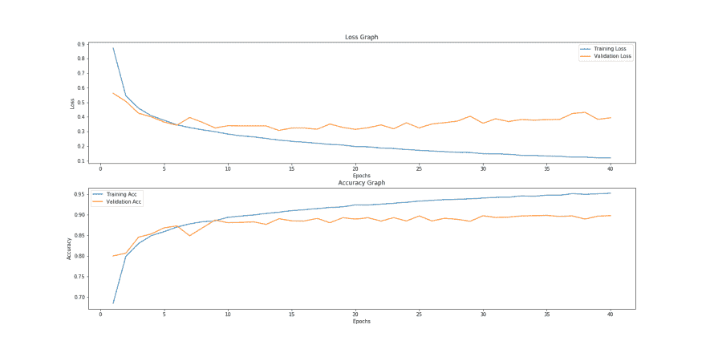

# 学习不深的时尚 MNIST

> 原文：<https://dev.to/hydroweaver/fashion-mnist-with-not-so-deep-learning-16el>

[](https://res.cloudinary.com/practicaldev/image/fetch/s--B1JktMMm--/c_limit%2Cf_auto%2Cfl_progressive%2Cq_auto%2Cw_880/https://thepracticaldev.s3.amazonaws.com/i/z9d3jxofhn8dai8ulv5s.png)

嗨德弗兹！

这是一篇关于使用从 Python 深度学习的第一部分获得的知识来分类 T2 时尚 MNIST 图片的文章。

这实际上是 MNIST 数字识别器的扩展，用于识别不同种类的可穿戴设备，外套，衬衫，鞋子等。

正如你从标题中看到的，我没有使用 DL 的更深层部分，即卷积神经网络，坦率地说，我只是强行进行了几次组合，直到我在测试数据上获得最佳精度。

我使用了以下几种方法的组合，并选择了测试精度最高的一种方法:

1.  多个隐藏层
2.  隐藏层中的多个单元组合
3.  第一层单元的多重组合

最佳模型为 1 个隐层 128 个单元，外层 512 个单元，准确率为 89.04%。

然而这并不是应该做的，因为在现实世界中，处理真正的、困难的 ML 问题的资源是有限的！😞

### 代码

```
from keras import models
from keras import layers
from keras.datasets import fashion_mnist
import numpy as np
import matplotlib.pyplot as plt
from keras.utils import to_categorical, plot_model
import operator

(train_x, train_y), (test_x, test_y) = fashion_mnist.load_data()

def shape(arr):
    x = np.reshape(arr, (len(arr), 784))
    return x

#epochs e = 40

#prediction array eval_arr = {}
pred_arr = {}

#label summary label_list = {0: 'T-shirt/top', 1: 'Trouser', 2:'Pullover', 3:'Dress', 4:'Coat', 5:'Sandal', 6:'Shirt', 7:'Sneaker', 8:'Bag', 9:'Ankle boot'}

#path output_dir_model = r'C:\Users\karan.verma\.spyder-py3\deep-learning\models'

train_x_reshaped = shape(train_x).astype('float32')/255
train_y = to_categorical(train_y)
train_y = train_y.astype('float32')

test_x_reshaped = shape(test_x).astype('float32')/255
test_y = to_categorical(test_y)
test_y = test_y.astype('float32')

#take out validation data, 25% = 15,000 samples 
partial_train_x = train_x_reshaped[:int(len(train_x_reshaped)*0.75)]
partial_train_y = train_y[:int(len(train_y)*0.75)]

val_x = train_x_reshaped[int(len(train_x_reshaped)*0.75):]
val_y = train_y[int(len(train_y)*0.75):]

# run model with several different parameters 
#lyrs = [1, 2]
#units_out = [512, 256, 128, 64, 32, 16]
#units_in = [128, 64, 32, 16] 
lyrs = [1]
units_out = [512]
units_in = [128]

#make model for lyr in lyrs:
    for unit_out in units_out:
        for unit_in in units_in:

            print('Running model having %d hidden layers & %d units in each hidden layer and %d units in the outer layer' % (lyr, unit_in, unit_out))

            model = models.Sequential()
            model.add(layers.Dense(unit_out, activation='relu', input_shape=(784,)))

            for i in range(lyr):
                model.add(layers.Dense(unit_in, activation='relu'))

            model.add(layers.Dense(10, activation = 'sigmoid'))

            #compile model
            model.compile(optimizer = 'rmsprop',
                          loss = 'categorical_crossentropy',
                          metrics=['accuracy'])

            #model fit 
            history = model.fit(partial_train_x,
                                partial_train_y,
                                epochs = e,
                                batch_size=512,
                                validation_data=(val_x, val_y),
                                verbose = 1)

            acc_list = history.history
            fig, ax = plt.subplots(2,1, figsize=(20, 10))

            plt.subplot(211)
            plt.plot(np.arange(1, e+1), acc_list['loss'], label='Training Loss')
            plt.plot(np.arange(1, e+1), acc_list['val_loss'], label='Validation Loss')
            plt.title('Loss Graph')
            plt.xlabel('Epochs')
            plt.ylabel('Loss')
            plt.legend()

            plt.subplot(212)
            plt.plot(np.arange(1, e+1), acc_list['acc'], label='Training Acc')
            plt.plot(np.arange(1, e+1), acc_list['val_acc'], label='Validation Acc')
            plt.title('Accuracy Graph')
            plt.xlabel('Epochs')
            plt.ylabel('Accuracy')
            plt.legend()

            #plt.tight_layout()
            fig.savefig('{}/Model having %d hidden layers & %d units in each hidden layer and %d units in the outer layer.png'.format(output_dir_model) % (lyr, unit_in, unit_out))            
            plt.clf()

            eval_arr['Model having %d hidden layers & %d units in each hidden layer and %d units in the outer layer' % (lyr, unit_in, unit_out)] = model.evaluate(test_x_reshaped, test_y)
            pred_arr['Model having %d hidden layers & %d units in each hidden layer and %d units in the outer layer' % (lyr, unit_in, unit_out)]= np.argmax(model.predict(test_x_reshaped), axis=1)

#get best model from eval_arr best_model = {}
k = ''

for key, val in eval_arr.items():
    best_model[key] = val[1]

print('The best model is: {}'.format(max(best_model.items(), key=operator.itemgetter(1))))

#Building Prediction Pipeline
#('Model having 1 hidden layers & 128 units in each hidden layer and 512 units in the outer layer',0.8953) but it varies 
prediction = model.predict(test_x_reshaped)

print('Random samples from the test data: ')
fig, ax = plt.subplots(2, 3, figsize=(20, 10))
for i in range(1, 7):
        c = np.random.choice(len(test_x_reshaped))
        plt.subplot(2,3,i)
        plt.imshow(test_x[c])
        plt.title('Original {} & Predicted {}'.format(label_list[np.argmax(test_y[c])], label_list[np.argmax(prediction[c])])) 
```

### 输出图形

[](https://res.cloudinary.com/practicaldev/image/fetch/s--Z-g29eNd--/c_limit%2Cf_auto%2Cfl_progressive%2Cq_auto%2Cw_880/https://thepracticaldev.s3.amazonaws.com/i/vyzu3nrdly9q8wqfvni5.png)

### 关键要点

1.  如果你正在处理一个 ML 问题，花点时间理解图表，否则它没有任何意义
2.  尝试书本/教程之外的问题。
3.  在没有任何指导的情况下，自己去实现一些东西，这会让你的大脑受伤，但是你会学会的。
4.  陷入多次，谷歌它，使其工作，并前进到本书的第 2 节！😂

链接到[代码](https://github.com/hydroweaver/deep-learning/blob/master/fashion_mnist_trial.py)。

* *编辑:总是忘记，但所有的问题，评论，批评是竭诚欢迎！😃

祝你愉快！