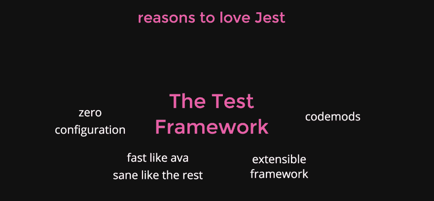
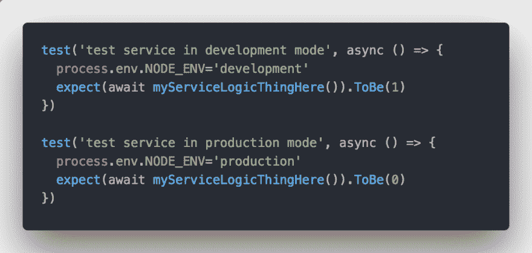

# 喜欢 Jest 的理由:测试框架

> 原文：<https://dev.to/lirantal/reasons-to-love-jest-the-test-framework-2hoe>

我们有磁带，摩卡，艾娃，现在笑话。让我们看看这是怎么回事！

我喜欢写测试，但是 Jest 把它带到了一个全新的水平。
就像我早上起床时问自己:

> 我今天要开发什么新的应用程序？我需要一些东西来写一些 jests 测试

我喜欢 Jest 有很多原因，这是我分享为什么我真的喜欢它的几个帖子中的第一个，所以让我们开始吧。

# 零配置

Jest 遵循零配置的#0CJS 实践，即使它可以用许多配置变量进行扩展，它也是开箱即用的，您不需要配置任何特殊的东西。

想想 Webpack4，Parcel，Create React App——这是许多项目最近都在遵循的做法，所以它不应该是新闻，Jest 全心全意地拥抱它。

0CJS 可以归结为:

*   一个依赖项—只需安装 Jest
*   嘲讽是内置的，不需要安装类似 proxyquire、sinon、testdouble 等 testdoubles 库。
*   断言内置，不需要安装 Chai，Should.js，或者其他。Jest 提供了一个很好的基础，它称之为断言期望的匹配器。
*   代码覆盖率？内置的。

# 神速如艾娃，神智如馀

哦，艾娃，我的爱！

几年前，我从摩卡跳到了 Ava.js，这是一段有趣的旅程。对于艾娃，它不是关于工具，而是它所提倡的哲学和测试实践——在任何测试之间没有共享的状态。

然而，这并不是一项容易的任务。
让我们看一个简单的例子——假设您的应用程序根据 NODE_ENV 这样的环境变量表现不同(这不是一个牵强的例子),并且您想在不同的条件下测试它:

看到陷阱了吗？

使用艾娃，这两个测试用例是并发执行的，这将导致第一个测试用例进入服务承诺时，第二个测试用例已经运行并将全局变量的值更改为生产。

这些陷阱在测试代码中并不少见——全局变量、作为 Node.js 模块系统基础的单件，或者管理测试用例之间的状态是流程的一部分的集成测试。

所有这些都是不好的测试模式，应该像艾娃鼓励的那样避免，但是我们经常发现自己处于这些情况中。

# 可扩展框架

ReactiveConf 2017 的 Rogelio Guzman 有一个关于 [Jest 作为一个平台](https://www.youtube.com/watch?v=NtjyeojAOBs)的精彩演讲，我强烈推荐你观看。

但是即使不深入 Jest 项目的内部以及这个平台是如何构建的

Jest 的匹配器(断言，比如 expect()。toBe(1))很容易扩展，有助于使您的代码更加易读和简洁，而不需要您使用任何语言结构。

例如，当 Jest matchers 给你现成的东西时，比如:

*   。托比·特鲁西
*   。toHaveBeenCalled()
*   。toBeGreaterThan(number)安装 jest 扩展包后，您还将赢得以下匹配者:

数组:

*   。toBeArrayOfSize()
*   。toBeArray()
*   。toIncludeAllMembers([成员])

数字或对象

*   。托比温()
*   。toContainKey(键)

更多生态系统扩展在 [jest-extended](https://github.com/jest-community/jest-extended)

# Codemods

假设您有一个在一个测试框架中编写的现有代码库，并且您想要转移到另一个框架。你会怎么做？Codemods 是帮助您自动转换代码库的程序，主要可以分为以下几个成熟度级别:

*   搜索和替换
*   应用正则表达式进行更智能的搜索和替换
*   应用从一种语言语法到另一种语言语法的抽象语法树(AST)转换。

> Codemods 并不是 Jest 所特有的，但是当您需要迁移现有项目时，它们使这项工作变得很容易。

我[写了一篇文章](https://medium.com/@liran.tal/migrating-a-mocha-project-to-jest-test-framework-76d13d76685)记录了一个小项目的这个过程，如果你打算尝试同样的过程。

当然,[jest-codemods repository](https://github.com/skovhus/jest-codemods)是一个很好的资源，可以帮助你前进。

-

我很乐意听听你喜欢 Jest 的理由。我很快会分享第二部分——“喜欢 Jest 的理由:开发者体验”

敬请期待！